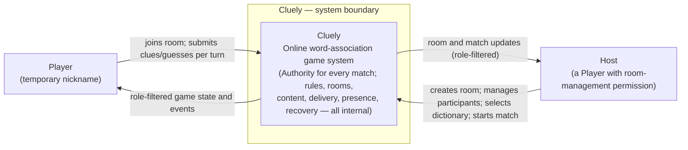
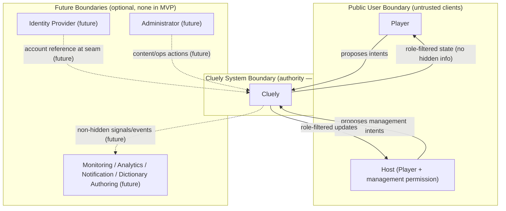
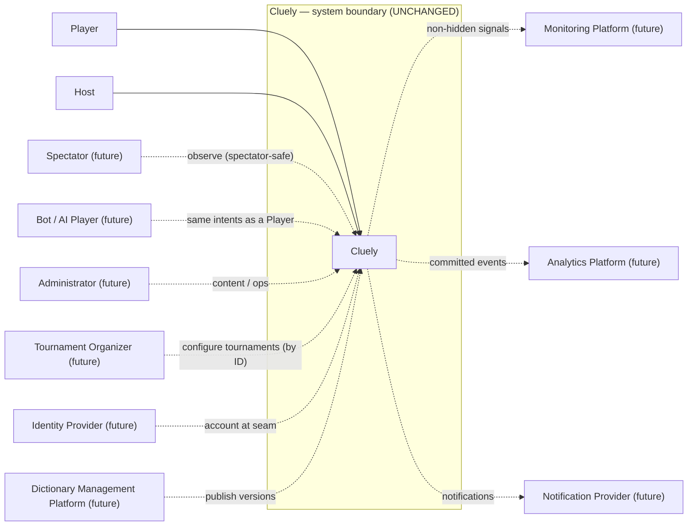

# Cluely — C4 System Context (Level 1)

| | |
|---|---|
| **Document** | 08.03 — C4 System Context (Level 1) |
| **Phase** | Software Design (third document) |
| **Version** | 1.0 |
| **Status** | Approved — canonical C4 Level 1 system context |
| **Technology** | **Neutral.** No container, component, database, protocol, framework, or deployment concept appears. This is C4 **Level 1** only. |
| **Purpose** | Visualize the **already-approved** architecture at C4 Level 1: what Cluely is, who interacts with it, what sits around it, and where the boundaries are — introducing **no** new architecture, business concept, or technology. |
| **Owner** | Lead Architect. |
| **Consumes (does not redefine)** | [Domain Model (08.01)](01-domain-model-and-ubiquitous-language.md), [Module Decomposition (08.02)](02-module-decomposition.md), [ADR-000…ADR-010](../07-software-architecture/12-decisions/README.md), [Architecture Discovery](../07-software-architecture/README.md), [SRS](../02-business-analysis/01-software-requirements.md), [Business Rules](../02-business-analysis/02-business-rules.md), [Business Invariants](../02-business-analysis/10-business-invariants.md), [Product Roadmap](../03-business-governance/06-product-roadmap.md). |

> **Reading contract.** Everything shown here already exists in approved documentation. This document
> **draws**, it does not decide. Terminology follows [ADR-000](../07-software-architecture/12-decisions/ADR-000-architecture-vocabulary.md);
> gameplay terms defer to the [Business Glossary](../03-business-governance/01-business-glossary.md).
>
> **Diagram-format note.** The house style is ASCII diagrams ([standards §4](../_meta/01-documentation-standards.md#4-markdown-conventions)),
> which [08.01](01-domain-model-and-ubiquitous-language.md)/[08.02](02-module-decomposition.md) follow.
> This document uses **Mermaid** as a *conscious, prompt-driven exception* for the C4 views; the prose
> is the source of truth and each diagram restates it.

---

## Table of Contents
1. [Purpose](#1-purpose)
2. [System Boundary](#2-system-boundary)
3. [Primary Actors](#3-primary-actors)
4. [External Systems](#4-external-systems)
5. [Context Diagram](#5-context-diagram)
6. [Relationship Catalogue](#6-relationship-catalogue)
7. [Trust Boundaries](#7-trust-boundaries)
8. [Information Flow](#8-information-flow)
9. [Supported User Journeys](#9-supported-user-journeys)
10. [Context Invariants](#10-context-invariants)
11. [Context Constraints](#11-context-constraints)
12. [Future Expansion](#12-future-expansion)
13. [Context Smell Analysis](#13-context-smell-analysis)
14. [Architecture Compliance Review](#14-architecture-compliance-review)
15. [Readiness Review](#15-readiness-review)

---

## 1. Purpose

**What C4 Level 1 is.** The **System Context** is the highest-zoom C4 view. It shows exactly one
software system as a single opaque box, the **people** who use it, and the **other systems** it
interacts with — and nothing inside the box.

**Why it exists.** To let any stakeholder — business, architecture, engineering, QA, or a future
contributor — understand *what Cluely is and what surrounds it* in one glance, before any internal
detail. It is the executive overview and the shared mental model for every later view.

**Why it intentionally hides implementation.** At Level 1 the system is a black box **on purpose**: it
communicates scope and relationships without prejudging structure or technology. Modules, containers,
databases, protocols, and deployment are deliberately invisible here — they appear only at
[Level 2 (08.04, containers)](../09-technical-design/README.md) and below.

**How it relates to the approved design.** Everything inside the Cluely box is defined by the
[Domain Model (08.01)](01-domain-model-and-ubiquitous-language.md) (concepts) and the
[Module Decomposition (08.02)](02-module-decomposition.md) (logical modules). At this level those
collapse into **one system**. When we zoom to Level 2, the six modules of 08.02 (M1–M6) become the
first internal detail — but **not in this document**.

---

## 2. System Boundary

**What is Cluely?** Cluely is a single, self-contained online **word-association game system**,
functionally equivalent to Codenames, played in private rooms with temporary nicknames and no
accounts. It is the **authority** for every match it hosts.

**What belongs inside Cluely.** Everything that decides, holds, or serves gameplay — i.e., all six
logical modules of [08.02](02-module-decomposition.md), collapsed here into one box:

- The **authoritative gameplay** (rooms, matches, boards, turns, adjudication) — the single Authority
  per room ([ADR-002](../07-software-architecture/12-decisions/ADR-002-authoritative-game-state.md)/[ADR-003](../07-software-architecture/12-decisions/ADR-003-per-room-coordination-model.md)).
- The **word content** (country-scoped, versioned dictionaries) — module **M3 Content** is
  **internal** ([ADR-008](../07-software-architecture/12-decisions/ADR-008-dictionary-content-architecture.md)); in the MVP, dictionaries are bundled/provided within the system.
- **Delivery** of role-filtered state, **presence/reconnection**, and **recovery** — all internal
  ([ADR-004](../07-software-architecture/12-decisions/ADR-004-real-time-communication-delivery.md)/[ADR-006](../07-software-architecture/12-decisions/ADR-006-role-based-information-visibility.md)/[ADR-009](../07-software-architecture/12-decisions/ADR-009-participant-lifecycle-presence-session-continuity.md)/[ADR-005](../07-software-architecture/12-decisions/ADR-005-state-recovery-resilience.md)).

**What belongs outside Cluely.** In the **MVP, nothing** — Cluely is fully self-contained. The only
things outside are the **people** who play (Player, Host). Every *external system* in this document is
**future/optional** (§4, §12): identity, notification, monitoring, analytics, and an editorial
dictionary-authoring platform. None exists in the current scope, and none ever owns gameplay.

**Why.** Self-containment is a deliberate architectural stance: the Authority, rules, content, and
hidden information must never depend on an external party for a match to be decided fairly
([ADR-002](../07-software-architecture/12-decisions/ADR-002-authoritative-game-state.md), [AP-03 server-authority](../06-architecture-governance/01-architecture-principles.md)). External systems may later *augment* Cluely (accounts, metrics) but never *decide* for it.

> **MVP truth:** one system boundary, two human actors (Player, Host), **zero** external systems.

---

## 3. Primary Actors

An **actor** is a human (or, in future, an automated agent) outside the system boundary that interacts
with Cluely. Each is validated against approved documentation; speculative actors without a trace are
**rejected** (§3.3).

### 3.1 Current actors (MVP)
| Actor | Purpose | Goals | Permissions | Primary interactions | Trace |
|-------|---------|-------|-------------|----------------------|-------|
| **Player** | A person taking part in a room/match under a temporary nickname. | Play fairly; give/guess clues; see only role-appropriate state. | Join a room; pick team/role; submit clues/guesses per turn; view role-filtered state. | Join room → team/role → play match → reconnect → finish. | [Glossary Player](../03-business-governance/01-business-glossary.md); [08.01 §1.2](01-domain-model-and-ubiquitous-language.md#12-people--roles) |
| **Host** *(a Player specialization)* | A Player holding the room-management **assignment** — **not** a separate kind of human. | Organize the room; start the match; keep the room orderly. | All Player permissions **plus** create room, remove participant, transfer host, select dictionary, start match. | Create room → manage participants/dictionary → start match. | [08.01 §1.2 (Host = assignment)](01-domain-model-and-ubiquitous-language.md#12-people--roles); [BR-HOST/HM](../02-business-analysis/02-business-rules.md) |

> **Modeling note (from 08.01):** Host is an **assignment on a Participant**, so at L1 it is drawn as
> a *specialization of Player* with elevated permission — not two unrelated actor boxes. Every Host is
> a Player.

### 3.2 Future actors (approved-but-not-yet-built)
| Actor | Purpose | Permissions (future) | Trace |
|-------|---------|----------------------|-------|
| **Spectator** | Watch a match without playing. | Observe a spectator-safe projection (no Key). | [08.01 §17](01-domain-model-and-ubiquitous-language.md#17-future-evolution); [08.02 §13](02-module-decomposition.md#13-extension-points) |
| **Bot / AI Player** | An automated participant. | Emits the **same** Commands as a Player through the Authority — no privileged path. | [08.02 §13](02-module-decomposition.md#13-extension-points) |
| **Administrator** | Operate content/rooms; no gameplay authority. | Publish dictionary versions; operational room actions. | Administration context [08.02 §2.2](02-module-decomposition.md#22-rejected-merged-or-deferred-candidates-with-reasons) |
| **Tournament Organizer** | Structure many matches into competitive events. | Configure tournaments referencing matches by ID. | [Roadmap Phase 4](../03-business-governance/06-product-roadmap.md#7-phase-4--public-matchmaking--competitive-future); [08.01 §17](01-domain-model-and-ubiquitous-language.md#17-future-evolution) |

### 3.3 Rejected actors (no trace — validation, not omission)
| Candidate | Decision | Reason |
|-----------|----------|--------|
| **Support Operator** | **Rejected** | No approved document defines a support/customer-service role. If a future support need arises it would most likely be a facet of **Administrator**, not a new actor. Recorded here so the omission is a **deliberate validation result**, not an oversight. |

---

## 4. External Systems

An **external system** is a separate software system outside Cluely's boundary. In the **MVP there are
none** — Cluely is self-contained (§2). Every system below is **future/optional** and **conceptual**
(no vendor, no technology). None ever owns gameplay.

| External system (future) | Purpose | Responsibilities | Relationship to Cluely | Trace |
|--------------------------|---------|------------------|------------------------|-------|
| **Identity Provider** | Durable accounts/authentication. | Verify identity; supply an account reference. | Attaches at the **future-auth seam**; supplies an optional `accountId`; never touches rules. | [ADR-000 Future-Auth Seam](../07-software-architecture/12-decisions/ADR-000-architecture-vocabulary.md#future-auth-seam); [SRS §2.14](../02-business-analysis/01-software-requirements.md#214-future-authentication-considerations); [Roadmap Phase 2](../03-business-governance/06-product-roadmap.md#5-phase-2--accounts--continuity-future) |
| **Dictionary Management Platform** | Editorial authoring/publication of word content. | Author and publish immutable Dictionary Versions **into** internal Content (M3). | Upstream, **optional** editorial source; **not** the internal Content module; never participates in a live match. | [ADR-008](../07-software-architecture/12-decisions/ADR-008-dictionary-content-architecture.md); Administration [08.02 §2.2](02-module-decomposition.md#22-rejected-merged-or-deferred-candidates-with-reasons) |
| **Monitoring Platform** | Operational observability. | Receive operational/health signals (no business/hidden data). | Read-only consumer of operational signals; never influences play. | R-17 Observability [System Responsibilities](../07-software-architecture/03-system-responsibilities.md) |
| **Analytics Platform** | Product metrics on committed facts. | Consume committed Domain Events; compute stats. | Downstream read-only; never influences play. | R-17; [Roadmap Phase 3](../03-business-governance/06-product-roadmap.md#6-phase-3--progression--recognition-future) |
| **Notification Provider** | Out-of-band notifications (e.g., invites). | Deliver messages to users outside a live match. | Optional side-channel; never carries hidden information or decides outcomes. | [Roadmap Phase 2/3](../03-business-governance/06-product-roadmap.md#5-phase-2--accounts--continuity-future) |

> **Distinction that must not blur:** the internal **Content module (M3)** *serves* words during a
> match; the future external **Dictionary Management Platform** *authors/publishes* them beforehand.
> The module is inside the boundary; the authoring platform is outside and optional ([ADR-008](../07-software-architecture/12-decisions/ADR-008-dictionary-content-architecture.md)).

---

## 5. Context Diagram

**Primary context — MVP (current scope only).** Two human actors, one system, no external systems.



*The future-state context (with external systems) is shown separately in [§12](#12-future-expansion)
to keep present and future unmistakably distinct.*

---

## 6. Relationship Catalogue

Every relationship at this level, MVP and (marked) future. "Ownership" = who owns the interaction's
truth; the Authority (inside Cluely) always owns gameplay truth.

| # | Source | Destination | Business purpose | Information exchanged | Direction | Ownership | Trust boundary crossed | Frequency | Criticality | Future evolution |
|---|--------|-------------|------------------|-----------------------|-----------|-----------|------------------------|-----------|-------------|------------------|
| R1 | Player | Cluely | Take part in a match | Intents: join, team/role, clue, guess, reconnect | → | Cluely (Authority adjudicates) | Public User → System | Per turn/action (frequent) | **Critical** | Same for Bot/AI (identical intents) |
| R2 | Cluely | Player | Show only role-appropriate state | Role-filtered projections + committed events | → | Cluely | System → Public User | Per commit (frequent) | **Critical** | Adds Spectator projection |
| R3 | Host | Cluely | Organize the room & start play | Management intents: create, remove, transfer, select dictionary, start | → | Cluely | Public User → System | Per room (occasional) | High | Unchanged |
| R4 | Cluely | Host | Reflect room/match management outcomes | Room/match updates (role-filtered) | → | Cluely | System → Public User | Per change | High | Unchanged |
| R5 *(future)* | Identity Provider | Cluely | Attach durable identity | Account reference at the seam | → | Identity Provider (identity only) | Future Identity | On login | Medium | Enables accounts |
| R6 *(future)* | Dictionary Management Platform | Cluely | Supply publishable content | Immutable Dictionary Versions | → | Content author | Future External Service | Editorial cadence (rare) | Medium | Custom/premium content |
| R7 *(future)* | Cluely | Monitoring/Analytics Platform | Operate & measure | Operational signals / committed events (no hidden data) | → | Cluely (emits) | Future External Service | Continuous/aggregate | Low–Medium | Ranked, dashboards |
| R8 *(future)* | Cluely | Notification Provider | Out-of-band messaging | Invitations/notifications (no hidden data) | → | Cluely (emits) | Future External Service | Occasional | Low | Social features |

---

## 7. Trust Boundaries

A **trust boundary** is a line across which trust changes and guarantees must be enforced.

| Boundary | Separates | Why it exists |
|----------|-----------|---------------|
| **Public User Boundary** | Players/Hosts (untrusted clients) ↔ Cluely (authority) | Clients **propose** intents; Cluely **decides**. Nothing a client sends is trusted; validation/adjudication happen inside ([ADR-002](../07-software-architecture/12-decisions/ADR-002-authoritative-game-state.md), [AP-03](../06-architecture-governance/01-architecture-principles.md)). Hidden information is filtered **before** it crosses this line outward ([ADR-006](../07-software-architecture/12-decisions/ADR-006-role-based-information-visibility.md), [INV-B9](../02-business-analysis/10-business-invariants.md)). |
| **Administrative Boundary** *(future)* | Administrator ↔ Cluely | Content/operational actions are privileged and must be separated from gameplay authority; an Administrator never adjudicates a match ([08.02 §2.2](02-module-decomposition.md#22-rejected-merged-or-deferred-candidates-with-reasons)). |
| **Future Identity Boundary** | Identity Provider ↔ Cluely | Identity is externally asserted and must attach at the isolated **future-auth seam** without entering the rules ([ADR-000](../07-software-architecture/12-decisions/ADR-000-architecture-vocabulary.md#future-auth-seam), [SRS §2.14](../02-business-analysis/01-software-requirements.md#214-future-authentication-considerations)). |
| **Future External Service Boundary** | Monitoring/Analytics/Notification/Dictionary-authoring ↔ Cluely | External services are optional and untrusted with respect to gameplay: they receive only non-hidden data and never own outcomes. |



---

## 8. Information Flow

Conceptual flows (who informs whom). All gameplay flows loop through the Authority inside Cluely;
players never exchange information directly.

**MVP — play loop:**
```text
Player ──(intent: clue/guess)──► Cluely (validate → adjudicate → commit) ──(role-filtered state)──► Player(s)
Host   ──(manage/start)────────► Cluely (authorize → commit) ───────────► Host + Player(s)
```

**Future — augmentation flows (never gameplay-deciding):**
```text
Dictionary Authoring ──(publish versions)──► Cluely (Content M3) ──(words at board gen)──► internal only
Identity Provider ────(account reference)──► Cluely (future-auth seam) ─────────────────► optional identity
Cluely ──(committed events / operational signals, no hidden data)──► Analytics / Monitoring (future)
```

**Key property:** there is **no** Player→Player edge and **no** external→gameplay edge anywhere. Every
outward flow from Cluely is role-filtered so hidden information never leaves the boundary
([ADR-006](../07-software-architecture/12-decisions/ADR-006-role-based-information-visibility.md), [INV-B9](../02-business-analysis/10-business-invariants.md)).

---

## 9. Supported User Journeys

Interactions only — no implementation. Scores below are *relative confidence/ease* (Mermaid journey
convention, 1–5), not metrics.

```mermaid
journey
    title Cluely — Major User Journeys (MVP; futures marked)
    section Set up a room
      Create room: 5: Host
      Share room code: 5: Host
      Join room with nickname: 5: Player
      Pick team and role: 4: Player
    section Play a match
      Select dictionary and start match: 5: Host
      Submit clue (Spymaster): 4: Player
      Submit guesses (Operative): 4: Player
      See role-filtered board update: 5: Player
    section Resilience
      Disconnect and reconnect: 3: Player
      Resume at last committed state: 4: Player
    section Finish
      Reach terminal result: 5: Player
      View outcome: 5: Player
```

**Journey inventory (with future items):**
| Journey | Actors | Status | Trace |
|---------|--------|--------|-------|
| Create Room | Host | MVP | [BR-RC](../02-business-analysis/02-business-rules.md) |
| Join Room | Player | MVP | [BR-JR](../02-business-analysis/02-business-rules.md) |
| Start Match | Host | MVP | [BR-GS](../02-business-analysis/02-business-rules.md) |
| Play Match | Player | MVP | [BR-CL/GV/TO](../02-business-analysis/02-business-rules.md) |
| Reconnect | Player | MVP | [BR-RX](../02-business-analysis/02-business-rules.md), [ADR-009](../07-software-architecture/12-decisions/ADR-009-participant-lifecycle-presence-session-continuity.md) |
| Finish Match | Player | MVP | [BR-WIN/LOSE/TIE](../02-business-analysis/02-business-rules.md) |
| Authentication | Player→account | Future | [Roadmap Phase 2](../03-business-governance/06-product-roadmap.md#5-phase-2--accounts--continuity-future) |
| Spectating | Spectator | Future | [08.01 §17](01-domain-model-and-ubiquitous-language.md#17-future-evolution) |
| Tournament | Tournament Organizer | Future | [Roadmap Phase 4](../03-business-governance/06-product-roadmap.md#7-phase-4--public-matchmaking--competitive-future) |

---

## 10. Context Invariants

Always-true properties at the context level (each traces to an approved decision).

| # | Context invariant | Origin |
|---|-------------------|--------|
| CX-1 | **Players never communicate directly** — all interaction routes through the Authority. | [ADR-002](../07-software-architecture/12-decisions/ADR-002-authoritative-game-state.md)/[ADR-003](../07-software-architecture/12-decisions/ADR-003-per-room-coordination-model.md) |
| CX-2 | **External systems never own gameplay** — the Authority is always inside Cluely. | [ADR-002](../07-software-architecture/12-decisions/ADR-002-authoritative-game-state.md), [AP-03](../06-architecture-governance/01-architecture-principles.md) |
| CX-3 | **Authority always resides inside Cluely** — never externalized. | [ADR-002](../07-software-architecture/12-decisions/ADR-002-authoritative-game-state.md) |
| CX-4 | **Dictionary authoring never participates in a live match** — content is pinned by ID beforehand. | [ADR-008](../07-software-architecture/12-decisions/ADR-008-dictionary-content-architecture.md) |
| CX-5 | **Recovery never leaves the system boundary** — restoration is internal to Cluely. | [ADR-005](../07-software-architecture/12-decisions/ADR-005-state-recovery-resilience.md) |
| CX-6 | **Visibility filtering stays internal** — hidden information never crosses the boundary outward. | [ADR-006](../07-software-architecture/12-decisions/ADR-006-role-based-information-visibility.md), [INV-B9](../02-business-analysis/10-business-invariants.md) |
| CX-7 | **No cross-room interaction is visible at the context** — rooms are isolated. | [ADR-007](../07-software-architecture/12-decisions/ADR-007-room-isolation-distribution.md) |
| CX-8 | **Every inbound client message is an untrusted intent** — Cluely decides, clients propose. | [AP-03](../06-architecture-governance/01-architecture-principles.md), [ADR-010](../07-software-architecture/12-decisions/ADR-010-command-query-strategy.md) |
| CX-9 | **Every outbound flow is role-filtered** — no raw authoritative state leaves the box. | [ADR-006](../07-software-architecture/12-decisions/ADR-006-role-based-information-visibility.md) |

---

## 11. Context Constraints

| Constraint | Explanation |
|-----------|-------------|
| **Single system boundary** | Cluely is one system; there is no second gameplay system to coordinate with (rooms are isolated, [ADR-007](../07-software-architecture/12-decisions/ADR-007-room-isolation-distribution.md)). |
| **Authority never externalized** | No external actor/system may decide a match outcome ([ADR-002](../07-software-architecture/12-decisions/ADR-002-authoritative-game-state.md)). |
| **Gameplay remains self-contained** | A match can be created, played, and decided with **no** external dependency (MVP truth, §2). |
| **External integrations remain optional** | Identity/monitoring/analytics/notification/authoring are additive; their absence never blocks play. |
| **Identity remains replaceable** | Accounts attach at the seam; the provider is swappable and non-essential ([ADR-000](../07-software-architecture/12-decisions/ADR-000-architecture-vocabulary.md#future-auth-seam)). |
| **Content remains independent** | Word content is versioned and pinned by ID; authoring is decoupled from play ([ADR-008](../07-software-architecture/12-decisions/ADR-008-dictionary-content-architecture.md)). |

---

## 12. Future Expansion

The context **evolves by adding external actors/systems around an unchanged Cluely box** — the system
boundary never moves. This restates [08.01 §17](01-domain-model-and-ubiquitous-language.md#17-future-evolution)
and [08.02 §13](02-module-decomposition.md#13-extension-points) at L1.



| Capability | How the context changes | Boundary moves? |
|-----------|--------------------------|-----------------|
| Authentication | +Identity Provider at the seam | **No** |
| Friends / Organizations | +external social context (by ID) | **No** |
| Ranked | +Analytics consuming committed events | **No** |
| Community / Premium Content | +Dictionary Management Platform | **No** |
| Tournament Platform | +Tournament Organizer + tournament context | **No** |
| Streaming Integration | +Spectator + optional streaming side-channel | **No** |
| Enterprise Edition | +Administrator scoping | **No** |

**Guarantee:** every expansion adds an actor or an optional external system **around** Cluely; none
splits the box, externalizes the Authority, or bypasses role-filtering.

---

## 13. Context Smell Analysis

| Smell | Present? | Mitigation |
|-------|----------|------------|
| **Boundary leakage** | *Guarded* | Content (M3) is explicitly **inside**; authoring platform explicitly **outside** — the two are never conflated (§4). Hidden info never crosses outward (CX-6/9). |
| **Overloaded actors** | *Avoided* | Host is a **Player specialization**, not a catch-all admin; Administrator (future) is separate. Support Operator rejected (§3.3). |
| **Hidden external dependencies** | *Avoided* | MVP has **zero** external systems; all integrations are future/optional and enumerated (§4). |
| **Technology assumptions** | *Avoided* | No vendor/protocol/tech named anywhere; systems are conceptual. |
| **Premature integrations** | *Avoided* | Every external system is marked future; none appears in the MVP primary diagram (§5). |
| **Coupling to providers** | *Guarded* | Identity/content/monitoring are replaceable and optional (§11); Cluely never depends on a specific provider. |

---

## 14. Architecture Compliance Review

| Source | Requirement | Context-level compliance |
|--------|-------------|--------------------------|
| [ADR-000](../07-software-architecture/12-decisions/ADR-000-architecture-vocabulary.md) | Canonical vocabulary | Actors/systems use approved terms; no new terminology. ✅ |
| [ADR-001](../07-software-architecture/12-decisions/ADR-001-overall-architecture-style.md) | One system, self-contained | Single Cluely box; MVP has no external deps. ✅ |
| [ADR-002](../07-software-architecture/12-decisions/ADR-002-authoritative-game-state.md) | Authority internal | CX-2/3; Authority never externalized. ✅ |
| [ADR-003](../07-software-architecture/12-decisions/ADR-003-per-room-coordination-model.md) | Serialized authority | Clients propose; Cluely decides (CX-8). ✅ |
| [ADR-004](../07-software-architecture/12-decisions/ADR-004-real-time-communication-delivery.md) | Delivery internal | Delivery is inside the box (not an external system). ✅ |
| [ADR-005](../07-software-architecture/12-decisions/ADR-005-state-recovery-resilience.md) | Recovery internal | CX-5. ✅ |
| [ADR-006](../07-software-architecture/12-decisions/ADR-006-role-based-information-visibility.md) | Visibility internal, no leak | CX-6/9; role-filtered outbound only. ✅ |
| [ADR-007](../07-software-architecture/12-decisions/ADR-007-room-isolation-distribution.md) | Room isolation | CX-7; no cross-room edges. ✅ |
| [ADR-008](../07-software-architecture/12-decisions/ADR-008-dictionary-content-architecture.md) | Content by ID, immutable | Content internal (M3); authoring external/optional (§4). ✅ |
| [ADR-009](../07-software-architecture/12-decisions/ADR-009-participant-lifecycle-presence-session-continuity.md) | Session/presence internal | Presence/reconnect inside the box. ✅ |
| [ADR-010](../07-software-architecture/12-decisions/ADR-010-command-query-strategy.md) | Commands to Authority | Inbound = intents to Cluely (CX-8). ✅ |
| [08.01](01-domain-model-and-ubiquitous-language.md) | Domain concepts | Host-as-assignment respected; no new concepts. ✅ |
| [08.02](02-module-decomposition.md) | Modules internal | All six modules collapse into one box; none appears at L1. ✅ |

**Violations found:** none. **No modules, containers, technologies, databases, APIs, or deployment
concepts appear** (verified in §Validation).

---

## 15. Readiness Review

**Overall assessment.** A complete, standalone C4 Level 1 context: one self-contained system, two MVP
human actors (Player, Host-as-specialization), and a clearly-separated set of **future** external
actors/systems. It introduces **no** new architecture, business concept, or technology.

**Strengths.** MVP self-containment stated plainly and drawn honestly (present vs. future kept in
separate diagrams); Content correctly **inside** the boundary with the authoring platform **outside**;
Host modeled per the frozen domain model; speculative actors validated (Support Operator rejected);
every relationship carries a documented business purpose and trace.

**Remaining risks.** (1) Future/present blurring — mitigated by separate §5 vs §12 diagrams and
consistent *(future)* labels. (2) The internal-Content vs external-authoring distinction is subtle —
called out explicitly in §4/§13 so it cannot drift.

**Open questions (non-blocking).** Whether Administrator and Tournament Organizer become first-class at
their roadmap phases or remain facets; final spectator visibility scope — all deferred to the phases
that introduce them.

**Deferred decisions.** All internal structure (modules as containers), technologies, protocols,
persistence, and deployment — deferred to **08.04 — C4 Container (Level 2)** *(future)* and
[09 Technical Design](../09-technical-design/README.md).

**Readiness for C4 Level 2.** **Ready.** The single Cluely box, its actors, boundaries, and
relationships are fixed; at Level 2 the box opens to reveal the six approved modules of
[08.02](02-module-decomposition.md) as logical containers — **without** redefining anything here.

**Recommendation.** Approve as the official executive overview and proceed to **08.04 — C4 Container
Diagram (Level 2)**. No later view may add an actor, external system, or boundary that is not first
reflected here.

### Validation checklist (self-verified)
| Check | Result |
|-------|--------|
| Every actor exists in approved docs | ✅ (Player/Host; futures traced; Support Operator rejected with reason) |
| Every external system is conceptual only | ✅ (no vendor/tech; all future/optional) |
| No containers / modules appear | ✅ (six modules collapsed into one box) |
| No technologies / databases / APIs appear | ✅ |
| No deployment concepts appear | ✅ |
| Every relationship has a business purpose | ✅ (§6) |
| Every diagram matches the written content | ✅ (§5/§7/§9/§12 nodes == §3 actors + §4 systems + §6 relationships) |
| Every concept traceable to Domain Model/ADRs | ✅ (inline traces throughout) |

---

## Revision History
| Version | Date | Change |
|---------|------|--------|
| 1.0 | 2026-07-04 | Initial canonical C4 System Context (Level 1). One self-contained system; MVP actors Player + Host (specialization); future actors (Spectator, Bot/AI, Administrator, Tournament Organizer) and future external systems (Identity, Dictionary authoring, Monitoring, Analytics, Notification) quarantined to §4/§12; Support Operator rejected. Mermaid context/trust/journey/future diagrams; full ADR-000…010 + 08.01/08.02 compliance. No new architecture, concepts, or technology. |
