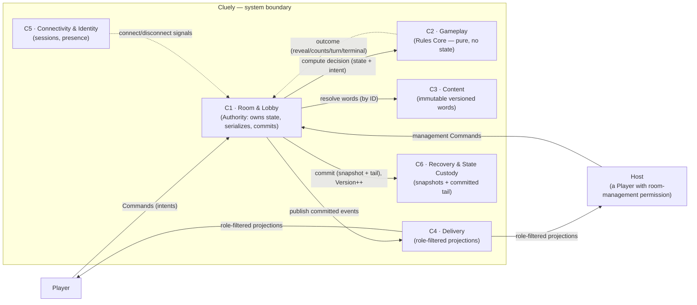
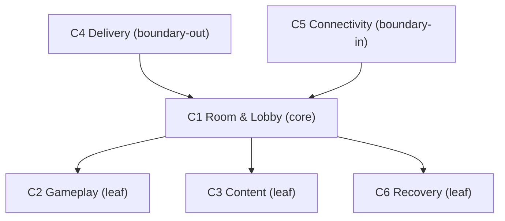
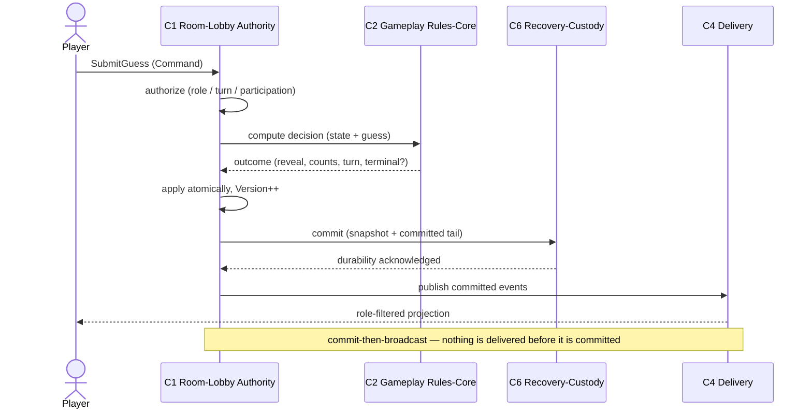
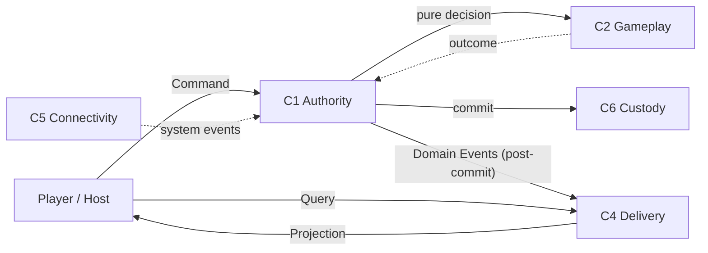

# Cluely — C4 Container Diagram (Level 2)

| | |
|---|---|
| **Document** | 08.04 — C4 Container Diagram (Level 2) |
| **Phase** | Software Design (fourth document) |
| **Version** | 1.0 |
| **Status** | Approved — canonical C4 Level 2 container view |
| **Technology** | **Neutral.** No framework, protocol, datastore, process/thread, microservice, component, or deployment concept appears. Containers here are **logical software containers**, not deployment units. |
| **Purpose** | Open the Cluely system boundary from [08.03 (L1)](03-c4-system-context.md) and visualize its **already-approved** internal logical containers — the six modules of [08.02](02-module-decomposition.md) — their responsibilities, dependencies, collaboration, ownership, communication, and failure boundaries. Introduces **no** new architecture. |
| **Owner** | Lead Architect. |
| **Consumes (does not redefine)** | [Domain Model (08.01)](01-domain-model-and-ubiquitous-language.md), [Module Decomposition (08.02)](02-module-decomposition.md), [C4 System Context (08.03)](03-c4-system-context.md), [ADR-000…ADR-010](../07-software-architecture/12-decisions/README.md), [SRS](../02-business-analysis/01-software-requirements.md), [Business Rules](../02-business-analysis/02-business-rules.md), [Business Invariants](../02-business-analysis/10-business-invariants.md). |

> **Reading contract.** The six containers **are** the six modules M1–M6 of [08.02](02-module-decomposition.md);
> this document **draws** them at C4 Level 2, it does not redesign them. Responsibilities, dependency
> rules, state ownership, concurrency ownership, and failure isolation are **pulled** from 08.02 (§3,
> §6, §9, §12) and the ADRs. Terminology follows [ADR-000](../07-software-architecture/12-decisions/ADR-000-architecture-vocabulary.md).
>
> **Diagram-format note.** Mermaid is used as the same **conscious, prompt-driven exception** to the
> ASCII house style noted in [08.03](03-c4-system-context.md); prose is the source of truth and every
> diagram restates it.

---

## Table of Contents
1. [Purpose](#1-purpose)
2. [Container Identification](#2-container-identification)
3. [Container Responsibilities](#3-container-responsibilities)
4. [Container Diagram](#4-container-diagram)
5. [Interaction Catalogue](#5-interaction-catalogue)
6. [Container Dependency Rules](#6-container-dependency-rules)
7. [Runtime Collaboration](#7-runtime-collaboration)
8. [State Ownership](#8-state-ownership)
9. [Command & Query Routing](#9-command--query-routing)
10. [Failure Boundaries](#10-failure-boundaries)
11. [Trust Boundaries](#11-trust-boundaries)
12. [Container Lifecycle](#12-container-lifecycle)
13. [Container Quality Attributes](#13-container-quality-attributes)
14. [Container Smell Analysis](#14-container-smell-analysis)
15. [Architecture Compliance Review](#15-architecture-compliance-review)
16. [Readiness for Aggregate Design](#16-readiness-for-aggregate-design)

---

## 1. Purpose

**What C4 Level 2 is.** The **Container** view opens the single system box from [Level 1](03-c4-system-context.md)
and shows the *logical containers* inside it and how they collaborate. In C4, a "container" is a
separately-reasoned unit of responsibility — **not** a deployment artifact, process, or technology.

**Why it exists.** To communicate, at a glance, how Cluely is organized internally: the six
responsibilities, who owns state, who decides, and how information moves — before any aggregate-internal
or technical detail.

**How it differs from adjacent artifacts.**
| Artifact | Zoom | This document's relationship |
|----------|------|------------------------------|
| [C4 L1 (08.03)](03-c4-system-context.md) | System as one box | We **open** that box. |
| [Module Decomposition (08.02)](02-module-decomposition.md) | Logical modules + rules | We **visualize** those modules as containers (1:1); we add no module. |
| Aggregate Design (08.05, *next*) | Inside a container | We stop at the container boundary; internals are deferred. |
| [Technical Design (09)](../09-technical-design/README.md) | Technology mapping | We choose **no** technology; that maps containers onto tech later. |

**Scope statement.** This document visualizes **approved logical containers only**. The six containers
are exactly M1–M6 of [08.02](02-module-decomposition.md#2-module-identification); nothing is invented,
merged, or split here.

---

## 2. Container Identification

The prompt's six candidates are **validated against [08.02 §2](02-module-decomposition.md#2-module-identification)**
— they are the six accepted modules, unchanged. Each container = one module.

| Container | = Module | Realizes context (08.01 §2) | Core responsibility |
|-----------|----------|------------------------------|---------------------|
| **C1 · Room & Lobby** | M1 | Room & Lobby | The **Authority**: owns/mutates the Room/Match aggregate; serializes Commands; commits. |
| **C2 · Gameplay** | M2 | Play | **Pure** Rules Core; computes outcomes; owns no state. |
| **C3 · Content** | M3 | Content | Immutable, versioned, country-scoped words; read-only to play. |
| **C4 · Delivery** | M4 | Delivery | Transports committed state/events; **role-filters** into Projections. |
| **C5 · Connectivity & Identity** | M5 | Connectivity & Identity | Sessions, reconnection, derived Presence signals. |
| **C6 · Recovery & State Custody** | M6 | (custody seam, [ADR-005](../07-software-architecture/12-decisions/ADR-005-state-recovery-resilience.md)) | Holds snapshots + committed tail; validates recovery; never adjudicates. |

**Merged / rejected candidates:** none at this level — the reconciliation (Projection→Delivery,
Presence→Connectivity, Recovery kept distinct, Admin/Analytics/Future-* deferred) was already made and
justified in [08.02 §2.2](02-module-decomposition.md#22-rejected-merged-or-deferred-candidates-with-reasons)
and is **not reopened**. No additional container is invented.

> **C4-language caution:** these are **logical** containers. Whether they run in one deployment unit
> (the modular-monolith MVP, [ADR-001](../07-software-architecture/12-decisions/ADR-001-overall-architecture-style.md)) or are later distributed by room ([ADR-007](../07-software-architecture/12-decisions/ADR-007-room-isolation-distribution.md)) is a
> deployment decision **out of scope** here.

---

## 3. Container Responsibilities

Pulled from [08.02 §3](02-module-decomposition.md#3-module-responsibilities); condensed to the L2 view.

### C1 · Room & Lobby *(Authority)*
- **Purpose:** Single-writer authority & consistency unit for one room and its ≤1 Match.
- **Responsibilities:** room lifecycle, host/team/role assignment, dictionary pin, match orchestration, **authorization** (role/turn admission — R-10 gate), **Command serialization**, atomic **commit** + **Version++**, emit committed Domain Events.
- **Owned concepts:** the whole Room/Match aggregate (Room, Participant, Board, Card, Turn).
- **Owned state:** Room State (S-01), Game State (S-02/04), Board State (S-03), Version, DictionaryReference.
- **Owned Commands:** CreateRoom, JoinRoom, LeaveRoom, TransferHost, RemoveParticipant, AssignTeam, AssignRole, SelectDictionary, StartMatch, SubmitClue, SubmitGuess, EndTurn.
- **Owned Queries:** RoomStatus, MembershipView (role-filtered views delegated to C4).
- **Owned events:** [EVT-1…EVT-11](../02-business-analysis/11-domain-events-catalog.md), EVT-24/25; reflects EVT-22/23.
- **Consumers:** all Commands terminate here; C4/C6 consume its committed output.
- **Dependencies:** C2 (compute), C3 (resolve), C6 (commit/recover), C4 (publish), C5 (consume signals).
- **Forbidden:** rule adjudication (C2), transport (C4), word storage (C3), connections (C5), snapshot mechanics (C6).
- **Extension points:** new Commands (e.g., spectator join) without new aggregates.

### C2 · Gameplay *(Rules Core — pure)*
- **Purpose:** Compute deterministic outcomes from supplied state.
- **Responsibilities:** board generation, clue validation, guess adjudication, turn/victory evaluation (R-04/05/07/08/09; R-10 rule-validation).
- **Owned concepts / state:** **none** (pure); operates on inputs handed in by C1.
- **Owned Commands/Queries:** none directly — exposes pure operations (GenerateBoard, ValidateClue, AdjudicateGuess, EvaluateTurn, EvaluateVictory) invoked by C1.
- **Owned events:** produces the *facts* C1 commits/emits as [EVT-12…EVT-21](../02-business-analysis/11-domain-events-catalog.md); emits none itself.
- **Dependencies:** **none.**
- **Forbidden:** owning/mutating state, transport, persistence, connections, natural language, external randomness.
- **Extension points:** new modes add rules here only.

### C3 · Content
- **Purpose:** Provide immutable, versioned, country-scoped word sets.
- **Responsibilities:** publish Dictionary Versions; resolve a DictionaryReference/locale to words (R-06).
- **Owned concepts / state:** Dictionary Version (aggregate root), Word — authoritative, immutable after publish.
- **Owned Queries:** ResolveVersion, ResolveWords. **Owned Commands:** PublishVersion *(Admin/future)*.
- **Owned events:** version publication ([ADR-008](../07-software-architecture/12-decisions/ADR-008-dictionary-content-architecture.md)).
- **Dependencies:** **none downstream** (upstream, read-only to C1).
- **Forbidden:** knowing about rooms/matches/participants.
- **Extension points:** custom/premium/regional versions; pin-by-ID unchanged.

### C4 · Delivery *(incl. Projection & Visibility)*
- **Purpose:** Transport committed state/events; **role-filter** into Projections.
- **Responsibilities:** consume committed events + snapshots; generate per-Role Projections; answer Queries (R-11); never adjudicate.
- **Owned concepts / state:** **none authoritative** — only derived, rebuildable Projection caches.
- **Owned Queries:** GetProjection(role), GetSnapshot(role). **Owned Commands:** none.
- **Consumers:** Players/Host (role-filtered).
- **Dependencies:** C1 outbound committed-event/snapshot **contract** (not C1 internals).
- **Forbidden:** adjudication, authoritative state, holding the Key as truth.
- **Extension points:** new Roles (spectator) add Visibility rules only.

### C5 · Connectivity & Identity
- **Purpose:** Manage transient sessions & reconnection; derive Presence.
- **Responsibilities:** session lifecycle, reconnect-token validation, connect/disconnect signals (R-12/13).
- **Owned concepts / state:** Session, ReconnectToken (S-06, transient); **Presence derived**.
- **Owned Commands:** OpenSession, Reconnect, CloseSession. **Owned Queries:** PresenceView.
- **Owned events:** system connect/disconnect, surfaced as [EVT-22/23](../02-business-analysis/11-domain-events-catalog.md).
- **Dependencies:** signals C1; depends on no gameplay container.
- **Forbidden:** deciding gameplay, owning game state, carrying hidden information.
- **Extension points:** the **future-auth seam** — durable Identity attaches here.

### C6 · Recovery & State Custody
- **Purpose:** Hold authoritative state durably enough to restore a room to its last commit, once.
- **Responsibilities:** snapshot at commit, committed-tail retention, recovery validation & replay (R-14/15).
- **Owned concepts / state:** snapshots + committed tail (custody of C1's state; **holds, never owns semantics**).
- **Owned Commands:** Commit(snapshotable), Recover. **Owned Queries:** GetLastCommit *(internal to C1)*.
- **Dependencies:** invoked by C1; depends on no other container.
- **Forbidden:** adjudication, changing business truth, role filtering.
- **Extension points:** distribution adds ownership-fencing without changing the custody contract.

---

## 4. Container Diagram

Primary Level 2 view: the two human actors, the system boundary opened, and the six containers with
their logical relationships. No technology, API, or database.



*(Dashed edges are return/one-way-signal flows; solid edges are outbound requests/publications.)*

---

## 5. Interaction Catalogue

Every relationship at L2. Interaction type per [ADR-010](../07-software-architecture/12-decisions/ADR-010-command-query-strategy.md) (Command / Query / Event / Projection).

| # | Source | Destination | Purpose | Type | Direction | Frequency | Ownership | Failure impact | Future evolution |
|---|--------|-------------|---------|------|-----------|-----------|-----------|----------------|------------------|
| I1 | Player/Host | C1 | Act on room/match | **Command** | → | Frequent | C1 (Authority) | Move not applied; client may retry (idempotent) | Bots/AI use identical Commands |
| I2 | C1 | C2 | Decide outcome of a validated intent | **Query-like pure call** | → | Per move | C2 (decides) | No decision → move rejected safely | New rules added in C2 |
| I3 | C2 | C1 | Return decision/effects | Return | → | Per move | C1 (applies) | — | — |
| I4 | C1 | C3 | Resolve pinned words for board gen | **Query** | → | Per match start | C3 (content) | Match cannot start until resolved | Custom/premium content |
| I5 | C1 | C6 | Persist committed change | **Command (custody)** | → | Per commit | C6 (holds) | Commit blocks broadcast (commit-then-broadcast) | Distribution fencing |
| I6 | C1 | C4 | Publish committed state/events | **Event** | → (one-way) | Per commit | C1 (emits) | Delivery lag only; truth already committed | Spectator projections |
| I7 | C4 | Player/Host | Show role-appropriate state | **Projection** | → | Per commit | C4 (derives) | Stale view; re-derived on reconnect | New Roles |
| I8 | Player/Host | C4 | Read current state | **Query** | → | On demand | C4 (answers) | Read fails; retry; no state change | — |
| I9 | C5 | C1 | Inform connectivity change | **Event (system)** | → (one-way) | On connect/disconnect | C5 (signals) | Presence display only (eventual) | Durable identity at seam |

**Property:** no Player→Player interaction; no external→gameplay interaction; every outbound player
flow is a role-filtered Projection ([ADR-006](../07-software-architecture/12-decisions/ADR-006-role-based-information-visibility.md), [INV-B9](../02-business-analysis/10-business-invariants.md)).

---

## 6. Container Dependency Rules

Pulled from [08.02 §6](02-module-decomposition.md#6-dependency-rules).

| Container | Allowed dependencies | Forbidden dependencies | Allowed comms | Forbidden comms | Reason |
|-----------|----------------------|------------------------|---------------|-----------------|--------|
| **C1** | **C2, C3, C6** | — | pure call (C2), query (C3), commit (C6); publishes events **to** C4 and consumes signals **from** C5 as one-way flows | being called by C2/C3 for decisions | Composition root; the only writer. **Note:** the publish flow is C1→C4 and the signal flow is C5→C1, but the *dependency* runs the other way — **C4 and C5 depend on C1** (Delivery on the Authority's committed output; Connectivity on C1 to reflect signals), not vice-versa. C1 keeps functioning if C4/C5 are down (see §10), so C1 does **not** depend on them. |
| **C2** | **none** | C1, C3, C4, C5, C6 | receive state+intent, return decision | any outbound call | Purity ([AAP-09](../06-architecture-governance/02-architecture-anti-principles.md)). |
| **C3** | **none** | C1, C2, C4, C5, C6 | answer queries | any downstream dependency | Upstream, read-only ([ADR-008](../07-software-architecture/12-decisions/ADR-008-dictionary-content-architecture.md)). |
| **C4** | C1 outbound **contract** | C2, C3, C6 internals; **not** depended on by C1 for decisions | consume events, produce projections, answer queries | writing state; adjudicating | Reader only; contract not internals → no cycle. |
| **C5** | C1 inbound signal **contract** | C2, C4, C6 | emit signals | deciding gameplay | Signals only. |
| **C6** | **none** (invoked by C1) | C2, C3, C4, C5 | hold/return custody | adjudicating; filtering | Custody, not authority. |

**Acyclicity:** C2, C3, C6 are **leaves** (they depend on nothing); C1 depends only on those three
leaves; C4 and C5 depend only on C1 (via one-way contracts — C1→C4 publish, C5→C1 signal — but the
*dependency* points C4→C1 and C5→C1). The directed dependency graph has no cycle — proven by the
topological order **C2, C3, C6 → C1 → C4, C5** (every edge points earlier→later).



---

## 7. Runtime Collaboration

For each scenario: container sequence · authority · ownership · state changes · communication ·
recovery behavior. All gameplay flows enter at **C1** (Authority), which serializes them.

| Scenario | Container sequence | State change (owner = C1) | Recovery behavior |
|----------|--------------------|---------------------------|-------------------|
| **Create Room** | Player→C1; C1→C6 (begin custody); C1→C4 (RoomCreated) | Room created; Version=1 | Snapshot from creation |
| **Join Room** | Player→C1; C1→C4 (PlayerJoined) | Membership++ | Covered by commit tail |
| **Start Match** | Host→C1; C1→C3 (resolve words); C1→C2 (GenerateBoard); C1 commit; C1→C6; C1→C4 (BoardGenerated, Key→Spymaster only) | Board+Key fixed; phase=Playing | Snapshot at match start |
| **Submit Clue** | Player→C1 (authorize); C1→C2 (ValidateClue); C1 commit; C1→C6; C1→C4 (ClueSubmitted) | Turn records Clue + allowance | Replay to last commit |
| **Submit Guess** | Player→C1 (authorize); C1→C2 (AdjudicateGuess); C1 commit (reveal+counts+turn atomically); C1→C6; C1→C4 (CardRevealed…) | Reveal, counts, possibly turn/terminal | Replay; no terminal re-fire |
| **Turn End** | C1→C2 (EvaluateTurn); C1 commit; C1→C4 (TurnEnded, TurnStarted) | Active team/turn advances | Replay to last commit |
| **Reconnect** | C5→C1 (validate token, signal); C1 re-attach; C4 resync role-filtered snapshot | Presence→connected | State already durable |
| **Recovery** | C1 requests restore; C6 loads snapshot + replays committed tail; C1 resumes Authority; C4 resends snapshot | Restored to last commit, **once** | The scenario itself |
| **Game Finish** | C1→C2 (EvaluateVictory); C1 commit terminal; C1→C6 (final snapshot); C1→C4 (GameFinished) | Result fixed; no resume ([INV-G7](../02-business-analysis/10-business-invariants.md)) | Terminal effects never replayed |

**Runtime collaboration — Submit Guess (representative):**



---

## 8. State Ownership

Pulled from [08.02 §9](02-module-decomposition.md#9-state-ownership) / [08.01 §14](01-domain-model-and-ubiquitous-language.md#14-domain-state-model). One owner each.

| Container | Authoritative | Derived | Read-only | Transient | Recoverable | External refs |
|-----------|---------------|---------|-----------|-----------|-------------|---------------|
| **C1** | Room/Match, Board+Key, Turn, membership, host, Version | GamePhase, whose-turn | — | in-flight Command | all authoritative (via C6) | Dictionary Version (by ID) |
| **C2** | **none** | (computes) | its policy inputs | working values | none | — |
| **C3** | Dictionary Versions, Words | counts/index | — | load buffers | published versions | — |
| **C4** | **none** | Projections | committed state (via contract) | broadcast buffers | none (rebuildable) | — |
| **C5** | Session, ReconnectToken | Presence | — | connection handles | token as needed | ParticipantId (by ID) |
| **C6** | custody copies (snapshot + tail) | — | — | replay buffers | the room's state | RoomId (by ID) |

**No Shared authoritative state exists** — only C1 writes game state; others compute, supply, filter,
signal, or hold ([AAP-08/14](../06-architecture-governance/02-architecture-anti-principles.md)).

---

## 9. Command & Query Routing

How Commands, Queries, Events, and Projections move — strictly per [ADR-010](../07-software-architecture/12-decisions/ADR-010-command-query-strategy.md).

- **Who accepts Commands:** **C1 only** (the Authority). Play intents (SubmitClue/Guess/EndTurn) and
  management intents both enter here, are serialized, authorized, and adjudicated (via C2).
- **Who answers Queries:** **C4** (role-filtered Projections); C1 may answer simple room status.
- **Who emits Events:** **C1** emits committed Domain Events after commit; C5 emits system events.
- **Who creates Projections:** **C4** (Projection Generation + Visibility Evaluation).
- **Who consumes them:** C4 and Observability consume Domain Events; C6 persists the tail; Players/Host
  consume Projections.



**Invariant:** Commands and Queries never cross — a Query never mutates, a Command never returns
authoritative truth to bypass delivery ([ADR-010](../07-software-architecture/12-decisions/ADR-010-command-query-strategy.md), read-after-write via C4).

---

## 10. Failure Boundaries

What happens if a container is temporarily unavailable. Room isolation ([ADR-007](../07-software-architecture/12-decisions/ADR-007-room-isolation-distribution.md)) means failures are
**per-room**, never global.

| Unavailable | Business impact | Isolation | Graceful degradation | Recovery expectation |
|-------------|-----------------|-----------|----------------------|----------------------|
| **C1 Room & Lobby** | That room cannot process moves (no Authority) | Only the affected room; others unaffected | Clients see "reconnecting"; no wrong state is ever shown | On restore, C6 replays to last commit; C1 resumes ([ADR-005](../07-software-architecture/12-decisions/ADR-005-state-recovery-resilience.md)) |
| **C2 Gameplay** | New moves cannot be adjudicated | Pure/stateless — restart is clean | Moves rejected/queued at C1; no corruption | Immediate on C2 availability (no state to restore) |
| **C3 Content** | New matches cannot pin/resolve words | Affects **match start only**, not in-progress play | Already-started matches continue (words already on the Board) | Resume when Content available |
| **C4 Delivery** | Players stop seeing updates | Truth still committed by C1 | Views stale; **no move is lost** | On reconnect, C4 re-derives from committed state |
| **C5 Connectivity** | Presence/reconnection degraded | Gameplay outcomes unaffected | Presence display eventual; grace windows apply | Reconnect when available ([ADR-009](../07-software-architecture/12-decisions/ADR-009-participant-lifecycle-presence-session-continuity.md)) |
| **C6 Recovery & Custody** | New commits cannot be persisted | Per room | **Commit-then-broadcast**: if custody fails, the move is not broadcast (no un-durable truth shown) | Restore custody; resume commits |

**Principle:** no failure ever produces *incorrect* state — at worst it produces *delayed* state.
Correctness is preserved over availability ([AP-05 fairness before optimization](../06-architecture-governance/01-architecture-principles.md)).

---

## 11. Trust Boundaries

Trust transitions *inside* the system (extends [08.03 §7](03-c4-system-context.md#7-trust-boundaries) inward).

```text
External Actors (untrusted)
   ↓  [Public User Boundary — clients propose, never decide]
C1 Room & Lobby (Authority — the trust root)
   ↓  [pure computation handoff — no state, no I/O]
C2 Gameplay (trusted pure decision)
   ↓  [commit boundary — atomic, durable]
C6 Custody  →  C4 Delivery
   ↓  [role-filter boundary — hidden info removed]
Role-filtered Delivery
   ↓
External Actors (see only what their Role permits)
```

| Trust transition | Why it exists |
|------------------|---------------|
| Actor → C1 | Clients are untrusted; C1 validates/authorizes every intent ([AP-03](../06-architecture-governance/01-architecture-principles.md)). |
| C1 → C2 | C2 is trusted *because* it is pure — no state/I/O to abuse ([AAP-09](../06-architecture-governance/02-architecture-anti-principles.md)). |
| C1 → C6 (commit) | Truth becomes durable atomically before anyone observes it. |
| C1/C6 → C4 → Actor | The single role-filter boundary where hidden information is removed ([ADR-006](../07-software-architecture/12-decisions/ADR-006-role-based-information-visibility.md), [INV-B9](../02-business-analysis/10-business-invariants.md)). |

---

## 12. Container Lifecycle

Active (●) / passive (○) / inactive (—) per stage. From [08.02 §11](02-module-decomposition.md#11-module-lifecycle).

| Stage | C1 | C2 | C3 | C4 | C5 | C6 |
|-------|----|----|----|----|----|----|
| **Lobby** | ● | — | ○ | ○ | ● | ○ |
| **Game Setup** | ● | ● (board gen) | ● (resolve) | ○ (Key→Spymaster) | ○ | ● (snapshot) |
| **Gameplay** | ● | ● (adjudicate) | — | ● (projections) | ○ | ● (commit each move) |
| **Recovery** | ○ (resumes) | — | — | ○ (resends) | ○ | ● (replay to last commit) |
| **Reconnect** | ● (re-attach) | — | — | ● (resync) | ● (token) | ○ |
| **Completion** | ● (terminal commit) | ● (victory) | — | ● (GameFinished) | ○ | ● (final snapshot) |
| **Archiving** | ○ (close/expire) | — | — | ○ (closed) | ● (close sessions) | ● (retire custody) |
| **Future Authentication** | ○ | — | — | — | ● (seam attaches identity) | — |

**Authority continuity:** exactly one C1 instance per room throughout; re-acquired under ownership
fencing (monotonic epoch, [ADR-007](../07-software-architecture/12-decisions/ADR-007-room-isolation-distribution.md)) so two writers never coexist.

---

## 13. Container Quality Attributes

| Container | Cohesion | Coupling | Complexity | Stability | Scalability | Recoverability | Extensibility | Trade-off note |
|-----------|----------|----------|------------|-----------|-------------|----------------|---------------|----------------|
| **C1** | High (one room's authority) | Highest (orchestrator) | High | High | By room count ([ADR-007](../07-software-architecture/12-decisions/ADR-007-room-isolation-distribution.md)) | Full (via C6) | High (new Commands) | Accepts breadth to guarantee single-writer consistency (§14). |
| **C2** | Very high (rules only) | **Zero** (pure) | Medium (rule logic) | Very high | Trivial (stateless) | N/A (no state) | High (new modes) | Purity traded for "words passed in," not fetched. |
| **C3** | High (content) | Zero downstream | Low | Very high (immutable) | Read-scales | Trivial (immutable) | High (new versions) | Immutability traded for no in-place edits. |
| **C4** | High (deliver+filter) | Low (contract to C1) | Medium (projection) | High | Read-scales per room | Rebuildable | High (new Roles) | Eventual view freshness accepted for non-authoritative reads. |
| **C5** | High (sessions/presence) | Low | Medium | Medium | Connection-scales | Token-based | High (auth seam) | Presence eventual, never authoritative. |
| **C6** | High (custody) | Low (invoked by C1) | Medium (replay) | High | Per room | Is the recovery | Medium | Durability cost on the commit path accepted for recoverability. |

---

## 14. Container Smell Analysis

Each: **Attack · Expected Failure · Architectural Protection · Residual Risk · Mitigation.** (Aligned
to [08.02 §17](02-module-decomposition.md#17-adversarial-architecture-review).)

| # | Attack | Expected failure | Protection | Residual risk | Mitigation |
|---|--------|------------------|------------|---------------|------------|
| 1 | Gameplay (C2) becomes authoritative | Two truths | C2 owns **no** state (§8) | Dev caches state in C2 | Purity fitness check; C2 takes value inputs only |
| 2 | Delivery (C4) mutates state | Corruption / leak | C4 non-authoritative (§8/§6) | Cache treated as truth | Projections labeled derived; recovery re-derives from C1 |
| 3 | Recovery (C6) becomes gameplay | Truth changed on restore | C6 holds, never adjudicates (§3) | Replay reorders effects | Deterministic replay to last commit, once ([ADR-005](../07-software-architecture/12-decisions/ADR-005-state-recovery-resilience.md)) |
| 4 | Content (C3) depends on Room | Content coupled to play | C3 has no downstream deps (§6) | Admin tooling couples them | Publish in Content/Admin; resolve by ID |
| 5 | Connectivity (C5) owns identity/gameplay | Connectivity decides outcomes | C5 signals only; presence derived (§3/§8) | Pause logic leaks to rules | Pause is a C1 state, not a C2 rule ([ADR-009](../07-software-architecture/12-decisions/ADR-009-participant-lifecycle-presence-session-continuity.md)) |
| 6 | Circular dependency | Build/reasoning cycle | DAG with leaves (§6) | New feature adds back-edge | Dependency fitness check; contracts not calls |
| 7 | God container (C1) | Unmaintainable core | C1 **delegates** decide/content/deliver/custody (§13) | Scope creep in C1 | Keep adjudication in C2, custody in C6; review |
| 8 | Shared mutable state | Race/corruption | No shared state (§8) | A "cache" shared across containers | Only C4 caches, privately, rebuildable |
| 9 | Duplicate ownership | Diffused guarantee | One owner each (§8); R-10 split named (authz C1 / rules C2) | Decider-vs-committer confusion | C2 decides, C1 commits — documented |
| 10 | Cross-container transaction | Distributed transaction | One aggregate, one writer (C1) commits atomically | Custody+commit split | Commit-then-broadcast; C3 makes commit atomic before broadcast |

---

## 15. Architecture Compliance Review

| Source | Requirement | L2 compliance |
|--------|-------------|---------------|
| [ADR-000](../07-software-architecture/12-decisions/ADR-000-architecture-vocabulary.md) | Vocabulary | Container names use context/role terms; no new terminology. ✅ |
| [ADR-001](../07-software-architecture/12-decisions/ADR-001-overall-architecture-style.md) | Modular, single-writer, pure core | C1 writer; C2 pure; containers logical, not services. ✅ |
| [ADR-002](../07-software-architecture/12-decisions/ADR-002-authoritative-game-state.md) | One authoritative state | Only C1 writes (§8). ✅ |
| [ADR-003](../07-software-architecture/12-decisions/ADR-003-per-room-coordination-model.md) | Serialized per-room | C1 serializes (§7/§9). ✅ |
| [ADR-004](../07-software-architecture/12-decisions/ADR-004-real-time-communication-delivery.md) | Deliver + filter, not adjudicate | C4 owns delivery, no adjudication (§3/§6). ✅ |
| [ADR-005](../07-software-architecture/12-decisions/ADR-005-state-recovery-resilience.md) | Snapshot + tail, once | C6 custody/recovery (§7/§10). ✅ |
| [ADR-006](../07-software-architecture/12-decisions/ADR-006-role-based-information-visibility.md) | Whitelist projections; Key hidden | C4 filters; INV-B9 (§9/§11). ✅ |
| [ADR-007](../07-software-architecture/12-decisions/ADR-007-room-isolation-distribution.md) | Isolate rooms; fence ownership | No cross-room edges; per-room failure (§10/§12). ✅ |
| [ADR-008](../07-software-architecture/12-decisions/ADR-008-dictionary-content-architecture.md) | Immutable, pin by ID | C3 upstream, by-ID (§3/§5). ✅ |
| [ADR-009](../07-software-architecture/12-decisions/ADR-009-participant-lifecycle-presence-session-continuity.md) | Session/presence | C5 owns sessions; presence derived (§3/§8). ✅ |
| [ADR-010](../07-software-architecture/12-decisions/ADR-010-command-query-strategy.md) | Commands to Authority; Queries as projections | Commands→C1; Queries→C4 (§9). ✅ |
| [08.01](01-domain-model-and-ubiquitous-language.md) | Domain concepts | One aggregate operated by C1/C2; unchanged. ✅ |
| [08.02](02-module-decomposition.md) | Modules | Containers = M1–M6, 1:1; none added. ✅ |
| [08.03](03-c4-system-context.md) | System context | Same actors/boundary; box opened only. ✅ |

**Violations found:** none. No technology, API, database, component, or deployment concept appears
(verified in §Validation).

---

## 16. Readiness for Aggregate Design

**Overall assessment.** A complete, standalone C4 Level 2 view: six logical containers (C1–C6 = M1–M6),
their responsibilities, an acyclic dependency graph, runtime collaboration, state ownership,
command/query routing, failure and trust boundaries — all pulled from the approved design with **no**
new architecture.

**Strengths.** Single-writer Authority isolated in C1; a genuinely pure C2; by-ID Content boundary;
non-authoritative Delivery; custody separated from adjudication; per-room failure isolation;
correctness-over-availability degradation; a cycle-free graph proven by topological order.

**Remaining risks.** (1) C1 breadth — god-container drift (mitigated by delegation, §13/§14). (2)
Temporal coupling in commit-then-broadcast (documented, §7 Note). (3) Distribution fencing correctness
— an [ADR-007](../07-software-architecture/12-decisions/ADR-007-room-isolation-distribution.md) design/test focus, not a container-boundary gap.

**Deferred decisions.** All container **internals** (aggregate structure — next, 08.05), technologies,
protocols, persistence, and deployment topology — deferred to 09 Technical Design+.

**Open questions (non-blocking).** Whether Observability becomes a first-class container before ranked
features; snapshot cadence/retention ([ADR-005](../07-software-architecture/12-decisions/ADR-005-state-recovery-resilience.md)); internal sub-structuring of C1's orchestration (an
internal concern, not a boundary change).

**Readiness for Aggregate Design.** **Ready.** The container boundaries are fixed; 08.05 refines the
**internal** domain structure of C1 (Room/Match aggregate) and C3 (Dictionary Version) **without
changing** any boundary established here.

**Recommendation.** Approve and proceed to **08.05 — Aggregate Design**. No later document may add,
merge, or split a container defined here.

### Validation checklist (self-verified)
| Check | Result |
|-------|--------|
| Every container originates from 08.02 | ✅ (C1–C6 = M1–M6) |
| No new logical modules invented | ✅ |
| No technologies / APIs / persistence / deployment / components appear | ✅ |
| Every relationship has a documented purpose | ✅ (§5) |
| Every container has one primary responsibility | ✅ (§3) |
| Dependency graph is acyclic | ✅ (§6 topological order) |
| Commands/Queries/Events/Projections follow ADR-010 | ✅ (§9) |
| Authority remains inside Room & Lobby (C1) | ✅ |
| Gameplay (C2) remains pure | ✅ |
| Delivery (C4) remains non-authoritative | ✅ |
| Recovery (C6) remains independent | ✅ |
| Content (C3) remains read-only | ✅ |
| Connectivity (C5) never owns gameplay | ✅ |
| Every diagram matches the written content | ✅ (§4/§6/§7/§9 nodes == §2 containers + §5 interactions) |

---

## Revision History
| Version | Date | Change |
|---------|------|--------|
| 1.0 | 2026-07-04 | Initial canonical C4 Container Diagram (Level 2). Six logical containers C1–C6 = modules M1–M6 (no invention); responsibilities, container/dependency/command-flow (Mermaid flowchart) and runtime-collaboration (Mermaid sequenceDiagram) diagrams, interaction catalogue, state ownership, command/query routing, failure & trust boundaries, lifecycle, quality attributes, smell + adversarial review, and full ADR-000…010 + 08.01/08.02/08.03 compliance. Technology-neutral; no new architecture. |
