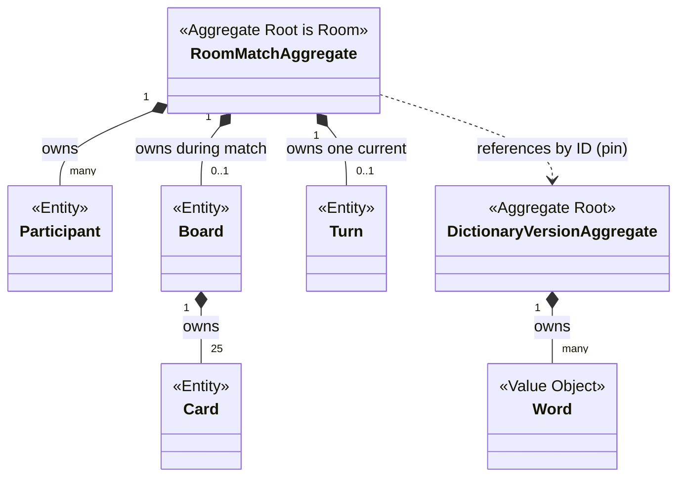
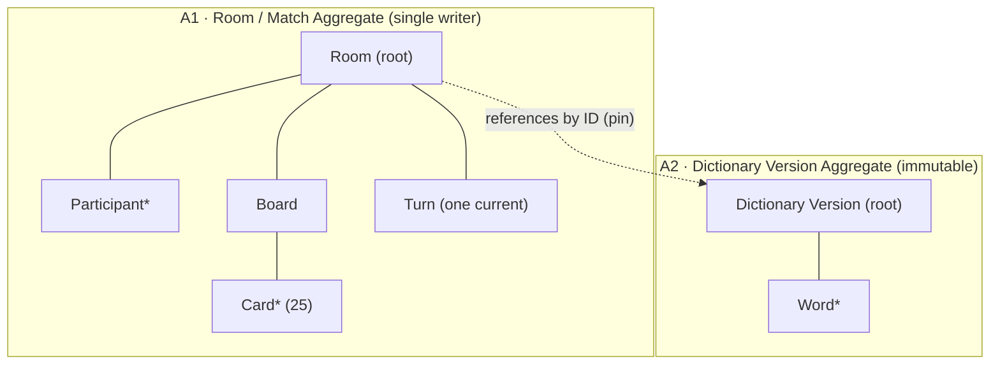
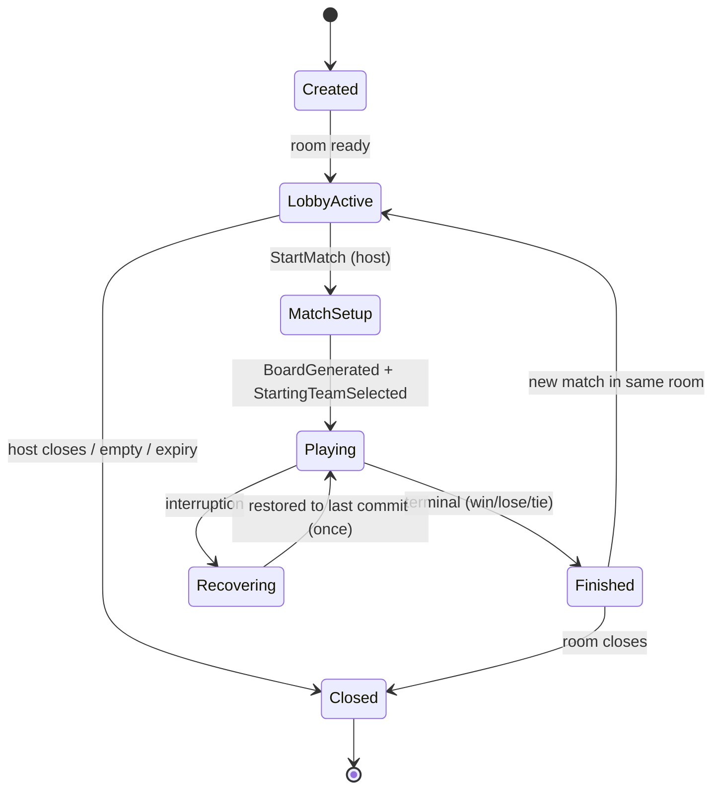

# Cluely — Aggregate Design

| | |
|---|---|
| **Document** | 08.05 — Aggregate Design |
| **Phase** | Software Design (fifth document) |
| **Version** | 1.0 |
| **Status** | Approved — canonical aggregate design (boundaries, entity/VO ownership, invariant & event ownership become frozen on approval) |
| **Technology** | **Neutral.** No persistence, database, repository, ORM, API, framework, class, or implementation concept appears. Purely conceptual. |
| **Purpose** | Refine the **internal structure** of the two approved aggregates — Room/Match and Dictionary Version — while preserving every architectural decision. Designs the *inside* of the aggregates (entities, value objects, invariant/event ownership, consistency boundary, lifecycle) without creating, splitting, or merging aggregates. |
| **Owner** | Lead Architect. |
| **Consumes (does not redefine)** | [Domain Model (08.01)](01-domain-model-and-ubiquitous-language.md), [Module Decomposition (08.02)](02-module-decomposition.md), [C4 Context (08.03)](03-c4-system-context.md), [C4 Container (08.04)](04-c4-container-diagram.md), [ADR-000…ADR-010](../07-software-architecture/12-decisions/README.md), [Business Rules](../02-business-analysis/02-business-rules.md), [Business Invariants](../02-business-analysis/10-business-invariants.md), [Domain Events](../02-business-analysis/11-domain-events-catalog.md), [SRS](../02-business-analysis/01-software-requirements.md). |

> **Reading contract.** The two aggregates are **locked** by [08.01 §3](01-domain-model-and-ubiquitous-language.md#3-aggregate-discovery);
> this document **refines their internals**, it does not reopen boundaries. Every entity, value object,
> invariant, and event is the one already classified in 08.01 — cited, not invented. The discriminating
> rule throughout: *what does frozen 08.01 already classify this as, and where is it actually enforced?*
> Terminology follows [ADR-000](../07-software-architecture/12-decisions/ADR-000-architecture-vocabulary.md).
> Mermaid is used as the same conscious, prompt-driven exception to the ASCII house style.

---

## Table of Contents
1. [Purpose](#1-purpose)
2. [Aggregate Identification](#2-aggregate-identification)
3. [Aggregate Responsibilities](#3-aggregate-responsibilities)
4. [Aggregate Boundaries](#4-aggregate-boundaries)
5. [Aggregate Root Design](#5-aggregate-root-design)
6. [Internal Entity Design](#6-internal-entity-design)
7. [Value Object Design](#7-value-object-design)
8. [Aggregate Relationships](#8-aggregate-relationships)
9. [Aggregate State Model](#9-aggregate-state-model)
10. [Aggregate Lifecycle](#10-aggregate-lifecycle)
11. [Consistency Boundary](#11-consistency-boundary)
12. [Invariant Enforcement Matrix](#12-invariant-enforcement-matrix)
13. [Domain Event Production](#13-domain-event-production)
14. [Aggregate Interaction Scenarios](#14-aggregate-interaction-scenarios)
15. [Aggregate Evolution](#15-aggregate-evolution)
16. [Aggregate Smell Analysis](#16-aggregate-smell-analysis)
17. [Architecture Compliance Review](#17-architecture-compliance-review)
18. [Aggregate Fitness Functions](#18-aggregate-fitness-functions)
19. [Aggregate Readiness Review](#19-aggregate-readiness-review)

---

## 1. Purpose

**What an Aggregate is.** An **aggregate** is the consistency unit of related state that changes
together under a single authority, whose invariants must always hold as a whole ([ADR-000](../07-software-architecture/12-decisions/ADR-000-architecture-vocabulary.md#aggregate)).
It has one **root** (the only entry point), a boundary, and internal entities/value objects that
outsiders reference only through the root, by identity.

**Why aggregates exist.** They make the atomic boundary of mutation and consistency explicit: one
writer, one transaction, all-or-nothing invariant preservation. For Cluely this is how fairness
guarantees (reveal + counts + turn + terminal) hold together.

**Why aggregate design matters.** It fixes *what is inside the box* — entity identity, value-object
immutability, invariant ownership, event production — so implementation conforms to one model rather
than inventing boundaries. On approval these become **frozen** inputs to application-layer and
technical design.

**How it differs from adjacent artifacts.**
| Artifact | Concern | This document's relationship |
|----------|---------|------------------------------|
| [Domain Model (08.01)](01-domain-model-and-ubiquitous-language.md) | *What* concepts exist & which are aggregates | We **refine the internals** of the aggregates it fixed. |
| [Module Decomposition (08.02)](02-module-decomposition.md) | Code cohesion (modules) | Aggregates live *inside* modules (A1 in C1/C2; A2 in C3); we don't touch module boundaries. |
| [C4 (08.03/08.04)](04-c4-container-diagram.md) | System/container visualization | We zoom *inside* a container to the aggregate. |
| Technical Design (09) | Technology mapping | We choose **no** technology, persistence, or class shape. |

---

## 2. Aggregate Identification

Validated against [08.01 §3](01-domain-model-and-ubiquitous-language.md#3-aggregate-discovery) — the
two aggregates are **unchanged**; this section restates, it does not reopen.

| Aggregate | Root | Why it is an aggregate |
|-----------|------|------------------------|
| **A1 · Room / Match** | Room | All in-room/in-match invariants must hold together under one single-writer authority ([ADR-001](../07-software-architecture/12-decisions/ADR-001-overall-architecture-style.md)/[ADR-003](../07-software-architecture/12-decisions/ADR-003-per-room-coordination-model.md)); reveal/counts/turn/terminal commit atomically. |
| **A2 · Dictionary Version** | Dictionary Version | Immutable, versioned, country-scoped content with a distinct lifecycle and authority; referenced by ID only ([ADR-008](../07-software-architecture/12-decisions/ADR-008-dictionary-content-architecture.md)). |

**Why everything else is not an aggregate.**
- **Match** is the Game-State **scope** of Room ([08.01 §4.5](01-domain-model-and-ubiquitous-language.md#45-turn-entity-within-match)), not a peer aggregate — it shares Room's writer and consistency boundary.
- **Participant, Board, Card, Turn** are **internal entities** of A1 — consistency-coupled to the Room; separating them would force cross-aggregate transactions ([08.01 §15](01-domain-model-and-ubiquitous-language.md#15-aggregate-boundary-validation)).
- **Team, Host, Clue, Presence, Word** are **value objects / derived / assignments**, not aggregates (§7).
- **Administration, Tournament, Identity** are **future** and out of scope ([08.01 §17](01-domain-model-and-ubiquitous-language.md#17-future-evolution)).

**No aggregate is created, split, or merged here.**

### Aggregate structure (conceptual — ownership & containment only)



*Conceptual only — no methods, no fields, no visibility markers. `*--` = ownership/containment;
`..>` = reference-by-ID.*

---

## 3. Aggregate Responsibilities

### A1 · Room / Match
- **Purpose:** Be the sole authority and consistency unit for one room and its ≤1 active Match.
- **Business responsibilities:** membership & host, team/role setup, dictionary pin, board/turn/clue/guess/reveal/terminal for the match ([BR-RC/JR/TA/ASN/HOST/HM/DC/GS/CL/GV/TO/WIN/LOSE/TIE](../02-business-analysis/02-business-rules.md)).
- **Owned concepts:** Room, Participant, Board, Card, Turn, the Key, Match scope.
- **Owned entities:** Participant, Board, Card, Turn (§6).
- **Owned value objects:** RoomCode, Team, RoleAssignment, HostAssignment, CardPosition, CardOwnership (Key), RevealFlag, Clue, GuessAllowance, RemainingCounts, GamePhase, GameResult, Version, DictionaryReference, Presence (§7).
- **Owned policies:** Participation, Host Transfer, Turn Progression, Victory, Board Generation, Dictionary Selection ([08.01 §12](01-domain-model-and-ubiquitous-language.md#12-domain-policies)).
- **Owned invariants:** all `INV-B*`, `INV-G*`, `INV-T*`, `INV-R*` (state), `INV-P1/P3/P5` (as owner), `INV-O*`, `INV-D3` (§12).
- **Owned state:** Room State (S-01), Game State (S-02/04), Board State (S-03), Version.
- **Owned events:** [EVT-1…EVT-21](../02-business-analysis/11-domain-events-catalog.md), EVT-24/25; reflects EVT-22/23.
- **Owned Commands:** CreateRoom, JoinRoom, LeaveRoom, TransferHost, RemoveParticipant, AssignTeam, AssignRole, SelectDictionary, StartMatch, SubmitClue, SubmitGuess, EndTurn.
- **Owned Queries:** RoomStatus (role-filtered views delegated to Delivery/C4).
- **Consumers:** C4 Delivery (projections), C6 Recovery (custody), Observability.
- **Extension points:** new Roles/Commands (spectator join) without new aggregates.

### A2 · Dictionary Version
- **Purpose:** Provide an immutable, versioned, country-scoped word set for board generation.
- **Business responsibilities:** supply ≥ 25 distinct words per region/version ([BR-DC](../02-business-analysis/02-business-rules.md)).
- **Owned concepts:** Dictionary Version, Word.
- **Owned entities:** none (Words are value objects).
- **Owned value objects:** Word, RegionCode, ContentVersion, word-count metadata (§7).
- **Owned policies:** publication/immutability ([ADR-008](../07-software-architecture/12-decisions/ADR-008-dictionary-content-architecture.md)).
- **Owned invariants:** `INV-D1`, `INV-D2` (§12).
- **Owned state:** Words + metadata (authoritative, immutable after publish).
- **Owned events:** version publication ([ADR-008](../07-software-architecture/12-decisions/ADR-008-dictionary-content-architecture.md)).
- **Owned Queries:** ResolveVersion, ResolveWords. **Owned Commands:** PublishVersion *(Admin/future)*.
- **Consumers:** A1 (resolves words by ID at board generation).
- **Extension points:** custom/premium/regional versions; pin-by-ID contract unchanged.

---

## 4. Aggregate Boundaries

| Dimension | A1 · Room / Match | A2 · Dictionary Version |
|-----------|-------------------|-------------------------|
| **Inside** | Room (root), Participant, Board, Card, Turn, all owned VOs, the Key | Dictionary Version (root), Words, region/version metadata |
| **Outside** | Dictionary content, delivery, sessions, custody mechanics | Any room/match/participant |
| **References** | Dictionary Version **by ID** (DictionaryReference) | none outward |
| **Forbidden references** | another Room; a live Dictionary object; delivery/connectivity objects held as state | any Room/Match/Participant |
| **Ownership** | single writer = Room root ([ADR-002](../07-software-architecture/12-decisions/ADR-002-authoritative-game-state.md)/[ADR-003](../07-software-architecture/12-decisions/ADR-003-per-room-coordination-model.md)) | Content authority; immutable after publish |
| **Lifecycle** | Created → Lobby → Match(Setup→Playing→Finished) → Closed/Expired (§10) | Draft → Published(immutable) → Deprecated |
| **Deletion** | room closure/expiry retires the aggregate (custody retired) | versions are retained/deprecated, never mutated |
| **Versioning** | monotonic **Version** per commit ([ADR-005](../07-software-architecture/12-decisions/ADR-005-state-recovery-resilience.md)) | RegionCode + ContentVersion identity; new content = new version |
| **Visibility** | role-filtered outward at Delivery ([ADR-006](../07-software-architecture/12-decisions/ADR-006-role-based-information-visibility.md)); the Key never leaves unfiltered | words are public content |
| **Identity** | RoomId (stable); RoomCode (lookup) | RegionCode + ContentVersion |

**Why the boundary exists.** A1's invariants are inherently whole-room/whole-match and must commit
atomically; A2 changes on an editorial cadence and must be immutable once pinned. Different
consistency needs, authorities, and lifecycles ⇒ two aggregates, referenced only by ID ([08.01 §15](01-domain-model-and-ubiquitous-language.md#15-aggregate-boundary-validation)).

---

## 5. Aggregate Root Design

### A1 root — **Room**
| Aspect | Design |
|--------|--------|
| **Responsibilities** | Sole entry point for all A1 mutation; holds membership/host/match; serializes and admits Commands; commits atomically; emits events. |
| **Allowed operations** | Accept validated Commands; delegate outcome computation to the Rules Core (C2); apply effects atomically; advance Version; produce events. |
| **Forbidden operations** | Adjudicating rules itself (C2 decides); transporting/filtering state (C4); holding sessions (C5); persistence mechanics (C6). |
| **State ownership** | Owns all A1 state; **only the root writes** ([ADR-002](../07-software-architecture/12-decisions/ADR-002-authoritative-game-state.md)). |
| **Consistency ownership** | Strong, within the room ([CB-01…CB-10](../07-software-architecture/06-consistency-boundaries.md)); no cross-room consistency ([ADR-007](../07-software-architecture/12-decisions/ADR-007-room-isolation-distribution.md)). |
| **Invariant enforcement** | Enforces all A1-owned invariants at command admission and commit (§12). |
| **Command admission** | Authorizes role/turn/participation (R-10 gate) **before** any effect; rejects out-of-turn/finished-match/capacity violations. |
| **Event production** | Emits committed Domain Events **after** commit (commit-then-broadcast). |
| **Version ownership** | Owns and monotonically advances **Version** on each commit. |
| **Recovery responsibility** | Requests restore; C6 replays to last commit; root resumes authority ([ADR-005](../07-software-architecture/12-decisions/ADR-005-state-recovery-resilience.md)). |
| **Identity** | RoomId (stable, opaque); RoomCode for human lookup. |
| **Why it alone controls A1** | One writer eliminates write races by construction; every invariant lies within its boundary, so one atomic commit preserves them all. |

### A2 root — **Dictionary Version**
| Aspect | Design |
|--------|--------|
| **Responsibilities** | Provide the immutable word set for a (RegionCode, ContentVersion). |
| **Allowed operations** | Answer resolution queries (ResolveWords/ResolveVersion). |
| **Forbidden operations** | Mutation after publish; referencing any room. |
| **State ownership** | Owns Words + metadata; frozen after publish. |
| **Consistency ownership** | Each version internally consistent; no cross-version consistency. |
| **Invariant enforcement** | `INV-D1/D2` at publication. |
| **Version ownership** | Identity *is* the version (RegionCode + ContentVersion). |
| **Recovery responsibility** | Trivial — immutable, reloadable by ID. |
| **Identity** | RegionCode + ContentVersion. |
| **Why it alone controls A2** | Immutability + single publication authority guarantee stable, reproducible content. |

---

## 6. Internal Entity Design

An entity has identity and a lifecycle. Below, each is validated against [08.01 §4](01-domain-model-and-ubiquitous-language.md#4-entity-discovery);
**candidates that 08.01 classifies otherwise are rejected** (§6.3).

### 6.1 A1 entities
| Entity | Identity | Purpose | Lifecycle | Owner | Mutability | Relationships | Forbidden |
|--------|----------|---------|-----------|-------|------------|---------------|-----------|
| **Room** *(root)* | RoomId | Hold membership/host/match; enforce invariants | Created→Lobby→Match→Closed | A1 | mutable (via root only) | contains Participant/Board/Turn; refs Dictionary Version by ID | being referenced from outside except by ID |
| **Participant** | ParticipantId | One person's membership, team/role, host flag, presence | Joining→Active→Disconnected(grace)→Left/Removed | A1 | mutable attrs | belongs to one Room; holds a Session by ID (C5) | referencing another Room; owning gameplay decisions |
| **Board** | one per Match (BoardId in match) | Hold 25 Cards, the Key, reveal state | Generated(once)→Revealing→Frozen | A1 | reveal flags only | contains 25 Cards | regenerating mid-match; exposing Key |
| **Card** | CardPosition (0–24) | One Word + immutable ownership + reveal flag | Unrevealed→Revealed (one-way) | A1 (Board) | RevealFlag only | part of one Board | changing Word/ownership; being referenced outside A1 |
| **Turn** | TurnId / sequence | Track active team, current Clue, allowance, guesses used | Started→AwaitingClue→AwaitingGuess→Ended | A1 | mutable | belongs to Match | existing more than one current ([INV-G2](../02-business-analysis/10-business-invariants.md)) |

### 6.2 A2 entities
A2 has **no internal entities** — a Dictionary Version's Words are **value objects** (immutable,
compared by value); there is no per-Word identity or lifecycle.

### 6.3 Rejected entity candidates (validation, not omission)
| Candidate | Correct classification | Why not an entity |
|-----------|------------------------|-------------------|
| **Match** | **Domain scope** of Room (Game State) | Shares Room's identity/writer; carries a MatchId for correlation but is not a peer entity ([08.01 §1.1/§4.5](01-domain-model-and-ubiquitous-language.md#11-structural--lifecycle-terms)). |
| **Word** | **Value Object** | Interchangeable if equal; no identity/lifecycle ([08.01 §5](01-domain-model-and-ubiquitous-language.md#5-value-object-discovery)). |
| **Team** | **Value Object** (Color + partition) | No identity beyond its color within a match. |
| **Host** | **Assignment** (a flag/VO on one Participant) | Not a separate-identity thing. |
| **Clue** | **Value Object** recorded on Turn | Immutable once submitted; no lifecycle. |

---

## 7. Value Object Design

A **value object (VO)** is immutable, has no identity, and is compared by value. Validated against
[08.01 §5](01-domain-model-and-ubiquitous-language.md#5-value-object-discovery). **Note the reverse
check:** the prompt lists "Guess" — but 08.01 classifies **Guess as a Command**, not a VO (its
*effects*, not the guess object, are the persisted facts); it is therefore **excluded** here. Prompt
names "Country/Locale/Version Reference" map to the **existing** VOs — Country→**RegionCode**,
Locale→**RegionCode**, Version Reference→**DictionaryReference** — so no new VO names are minted.

| Value Object | Purpose | Immutability | Equality | Creation | Owner | Usage | Forbidden behavior |
|--------------|---------|--------------|----------|----------|-------|-------|--------------------|
| **RoomId / ParticipantId** | Stable identity values | Immutable | By value | At creation | A1 | Identify root/participant | Reuse across rooms |
| **RoomCode** | Human room lookup | Immutable for room life | By value | At room creation | A1 | Join lookup | Colliding among live rooms ([INV-R2](../02-business-analysis/10-business-invariants.md) — enforced at registry, §12) |
| **Team / Color** | A side | Immutable per match | By value | At setup | A1 | Assign players | Changing mid-match ([INV-T5](../02-business-analysis/10-business-invariants.md)) |
| **RoleAssignment** | (Team, Role) pair | Immutable per match | By value | At setup | A1 | Assign role | Two roles per player ([INV-T4](../02-business-analysis/10-business-invariants.md)) |
| **HostAssignment** | Who is host (a ParticipantId) | Replaced atomically | By value | At creation/transfer | A1 | Identify host | Two hosts ([INV-R1](../02-business-analysis/10-business-invariants.md)) |
| **CardPosition / Coordinate** | Grid location 0–24 | Immutable | By value | At board gen | A1 | Locate card | Duplicate positions |
| **CardOwnership (Key element)** | starting/second/neutral/assassin | Immutable after gen | By value | At board gen | A1 | Adjudication | Mutating post-gen ([INV-B5](../02-business-analysis/10-business-invariants.md)) |
| **RevealFlag** | Card revealed? | Set once (one-way) | By value | On reveal | A1 | Projection/adjudication | Un-revealing ([INV-B7](../02-business-analysis/10-business-invariants.md)) |
| **Clue** | (word, number) recorded | Immutable once submitted | By value | On SubmitClue | A1 (Turn) | Turn record + allowance | Mutation after submit |
| **GuessAllowance** | number + 1 | Immutable (computed) | By value | On clue | A1 (Turn) | Bound guesses | Exceeding ([INV-G6](../02-business-analysis/10-business-invariants.md)) |
| **RemainingCounts / Score** | Unrevealed agents per team | Immutable snapshot (recomputed) | By value | On reveal | A1 | Terminal check | Manual edit |
| **GamePhase** | Match stage | Immutable enum value | By value | On transition | A1 | Admission gates | Illegal transition |
| **GameResult** | (winner, reason) | Immutable at terminal | By value | At terminal | A1 | Record outcome | Changing after set ([INV-O4](../02-business-analysis/10-business-invariants.md)) |
| **Version** | Monotonic ordering | Immutable value; strictly increases | By value | On commit | A1 | Ordering/recovery | Decreasing/reuse |
| **DictionaryReference** | (RegionCode, ContentVersion) pin | Immutable per match | By value | At StartMatch | A1 | Resolve words by ID | Repointing after start ([INV-D3](../02-business-analysis/10-business-invariants.md)) |
| **RegionCode / ContentVersion** | Locale + version | Immutable | By value | At publication | A2 | Version identity | Reuse for different content |
| **Word** | A word string | Immutable | By value | At publication | A2 | Board words | Mutation |
| **Presence** | Derived connectivity status | Immutable snapshot | By value | From session | A1 (derived) | Display/grace | Being treated as authoritative gameplay |
| **VisibilityScope** | Fields a Role may see | Immutable | By value | At projection | (Delivery uses) | Role filtering | Widening for hidden info |
| **ReconnectToken** | Opaque reconnect credential | Immutable | By value | At session open | C5 | Reconnect | Carrying PII ([INV-P2](../02-business-analysis/10-business-invariants.md)) |

**Excluded (validation):** **Guess** — a **Command** ([08.01 Appendix A](01-domain-model-and-ubiquitous-language.md#appendix-a--domain-classification-matrix)),
not a VO.

---

## 8. Aggregate Relationships



- **Reference by ID:** A1 → A2 only, via DictionaryReference; never a live object handle.
- **Ownership:** A1 owns Participant/Board/Card/Turn; A2 owns Words.
- **Allowed references:** navigational **within** an aggregate; by-ID **across**.
- **Forbidden references:** A1 ↔ A1 (room isolation, [ADR-007](../07-software-architecture/12-decisions/ADR-007-room-isolation-distribution.md)); A2 → anything downstream.
- **Cross-aggregate communication:** A1 *queries* A2 for words at board generation (read-only); no callbacks.
- **Dependency rules:** A2 is upstream/immutable; A1 depends on A2 by ID (per [08.04 §6](04-c4-container-diagram.md#6-container-dependency-rules)).
- **No shared mutable state:** the two aggregates share nothing writable; A2 is read-only to A1.

---

## 9. Aggregate State Model

| Class | A1 · Room / Match | A2 · Dictionary Version |
|-------|-------------------|-------------------------|
| **Authoritative** | membership, host, team/role, Board+Key, reveal flags, current Turn, phase, GameResult, Version, DictionaryReference | Words, RegionCode, ContentVersion |
| **Derived** | GamePhase, whose-turn, RemainingCounts, Presence | word count/index |
| **Transient** | in-flight Command being validated | load buffers |
| **Recoverable** | all authoritative state (snapshot + committed tail) | the published version (by ID) |
| **Immutable** | the Key, card positions/words, a Finished result | the whole version after publish |
| **Read-only (to others)** | everything (via role-filtered projections) | words (public content) |
| **Versioned** | Version advances per commit | version *is* identity |
| **Terminal** | Finished Match (no resume, [INV-G7](../02-business-analysis/10-business-invariants.md)/[INV-O4](../02-business-analysis/10-business-invariants.md)) | Deprecated (retained, never mutated) |

**Ownership:** every authoritative cell above is written by exactly one root — A1's Room or A2's
Dictionary Version. No cell is co-owned.

---

## 10. Aggregate Lifecycle



| Phase | A1 behavior | A2 behavior |
|-------|-------------|-------------|
| **Creation** | Room created; Version=1; custody begins | — |
| **Initialization** | Host/membership/team/role in lobby | — |
| **Activation** | StartMatch pins DictionaryReference; board generated | resolves words by ID (read-only) |
| **Gameplay** | serialized clue/guess/reveal/turn commits; Version++ each | — |
| **Recovery** | replay committed tail to last commit, once | trivially reloadable by ID |
| **Completion** | terminal result committed; immutable | — |
| **Archiving** | room closed/expired; custody retired | version retained |
| **Deletion** | aggregate retired at closure | versions never deleted-in-place; deprecated |
| **Version evolution** | monotonic Version within room life | new content ⇒ new (RegionCode, ContentVersion) |

---

## 11. Consistency Boundary

| Property | Guarantee |
|----------|-----------|
| **Atomic operations** | Reveal + counts + turn change + terminal evaluation commit **together** (all-or-nothing). |
| **Invariant enforcement** | All A1 invariants hold at every commit boundary (§12). |
| **Command serialization** | The A1 root processes Commands one at a time, per room ([ADR-003](../07-software-architecture/12-decisions/ADR-003-per-room-coordination-model.md)). |
| **Version increment** | Each commit strictly increases **Version** ([ADR-005](../07-software-architecture/12-decisions/ADR-005-state-recovery-resilience.md)). |
| **Failure handling** | If a commit cannot complete, no partial state is exposed (commit-then-broadcast). |
| **Recovery** | Restore to the last committed state, **once**; no terminal re-fire ([ADR-005](../07-software-architecture/12-decisions/ADR-005-state-recovery-resilience.md)). |
| **Visibility guarantees** | Outward state is role-filtered; the Key never leaves unfiltered ([ADR-006](../07-software-architecture/12-decisions/ADR-006-role-based-information-visibility.md), [INV-B9](../02-business-analysis/10-business-invariants.md)). |
| **Replay behavior** | Deterministic — same committed inputs yield the same state ([AP-06](../06-architecture-governance/01-architecture-principles.md)). |
| **Terminal guarantees** | A Finished Match never resumes; a recorded result is immutable ([INV-G7](../02-business-analysis/10-business-invariants.md)/[INV-O4](../02-business-analysis/10-business-invariants.md)). |

**Scope:** the consistency boundary is **one room**. A2 versions are each internally consistent and
frozen. There is **no** cross-room or cross-aggregate transaction.

---

## 12. Invariant Enforcement Matrix

Every one of the 37 business invariants, with **two distinct columns**: the aggregate that **owns the
constrained state**, and **where enforcement actually happens** (root command-admission, Rules Core
adjudication, Delivery boundary, Connectivity, or the room-allocation **registry**). *Owning the state
is not the same as being the enforcement locus* — several invariants are owned by A1 but enforced
elsewhere, and one (INV-R2) is inherently **not** an A1 responsibility at all.

| Invariant | Owned by | Enforced at | Validation stage | Failure result | Recovery impact | Trace |
|-----------|----------|-------------|------------------|----------------|-----------------|-------|
| INV-B1 Exactly 25 cards | A1 (Board) | Rules Core (board gen) | Match start | Board rejected; no start | Regenerated only pre-start | [INV-B1](../02-business-analysis/10-business-invariants.md) |
| INV-B2 9/8/7/1 partition | A1 (Board) | Rules Core (board gen) | Match start | Invalid board rejected | — | [INV-B2](../02-business-analysis/10-business-invariants.md) |
| INV-B3 One Assassin | A1 (Board) | Rules Core (board gen) | Match start | Rejected | — | [INV-B3](../02-business-analysis/10-business-invariants.md) |
| INV-B4 Each card one ownership | A1 (Card) | Rules Core (board gen) | Match start | Rejected | — | [INV-B4](../02-business-analysis/10-business-invariants.md) |
| INV-B5 Ownership immutable after gen | A1 (Card) | Aggregate root | Every commit | Illegal mutation rejected | Key restored as-was | [INV-B5](../02-business-analysis/10-business-invariants.md) |
| INV-B6 Words distinct on board | A1 (Board) using A2 | Rules Core (board gen) | Match start | Rejected | — | [INV-B6](../02-business-analysis/10-business-invariants.md) |
| INV-B7 Reveal monotonic | A1 (Card) | Rules Core + root commit | Each guess | Re-reveal is a no-op | Replayed idempotently | [INV-B7](../02-business-analysis/10-business-invariants.md) |
| INV-B8 Board unchanged during match | A1 (Board) | Aggregate root | Every commit | Mutation rejected | Board restored | [INV-B8](../02-business-analysis/10-business-invariants.md) |
| INV-B9 Unrevealed ownership hidden from Operatives | **A1 (owns Key)** | **Delivery boundary (C4)** | Projection | Leak blocked (never emitted) | Re-derived filtered | [INV-B9](../02-business-analysis/10-business-invariants.md), [ADR-006](../07-software-architecture/12-decisions/ADR-006-role-based-information-visibility.md) |
| INV-G1 ≤ one active match per room | A1 | Aggregate root | StartMatch admission | Second start rejected | — | [INV-G1](../02-business-analysis/10-business-invariants.md) |
| INV-G2 Exactly one active turn | A1 (Turn) | Rules Core + root | Each turn change | Extra turn rejected | Single current restored | [INV-G2](../02-business-analysis/10-business-invariants.md) |
| INV-G3 ≤ one active clue | A1 (Turn) | Rules Core | SubmitClue | Second clue rejected | — | [INV-G3](../02-business-analysis/10-business-invariants.md) |
| INV-G4 Only active team acts | A1 | Root authorization (R-10 gate) | Command admission | Out-of-turn rejected | — | [INV-G4](../02-business-analysis/10-business-invariants.md) |
| INV-G5 ≥ one guess before voluntary end | A1 | Rules Core | EndTurn | Premature end rejected | — | [INV-G5](../02-business-analysis/10-business-invariants.md) |
| INV-G6 Guesses ≤ allowance | A1 (Turn) | Rules Core | Each guess | Over-guess rejected | — | [INV-G6](../02-business-analysis/10-business-invariants.md) |
| INV-G7 Finished match cannot resume | A1 | Aggregate root | Command admission | Post-terminal rejected | Terminal never re-fired | [INV-G7](../02-business-analysis/10-business-invariants.md) |
| INV-G8 Turns strictly alternate | A1 | Rules Core | Turn change | Illegal order rejected | — | [INV-G8](../02-business-analysis/10-business-invariants.md) |
| INV-T1 Exactly two teams | A1 | Aggregate root | Setup | Invalid setup rejected | — | [INV-T1](../02-business-analysis/10-business-invariants.md) |
| INV-T2 Player ≤ one team | A1 (Participant) | Aggregate root | Assign | Second team rejected | — | [INV-T2](../02-business-analysis/10-business-invariants.md) |
| INV-T3 ≤ one Spymaster per team | A1 | Aggregate root | Assign role | Second Spymaster rejected | — | [INV-T3](../02-business-analysis/10-business-invariants.md) |
| INV-T4 One role per player per match | A1 (Participant) | Aggregate root | Assign role | Conflicting role rejected | — | [INV-T4](../02-business-analysis/10-business-invariants.md) |
| INV-T5 Composition frozen during match | A1 | Aggregate root | Command admission | Mid-match change rejected | — | [INV-T5](../02-business-analysis/10-business-invariants.md) |
| INV-T6 Valid start composition | A1 | Aggregate root | StartMatch admission | Start rejected | — | [INV-T6](../02-business-analysis/10-business-invariants.md) |
| INV-R1 Exactly one Host | A1 | Aggregate root (host transfer) | Every commit | Zero/two-host state rejected | Single host restored | [INV-R1](../02-business-analysis/10-business-invariants.md) |
| **INV-R2 Room-code uniqueness among live rooms** | **Room-allocation registry (C1), not A1** | **Registry at room creation** | CreateRoom | Duplicate code rejected/regenerated | N/A (creation-time) | [INV-R2](../02-business-analysis/10-business-invariants.md); see note ↓ |
| INV-R3 Host is a member | A1 | Aggregate root | Every commit | Non-member host rejected | Corrected on restore | [INV-R3](../02-business-analysis/10-business-invariants.md) |
| INV-R4 Empty room not live | A1 + lifecycle (R-16) | Aggregate root / cleanup | On leave/expiry | Empty room closed | — | [INV-R4](../02-business-analysis/10-business-invariants.md) |
| INV-R5 Capacity never exceeded | A1 | Aggregate root | JoinRoom admission | Over-capacity join rejected | — | [INV-R5](../02-business-analysis/10-business-invariants.md) |
| INV-P1 Nickname unique **within a room** | A1 (Participant) | Aggregate root | JoinRoom admission | Duplicate nickname rejected | — | [INV-P1](../02-business-analysis/10-business-invariants.md) |
| INV-P2 Identity transient & PII-free | **Connectivity & Identity (C5)** | **C5 (session)** | Session open | PII rejected by design | — | [INV-P2](../02-business-analysis/10-business-invariants.md), [ADR-009](../07-software-architecture/12-decisions/ADR-009-participant-lifecycle-presence-session-continuity.md) |
| INV-P3 Disconnect ≠ immediate removal | A1 (presence) + C5 signals | Aggregate root (grace policy) | On disconnect | Grace window applied | Presence re-derived | [INV-P3](../02-business-analysis/10-business-invariants.md) |
| INV-P4 One active connection per identity | **Connectivity & Identity (C5)** | **C5 (session)** | Reconnect | Older connection superseded | — | [INV-P4](../02-business-analysis/10-business-invariants.md) |
| INV-P5 Role-appropriate view preserved | **A1 (owns state)** | **Delivery boundary (C4)** | Projection | Wrong-role view blocked | Re-derived filtered | [INV-P5](../02-business-analysis/10-business-invariants.md), [ADR-006](../07-software-architecture/12-decisions/ADR-006-role-based-information-visibility.md) |
| INV-D1 Dictionary affects words only | A2 (Content) | Design: Rules Core independent of content | Board gen | Rule coupling forbidden | — | [INV-D1](../02-business-analysis/10-business-invariants.md) |
| INV-D2 Version supplies ≥ 25 distinct words | A2 | A2 publication + selection admission | Publish / SelectDictionary | Unplayable version rejected | — | [INV-D2](../02-business-analysis/10-business-invariants.md) |
| INV-D3 Match's version fixed once started | A1 (DictionaryReference) | Aggregate root | Post-StartMatch | Repoint rejected | Pin restored | [INV-D3](../02-business-analysis/10-business-invariants.md) |
| INV-O1 One winner per completed match | A1 | Rules Core (terminal eval) | Terminal | Ambiguous result impossible | — | [INV-O1](../02-business-analysis/10-business-invariants.md) |
| INV-O2 Terminal evaluated after every reveal | A1 | Rules Core | Each reveal | Missed check impossible | Replayed | [INV-O2](../02-business-analysis/10-business-invariants.md) |
| INV-O3 Assassin overrides all | A1 | Rules Core (precedence) | Each reveal | Wrong precedence impossible | — | [INV-O3](../02-business-analysis/10-business-invariants.md), [Rule Precedence](../02-business-analysis/16-rule-precedence.md) |
| INV-O4 Recorded result immutable | A1 | Aggregate root (terminal state) | Post-terminal | Result change rejected | Result preserved | [INV-O4](../02-business-analysis/10-business-invariants.md) |

> **Why INV-R2 is not an A1 responsibility.** Room-code uniqueness is inherently **cross-instance**:
> one A1 aggregate *is* one room and, by room isolation ([ADR-007](../07-software-architecture/12-decisions/ADR-007-room-isolation-distribution.md)), cannot see or coordinate with other
> rooms' state. Uniqueness is therefore owned by a **room-allocation registry** in the Room & Lobby
> module (C1) that assigns codes **at creation time**. This does **not** violate isolation: an
> allocator is a creation-time function, not per-room *mutable* state shared between rooms. Contrast
> **INV-P1** (nickname uniqueness *within* a room), which is cleanly an A1 root responsibility. This
> owned-vs-enforced distinction is the reason the matrix has two columns.

---

## 13. Domain Event Production

Every approved event ([EVT-1…EVT-25](../02-business-analysis/11-domain-events-catalog.md)); **none invented**. Producer is the owning aggregate/root; events are emitted **after commit**.

| Event | Producer | Trigger | Version | Consumers | Ordering | Replay | Visibility | Recovery |
|-------|----------|---------|---------|-----------|----------|--------|-----------|----------|
| EVT-1 RoomCreated | A1 root | CreateRoom commit | v++ | Delivery | per-room | idempotent (RoomId) | all | from snapshot |
| EVT-2 PlayerJoined | A1 root | JoinRoom | v++ | Delivery | per-room | idempotent | all | tail |
| EVT-3 PlayerLeft | A1 root | LeaveRoom | v++ | Delivery, host transfer | per-room | idempotent | all | tail |
| EVT-4 RoomExpired | A1 root | expiry | v++ | Delivery, cleanup | terminal | idempotent | all | — |
| EVT-5 HostTransferred | A1 root | host leaves | v++ | Delivery | per-room | idempotent | all | tail |
| EVT-6 PlayerRemovedByHost | A1 root | RemoveParticipant | v++ | Delivery | per-room | idempotent | all | tail |
| EVT-7 RoomClosed | A1 root | close | v++ | Delivery, cleanup | terminal | idempotent | all | — |
| EVT-8 TeamChanged | A1 root | AssignTeam | v++ | Delivery | per-room | idempotent | all | tail |
| EVT-9 RoleChanged | A1 root | AssignRole | v++ | Delivery | per-room | idempotent | all | tail |
| EVT-10 DictionarySelected | A1 root | SelectDictionary | v++ | Delivery | per-room | idempotent | all | tail |
| EVT-11 GameStarted | A1 root | StartMatch | v++ | Play, Delivery | per-room | idempotent (MatchId) | all | tail |
| EVT-12 BoardGenerated | A1 root (via Rules Core) | board gen commit | v++ | Delivery (role-filtered) | after EVT-11 | idempotent | **Key→Spymaster only** | snapshot |
| EVT-13 StartingTeamSelected | A1 root | after board gen | v++ | Delivery | after EVT-12 | idempotent | all | tail |
| EVT-14 TurnStarted | A1 root | turn begins | v++ | Delivery | per-match | idempotent | all | tail |
| EVT-15 RoundStarted | A1 root | round begins | v++ | Delivery | per-match | idempotent | all | tail |
| EVT-16 ClueSubmitted | A1 root | SubmitClue commit | v++ | Delivery | after TurnStarted | idempotent | all | tail |
| EVT-17 GuessSubmitted | A1 root | SubmitGuess commit | v++ | Delivery | after ClueSubmitted | idempotent | all | tail |
| EVT-18 CardRevealed | A1 root | reveal commit | v++ | Delivery | after GuessSubmitted | idempotent (position) | all (now-revealed) | tail |
| EVT-19 TurnEnded | A1 root | turn ends | v++ | Delivery | per-match | idempotent | all | tail |
| EVT-20 RoundFinished | A1 root | round ends | v++ | Delivery | per-match | idempotent | all | tail |
| EVT-21 GameFinished | A1 root | terminal commit | v++ | Delivery, Analytics | terminal | idempotent (MatchId) | all | tail |
| EVT-22 PlayerDisconnected | C5→A1 | disconnect signal | v++ | Delivery, presence | per-room | idempotent | all | derived |
| EVT-23 PlayerReconnected | C5→A1 | reconnect | v++ | Delivery, presence, Recovery | per-room | idempotent | all | derived |
| EVT-24/25 GamePaused/Resumed | A1 root | pause/resume | v++ | Delivery | per-room | idempotent | all | tail |

**Future evolution:** new Roles change only the *visibility* column (e.g., spectator projections); no
new events are required for the covered scenarios. "ProjectionGenerated"/"VisibilityUpdated" are
**not** business events (Delivery activities) — consistent with [08.01 §7](01-domain-model-and-ubiquitous-language.md#7-domain-events).

---

## 14. Aggregate Interaction Scenarios

For each: aggregate · entity · state change · events · version · invariants upheld.

| Scenario | Aggregate/entity | State change | Events | Version | Invariants |
|----------|------------------|--------------|--------|---------|-----------|
| **Create Room** | A1 / Room | Room created; host set | EVT-1 | 1 | INV-R1/R2(registry)/R3 |
| **Join Room** | A1 / Participant | membership++ | EVT-2 | v++ | INV-R5, INV-P1 |
| **Start Match** | A1 / Room, Board | pin DictionaryReference; phase=Setup | EVT-10, EVT-11 | v++ | INV-T6, INV-D3, INV-G1 |
| **Generate Board** | A1 / Board, Card (×25) | Board+Key fixed | EVT-12, EVT-13 | v++ | INV-B1/B2/B3/B4/B6; Key→Spymaster (INV-B9) |
| **Submit Clue** | A1 / Turn | Clue recorded; allowance set | EVT-16 | v++ | INV-G3, INV-G4 |
| **Submit Guess** | A1 / Turn, Card | (see Reveal) | EVT-17 | v++ | INV-G4/G6 |
| **Reveal Card** | A1 / Card, counts | RevealFlag set; counts updated (atomic) | EVT-18 | v++ | INV-B7, INV-O2/O3 |
| **Turn End** | A1 / Turn | active team advances | EVT-19, EVT-14 | v++ | INV-G2, INV-G8 |
| **Reconnect** | A1 / Participant (+C5) | presence→connected; resync | EVT-23 | v++ | INV-P3/P4/P5 |
| **Recovery** | A1 (via C6) | restore to last commit, once | (none new) | last | INV-G7, replay determinism |
| **Finish Match** | A1 / Room | terminal result committed | EVT-21 | v++ | INV-O1/O3/O4, INV-G7 |

**Aggregate interaction — Start Match + Generate Board (A1 ↔ A2 by ID):**

```mermaid
sequenceDiagram
    actor Host
    participant A1 as A1 Room-Match root
    participant A2 as A2 Dictionary Version
    Host->>A1: StartMatch (Command)
    A1->>A1: authorize + validate start composition (INV-T6)
    A1->>A2: ResolveWords (by DictionaryReference)
    A2-->>A1: immutable word set (>= 25 distinct)
    A1->>A1: generate Board + Key (INV-B1..B6), commit, Version++
    A1-->>Host: committed (GameStarted, BoardGenerated)
    Note over A1,A2: A2 is referenced by ID and read-only; no shared mutable state
```

---

## 15. Aggregate Evolution

Each future capability is absorbed **without** creating, splitting, or merging aggregates (restates
[08.01 §17](01-domain-model-and-ubiquitous-language.md#17-future-evolution)).

| Capability | Mechanism | Aggregate boundary change |
|-----------|-----------|---------------------------|
| Authentication | Participant gains optional `accountId` VO at the future-auth seam | **None** |
| Spectators | New Role (VO) + Visibility rule | **None** |
| Bots / AI | Participant whose Commands are machine-generated | **None** |
| Organizations | External context referencing IDs | **None** (new context, not new A1/A2 internals) |
| Ranked | Analytics consumes committed events (EVT-21) | **None** |
| Tournament | New future aggregate structuring Matches by ID | **None** to A1/A2 |
| Premium Content | New immutable Dictionary Versions | **None** (A2 adds versions) |

**Guarantee:** every extension adds a Role/VO inside an aggregate or a new context **outside** — never
a change to A1/A2 boundaries or ownership.

---

## 16. Aggregate Smell Analysis

Each: **Attack · Expected Failure · Architectural Protection · Residual Risk · Mitigation.**

| # | Attack | Expected failure | Protection | Residual risk | Mitigation |
|---|--------|------------------|------------|---------------|------------|
| 1 | God Aggregate (A1 too big) | Unmaintainable/contended | A1 is **bounded** (one room, 25 cards, one turn); human-paced ([08.01 §16](01-domain-model-and-ubiquitous-language.md#16-domain-smells)) | Scope creep into A1 | Keep adjudication in Rules Core; fitness FF-AG-1 |
| 2 | Leaky Aggregate (Key escapes) | Hidden-info leak | Key filtered at Delivery; never emitted raw (INV-B9) | New projection path | FF-AG-7; single delivery boundary |
| 3 | Shared mutable state | Race/corruption | Only the root writes; A2 immutable (§9) | A "cache" shared | Only Delivery caches (derived) |
| 4 | Multiple writers to A1 | Divergent truth | Single writer per room ([ADR-003](../07-software-architecture/12-decisions/ADR-003-per-room-coordination-model.md)); ownership fencing ([ADR-007](../07-software-architecture/12-decisions/ADR-007-room-isolation-distribution.md)) | Distribution bug | FF-AG-2; epoch fencing |
| 5 | Hidden references (live Dictionary object) | Coupling/mutation | A1→A2 **by ID only** (§8) | Convenience handle added | FF-AG-6; reference-by-ID check |
| 6 | Cross-aggregate transaction | Distributed transaction | A2 read-only; commit is A1-only atomic | Custody+commit split | Commit-then-broadcast |
| 7 | Aggregate split/merge | Boundary drift | Boundaries frozen (§2/§4) | Framework tempts a merge | Technical Design maps onto, can't redraw |
| 8 | Entity escaping aggregate | External mutation | Entities referenced only by ID within projections | Handle leaked in a view | FF-AG-5; entities never leave A1 |
| 9 | Duplicate ownership | Diffused guarantee | One owner each (§12), owned-vs-enforced explicit | Owner/enforcer confusion | Two-column matrix (§12) |
| 10 | Stale versions | Wrong ordering | Monotonic Version ([ADR-005](../07-software-architecture/12-decisions/ADR-005-state-recovery-resilience.md)) | Cached old version shown | FF-AG-8; version compare |
| 11 | Identity confusion | Wrong room/card acted on | Typed VOs (RoomId, CardPosition) not bare primitives | Mixed IDs | FF-AG-5; identity VOs |
| 12 | Event inconsistency | Consumers diverge | Events post-commit, ordered per room, idempotent (§13) | Duplicate delivery | Idempotent keys |
| 13 | Recovery inconsistency | Truth changed on restore | Replay to last commit, once; no terminal re-fire | Replay reorders | FF-AG-10; deterministic replay |
| 14 | Dictionary mutability | Content changes under a match | A2 immutable after publish ([ADR-008](../07-software-architecture/12-decisions/ADR-008-dictionary-content-architecture.md)); INV-D3 pins per match | Editorial republishes same version | FF-AG-9; immutability + pin-by-ID |

---

## 17. Architecture Compliance Review

| Source | Requirement | Compliance |
|--------|-------------|------------|
| [ADR-000](../07-software-architecture/12-decisions/ADR-000-architecture-vocabulary.md) | Vocabulary | Entities/VOs use approved terms; none invented. ✅ |
| [ADR-001](../07-software-architecture/12-decisions/ADR-001-overall-architecture-style.md) | Single-writer, pure core | A1 root single writer; rules stay in Rules Core. ✅ |
| [ADR-002](../07-software-architecture/12-decisions/ADR-002-authoritative-game-state.md) | One authoritative state | Only A1 root writes A1; A2 root writes A2 (§5/§9). ✅ |
| [ADR-003](../07-software-architecture/12-decisions/ADR-003-per-room-coordination-model.md) | Serialized per-room | Root serializes Commands (§11). ✅ |
| [ADR-004](../07-software-architecture/12-decisions/ADR-004-real-time-communication-delivery.md) | Delivery separate | Aggregates emit; Delivery transports (§13). ✅ |
| [ADR-005](../07-software-architecture/12-decisions/ADR-005-state-recovery-resilience.md) | Snapshot + tail, once | Version + recovery (§10/§11). ✅ |
| [ADR-006](../07-software-architecture/12-decisions/ADR-006-role-based-information-visibility.md) | Visibility, Key hidden | INV-B9/P5 enforced at Delivery (§12). ✅ |
| [ADR-007](../07-software-architecture/12-decisions/ADR-007-room-isolation-distribution.md) | Room isolation | No A1↔A1 refs; INV-R2 via registry, isolation preserved (§12). ✅ |
| [ADR-008](../07-software-architecture/12-decisions/ADR-008-dictionary-content-architecture.md) | Immutable, by ID | A2 immutable; A1→A2 by ID; INV-D3 pin (§4/§8). ✅ |
| [ADR-009](../07-software-architecture/12-decisions/ADR-009-participant-lifecycle-presence-session-continuity.md) | Session/presence | INV-P2/P4 at Connectivity; Presence derived (§7/§12). ✅ |
| [ADR-010](../07-software-architecture/12-decisions/ADR-010-command-query-strategy.md) | Commands to root; Queries as projections | Guess = Command; reads via Delivery (§7/§13). ✅ |
| [08.01](01-domain-model-and-ubiquitous-language.md) | Domain model | Same two aggregates, entities, VOs; Match/Word/Guess classified per 08.01. ✅ |
| [08.02](02-module-decomposition.md) | Modules | A1 in C1/C2, A2 in C3; boundaries unchanged. ✅ |
| [08.03](03-c4-system-context.md)/[08.04](04-c4-container-diagram.md) | C4 views | Container boundaries intact; we zoomed inside. ✅ |

**Violations found:** none. **No persistence, repository, ORM, API, framework, or class shape
appears** (verified in §Validation).

---

## 18. Aggregate Fitness Functions

Objective, repeatable checks (`FF-AG-*`) that the aggregate design holds as the system evolves.

| # | Fitness function | Property guarded |
|---|------------------|------------------|
| **FF-AG-1** | Exactly **one Aggregate Root** per aggregate (Room; Dictionary Version). | Single entry point |
| **FF-AG-2** | Exactly **one writer** mutates A1 state (no path writes A1 outside the root). | ADR-002/003 |
| **FF-AG-3** | **No shared mutable state** between aggregates (A2 read-only to A1). | Isolation |
| **FF-AG-4** | **Every invariant has exactly one owner** and a defined enforcement locus (§12). | Ownership |
| **FF-AG-5** | **Every entity belongs to exactly one aggregate** and never leaves it except by ID. | Boundary integrity |
| **FF-AG-6** | **Every cross-aggregate reference is by ID** (no live handles). | ADR-008 |
| **FF-AG-7** | **No delivery path exposes unrevealed ownership** to a non-Spymaster. | INV-B9/P5, ADR-006 |
| **FF-AG-8** | **Version is monotonic** and strictly increases per commit. | ADR-005 |
| **FF-AG-9** | **A published Dictionary Version is immutable**; a match's pin never changes. | ADR-008, INV-D3 |
| **FF-AG-10** | **Replay is deterministic** and restores to the last commit exactly once (no terminal re-fire). | ADR-005 |
| **FF-AG-11** | **No cross-aggregate/cross-room transaction** exists. | ADR-007 |
| **FF-AG-12** | **Room-code uniqueness is enforced at the registry**, not inside an A1 aggregate (isolation intact). | INV-R2, ADR-007 |
| **FF-AG-13** | **Every value object is immutable** (change replaces value). | §7 |

---

## 19. Aggregate Readiness Review

**Overall assessment.** A complete, internally consistent aggregate design for the two frozen
aggregates. Entities, value objects, invariant ownership (with a precise owned-vs-enforced split),
event production, consistency boundary, and lifecycle are all specified and traced to approved
sources. **No** aggregate is created, split, or merged; **no** technology appears.

**Strengths.** The two-column invariant matrix resolves the owned-vs-enforced distinction rigorously
(notably INV-R2→registry, INV-B9/P5→Delivery, INV-P2/P4→Connectivity, INV-P1 clean for A1); validated
classifications reject Match/Word as entities and Guess as a VO; a single-writer root with atomic
commit and monotonic version; A2 immutable and referenced by ID; 13 fitness functions make the design
checkable.

**Remaining risks.** (1) A1 breadth — bounded but broad (mitigated, §16). (2) Registry correctness for
INV-R2 under distribution — an [ADR-007](../07-software-architecture/12-decisions/ADR-007-room-isolation-distribution.md) concern, not an aggregate gap. (3) Delivery-enforced invariants
(B9/P5) depend on the filtering being the sole outward path — guarded by FF-AG-7.

**Deferred decisions.** Persistence/storage shape, identity representation, serialization, transaction
mechanism, and any technology — all deferred to [09 Technical Design](../09-technical-design/README.md).

**Open questions (non-blocking).** Whether the room-allocation registry is later a first-class module
or a C1 responsibility (currently a C1 creation-time function); snapshot cadence ([ADR-005](../07-software-architecture/12-decisions/ADR-005-state-recovery-resilience.md)).

**Readiness for Application Layer Design.** **Ready.** Aggregate boundaries, entity/VO ownership,
invariant ownership, and event ownership are fixed — the direct inputs to **08.06 Application Layer
Design**, which will orchestrate Commands/Queries against these aggregates without redefining them.

**Recommendation.** Approve; on approval the aggregate structure is **frozen**. No later document may
redefine these boundaries or ownership rules.

### Validation checklist (self-verified)
| Check | Result |
|-------|--------|
| No new aggregates / split / merge | ✅ (A1, A2 unchanged) |
| Every entity has one owner | ✅ (§6) |
| Every value object is immutable | ✅ (§7, FF-AG-13) |
| Every invariant has one owner | ✅ (§12, two-column) |
| Every Domain Event already exists | ✅ (EVT-1…25; none invented) |
| No persistence / repository / ORM / API / technology | ✅ |
| No implementation / class shape | ✅ (classDiagram is containment-only) |
| Aggregate boundaries match 08.01 | ✅ |
| Container boundaries match 08.02 | ✅ |
| C4 diagrams remain valid | ✅ |
| ADR-000…ADR-010 remain satisfied | ✅ (§17) |
| Every diagram matches the written model | ✅ (class/ownership/lifecycle/interaction == §§2–14) |

---

## Revision History
| Version | Date | Change |
|---------|------|--------|
| 1.0 | 2026-07-04 | Initial canonical Aggregate Design for A1 Room/Match and A2 Dictionary Version. Refines internals (entities, value objects, roots, state model, lifecycle, consistency boundary) with a two-column invariant-enforcement matrix (owned-by vs enforced-at; INV-R2→room registry, INV-B9/P5→Delivery, INV-P2/P4→Connectivity), full EVT-1…25 production mapping, interaction scenarios, evolution, smell + adversarial review, ADR-000…010 + 08.01–08.04 compliance, and 13 fitness functions. Mermaid class/ownership/lifecycle/interaction diagrams. No aggregate created/split/merged; technology-neutral. |
