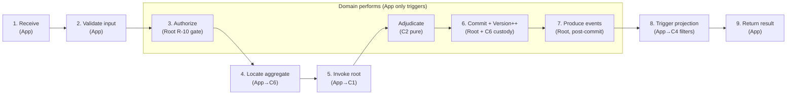
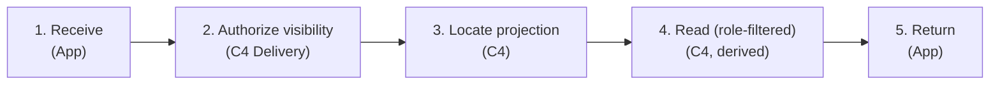
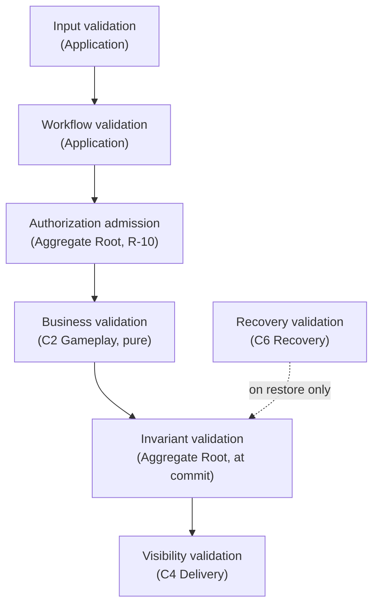
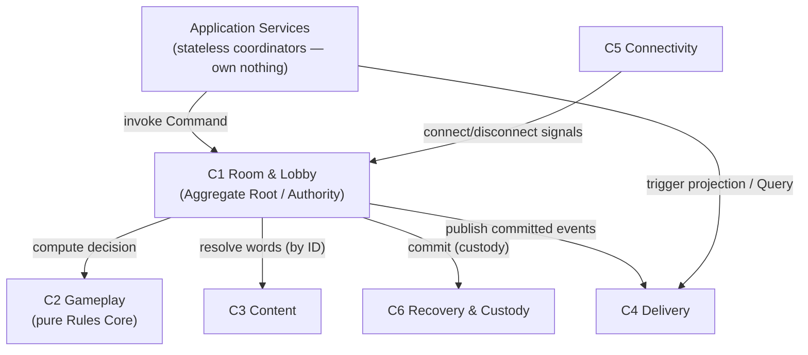

# Cluely — Application Layer Design

| | |
|---|---|
| **Document** | 08.06 — Application Layer Design |
| **Phase** | Software Design (sixth document) |
| **Version** | 1.0 |
| **Status** | Approved — canonical application-layer orchestration (workflows, command/query pipelines, validation/authorization layering, event publication, projection coordination become frozen on approval) |
| **Technology** | **Neutral.** No framework, mediator, CQRS library, controller, transport, repository, ORM, transaction manager, DI, broker, class, or interface appears. The Application Layer is a **logical responsibility**, not a framework. |
| **Purpose** | Define **how Commands and Queries are orchestrated** around the frozen domain: the command/query pipelines, use-case flows, validation and authorization layering, idempotency, error handling, event publication, and projection coordination — **coordinating** the approved aggregates without deciding rules, owning state, or bypassing Aggregate Roots or [ADR-010](../07-software-architecture/12-decisions/ADR-010-command-query-strategy.md). |
| **Owner** | Lead Architect / Senior Engineers. |
| **Consumes (does not redefine)** | [Domain Model (08.01)](01-domain-model-and-ubiquitous-language.md), [Module Decomposition (08.02)](02-module-decomposition.md), [C4 Context (08.03)](03-c4-system-context.md), [C4 Container (08.04)](04-c4-container-diagram.md), [Aggregate Design (08.05)](05-aggregate-design.md), [ADR-000…ADR-010](../07-software-architecture/12-decisions/README.md), [Business Rules](../02-business-analysis/02-business-rules.md), [Business Invariants](../02-business-analysis/10-business-invariants.md), [Domain Events](../02-business-analysis/11-domain-events-catalog.md), [Error Catalog](../02-business-analysis/12-business-error-catalog.md), [SRS](../02-business-analysis/01-software-requirements.md). |

> **Reading contract.** The Application Layer **coordinates**; the **Domain decides**; **Infrastructure
> executes/holds**. This is the single discriminator applied at every stage below. The Application
> Layer owns **no state and no aggregate** and is **not a new module/container** — it is the collective
> of stateless **Application Services** ([ADR-000](../07-software-architecture/12-decisions/ADR-000-architecture-vocabulary.md#application-service)) at the C1 command-intake seam (and the
> coordinator of C4 on the query side). Every Command routes **through an Aggregate Root**; every Query
> is **read-only**. Nothing here is invented — use cases, events, and modules are pulled from
> 08.01–08.05 and the ADRs.

---

## Table of Contents
1. [Purpose](#1-purpose)
2. [Application Responsibilities](#2-application-responsibilities)
3. [What the Application Layer MUST NOT Do](#3-what-the-application-layer-must-not-do)
4. [Command Pipeline](#4-command-pipeline)
5. [Query Pipeline](#5-query-pipeline)
6. [Use Case Catalog](#6-use-case-catalog)
7. [Workflow Orchestration](#7-workflow-orchestration)
8. [Validation Architecture](#8-validation-architecture)
9. [Authorization Flow](#9-authorization-flow)
10. [Idempotency Strategy](#10-idempotency-strategy)
11. [Error Handling Strategy](#11-error-handling-strategy)
12. [Event Publication](#12-event-publication)
13. [Projection Coordination](#13-projection-coordination)
14. [Long-Running Work](#14-long-running-work)
15. [Cross-Module Coordination](#15-cross-module-coordination)
16. [Application Layer Fitness Functions](#16-application-layer-fitness-functions)
17. [Architecture Compliance Review](#17-architecture-compliance-review)
18. [Application Readiness Review](#18-application-readiness-review)

---

## 1. Purpose

**What an Application Layer is.** A thin, **stateless** orchestration seam that turns an inbound
intent into a coordinated use-case flow: it *receives*, *validates input*, *locates* the target
aggregate, *invokes* it, *triggers* commit/publication/projection, and *returns* a result. In DDD
terms it is a set of **Application Services** ([ADR-000](../07-software-architecture/12-decisions/ADR-000-architecture-vocabulary.md#application-service)) — coordinators, not decision-makers.

**Why it exists.** To keep *orchestration* separate from *decision-making*. Without it, transport
would call the domain directly (or the domain would grow transport concerns); with it, there is one
place that sequences a use case and one place (the Domain) that decides outcomes.

**The coordinate / decide / execute split (the discriminator used throughout).**
| Role | Who | Owns |
|------|-----|------|
| **Coordinate** | **Application Layer** (Application Services) | the *verbs* of a use case: receive, validate-input, locate, invoke, trigger, return. **No state, no aggregate, no rules.** |
| **Decide** | **Domain** — Aggregate Root (C1) + pure Rules Core (C2) | authorization admission, adjudication, commit, Version++, event production. |
| **Execute / hold** | **Infrastructure** — Custody (C6), Delivery (C4), Connectivity (C5), Content (C3) | persistence-of-custody, transport+filtering, sessions, immutable content. |

**How it differs from adjacent artifacts.**
| Artifact | Concern | Relationship |
|----------|---------|--------------|
| [Domain (08.01/08.05)](05-aggregate-design.md) | *Decides* outcomes | The App **invokes** it; never replaces it. |
| [Architecture (ADRs)](../07-software-architecture/12-decisions/README.md) | Binding decisions | The App **conforms**; adds none. |
| Technical Design (09) | Technology mapping | Frameworks later **conform to** these flows. |
| Infrastructure | *Executes/holds* | The App **triggers** it; owns none of it. |
| Implementation | Code | Must realize these flows without changing them. |

> **Placement.** The Application Layer is **not a 7th module/container.** Command-side Application
> Services live at the **C1** command-intake seam ([08.04](04-c4-container-diagram.md)); query-side coordination fronts **C4**. It
> acquires **no** authoritative ownership — doing so would break [08.05](05-aggregate-design.md)'s "one owner each."

---

## 2. Application Responsibilities

Each responsibility is a **coordination verb** — the App triggers or sequences; the owner *performs*.

| Responsibility | What the App does (coordinate) | Who performs/owns (decide/execute) |
|----------------|--------------------------------|-------------------------------------|
| **Command orchestration** | Sequence the command pipeline (§4) | Aggregate Root decides & commits |
| **Query orchestration** | Sequence the query pipeline (§5) | C4 Delivery answers (projection) |
| **Workflow coordination** | Order the steps of a use case (§7) | Domain decides each step's outcome |
| **Aggregate loading** | *Locate* the target aggregate (by ID) | Custody (C6) holds it; Root is entry point |
| **Aggregate "saving" (conceptual)** | *Trigger* the Root's atomic commit | **Root** commits + Version++; **C6** holds custody — **no persistence/repository here** |
| **Event publication** | *Trigger* hand-off of committed events | **Root produces** events post-commit; C4 consumes (§12) |
| **Projection triggering** | *Request* a projection/read | **C4** builds & filters (§13) |
| **Authorization orchestration** | *Invoke* the checks in order | **Root** admits (role/turn); **C4** authorizes visibility (§9) |
| **Validation orchestration** | *Invoke* validators in order | Input→App; business/invariant→Domain; visibility→C4 (§8) |
| **Recovery coordination** | *Request* restore; resume the flow | **C6** replays; **Root** resumes authority (§14) |
| **Idempotency coordination** | Deduplicate intake by key | Root's idempotent handling + C6 replay-once + C4 idempotent consumption (§10) |
| **Result creation** | Assemble the outcome to return | (values already decided by Domain/Delivery) |

**Ownership rule:** the App owns the *coordination*; it never owns the *authoritative action*. It holds
**no state**.

---

## 3. What the Application Layer MUST NOT Do

Explicit rejections, each with the true owner.

| The App must NOT | Because it belongs to |
|------------------|-----------------------|
| Make business decisions / evaluate rules / run game logic | **C2 Gameplay** (pure Rules Core) — [08.05 §5](05-aggregate-design.md#5-aggregate-root-design) |
| Decide role/turn/participation admission | **Aggregate Root** (R-10 gate) — [08.05 §12](05-aggregate-design.md#12-invariant-enforcement-matrix) |
| Generate the board / select the key | **C2** board generation |
| Generate dictionaries / resolve content rules | **C3 Content** ([ADR-008](../07-software-architecture/12-decisions/ADR-008-dictionary-content-architecture.md)) |
| Filter projections by role / decide visibility | **C4 Delivery** ([ADR-006](../07-software-architecture/12-decisions/ADR-006-role-based-information-visibility.md)) |
| Own or mutate aggregate state | **Aggregate Root** ([ADR-002](../07-software-architecture/12-decisions/ADR-002-authoritative-game-state.md)) |
| Perform persistence / custody / recovery mechanics | **C6 Recovery & Custody** ([ADR-005](../07-software-architecture/12-decisions/ADR-005-state-recovery-resilience.md)) |
| Manage connections / network / transport | **C5 Connectivity** + transport (deferred) |
| Own identity / sessions | **C5 Connectivity & Identity** ([ADR-009](../07-software-architecture/12-decisions/ADR-009-participant-lifecycle-presence-session-continuity.md)) |
| Choose technology / frameworks / storage | **09 Technical Design** (deferred) |

**Consequence:** if any of the above appears in an Application Service, it is a boundary violation
(guarded by fitness functions, §16).

---

## 4. Command Pipeline

The lifecycle of a Command, with **coordinate vs perform** made explicit per stage. The App owns only
the verbs *receive, validate-input, locate, invoke, trigger, return*; it never commits, versions,
produces events, or filters.

| Stage | Application *coordinates* | Who *performs / owns* |
|-------|---------------------------|------------------------|
| **1. Receive** | Accept the intent; attach an idempotency key | — |
| **2. Validate input** | Well-formedness/shape of the intent | **App** (input only) |
| **3. Authorize** | *Invoke* admission | **Aggregate Root** (role/turn/participation — R-10 gate, [INV-G4](../02-business-analysis/10-business-invariants.md)) |
| **4. Locate aggregate** | Resolve target by ID | **C6** holds it; **Root** is the entry point |
| **5. Invoke aggregate** | Hand the validated intent to the Root | **Root** orchestrates; **C2** adjudicates (pure) |
| **6. Commit** | *Trigger* the atomic transition | **Root** commits + **Version++**; **C6** holds custody (commit-then-broadcast) |
| **7. Publish events** | *Trigger* hand-off | **Root produces** committed Domain Events **after** commit |
| **8. Trigger projection** | *Request* the read view | **C4** builds & **role-filters** |
| **9. Return result** | Assemble outcome (accepted/rejected + reference) | (decided by Domain) |

**Key:** stages 3, 5, 6, 7, 8 are *performed* by the Domain/Infrastructure; the App merely sequences
them. A Command **never** bypasses the Aggregate Root ([ADR-010](../07-software-architecture/12-decisions/ADR-010-command-query-strategy.md)).



---

## 5. Query Pipeline

The lifecycle of a Query — **read-only**, answered as a role-filtered Projection by C4. The App
coordinates; C4 authorizes visibility and reads.

| Stage | Application *coordinates* | Who *performs / owns* |
|-------|---------------------------|------------------------|
| **1. Receive** | Accept the read request | — |
| **2. Authorize visibility** | *Invoke* the visibility check | **C4 Delivery** (which Role may see what — [ADR-006](../07-software-architecture/12-decisions/ADR-006-role-based-information-visibility.md)) |
| **3. Locate projection** | Identify the target view | **C4** |
| **4. Read** | *Request* the projection | **C4** builds/reads (derived, never authoritative) |
| **5. Return** | Return the role-filtered view | — |



**Why Queries never modify state.** A Query reads a **derived Projection**, not authoritative state;
it holds no writer, never enters the Aggregate Root's command path, and Commands/Queries never cross
([ADR-010](../07-software-architecture/12-decisions/ADR-010-command-query-strategy.md)). Read-after-write is achieved via committed events delivered by C4, not by a
Query mutating anything.

---

## 6. Use Case Catalog

Every capability — pulled 1:1 from [08.04 §5](04-c4-container-diagram.md#5-interaction-catalogue) /
[08.05](05-aggregate-design.md); **none invented**. Commands route through the A1 root; Queries are
answered by C4.

| Use case | C/Q | Primary aggregate | Supporting | Produces events | Triggers projection | Recovery impact | Idempotency key | Authorization (admission owner) |
|----------|-----|-------------------|------------|-----------------|---------------------|-----------------|-----------------|---------------------------------|
| Create Room | C | A1 | — | EVT-1 | room view | new custody | (client req id) | registry (code) + root |
| Join Room | C | A1 | — | EVT-2 | membership | tail | (room,nick,req) | root (INV-R5/P1) |
| Leave Room | C | A1 | — | EVT-3 | membership | tail | (participant,req) | root |
| Transfer Host | C | A1 | — | EVT-5 | room view | tail | (req) | root (INV-R1) |
| Remove Participant | C | A1 | — | EVT-6 | membership | tail | (req) | root (host-only) |
| Assign Team | C | A1 | — | EVT-8 | lobby | tail | (req) | root (INV-T2) |
| Assign Role | C | A1 | — | EVT-9 | lobby | tail | (req) | root (INV-T3/T4) |
| Select Dictionary | C | A1 | A2 (by ID) | EVT-10 | lobby | tail | (req) | root |
| Start Match | C | A1 | A2 (resolve) | EVT-11, EVT-12, EVT-13 | board (Key→Spymaster) | snapshot | (req) | root (INV-T6, INV-D3) |
| Submit Clue | C | A1 | — | EVT-16 | turn view | tail | (turn,req) | root (INV-G3/G4) |
| Submit Guess | C | A1 | — | EVT-17, EVT-18, (EVT-19/21) | board/turn view | tail | (turn,req) | root (INV-G4/G6) |
| End Turn | C | A1 | — | EVT-19, EVT-14 | turn view | tail | (turn,req) | root (INV-G5) |
| Reconnect | C | A1 | C5 | EVT-23 | resync snapshot | none (durable) | (session) | C5 token + root |
| Close Room | C | A1 | — | EVT-7 | closed | — | (req) | root (host-only) |
| Get Room | Q | — | (reads A1) | — | room projection | — | n/a | C4 visibility |
| Get Board | Q | — | (reads A1) | — | board projection (role-filtered) | — | n/a | C4 visibility (Key→Spymaster) |
| Get Score | Q | — | (reads A1) | — | counts projection | — | n/a | C4 visibility |
| Get History | Q | — | (reads committed events) | — | history projection | — | n/a | C4 visibility |

---

## 7. Workflow Orchestration

For each phase: **Application** (coordinate) · **Domain** (decide) · **Delivery** (project) ·
**Recovery** (custody).

| Phase | Application coordinates | Domain decides | Delivery | Recovery |
|-------|-------------------------|----------------|----------|----------|
| **Room Creation** | receive CreateRoom; locate registry; invoke root; trigger publish | root creates room, sets host, Version=1; registry assigns unique code | broadcast RoomCreated | begin custody, snapshot |
| **Lobby** | sequence join/leave/team/role/host commands | root admits & commits each | project membership/lobby | append tail |
| **Match Setup** | invoke root StartMatch; trigger content resolve | root pins DictionaryReference; C2 generates board+Key | project board (Key→Spymaster only) | snapshot at start |
| **Gameplay** | sequence clue/guess/end-turn; trigger publish/project each | root authorizes; C2 adjudicates; root commits + Version++ | project per commit | commit each move |
| **Recovery** | request restore; resume flow | root resumes authority | resend snapshot on resume | replay tail to last commit, once |
| **Reconnect** | coordinate token check → resync | root re-attaches participant | resync role-filtered snapshot | (state already durable) |
| **Game Finish** | invoke terminal; trigger publish/project | C2 evaluates victory; root commits terminal (immutable) | broadcast GameFinished | final snapshot |

**Use-case orchestration — Submit Guess (the App as thin coordinator):**

```mermaid
sequenceDiagram
    actor Player
    participant App as Application Service
    participant C1 as C1 Aggregate Root
    participant C2 as C2 Gameplay pure
    participant C6 as C6 Custody
    participant C4 as C4 Delivery
    Player->>App: SubmitGuess (intent + idempotency key)
    App->>App: validate input, dedupe key (coordinate)
    App->>C1: invoke command
    C1->>C1: authorize admission (role / turn) R-10
    C1->>C2: compute decision (state + guess)
    C2-->>C1: outcome (reveal / counts / turn / terminal)
    C1->>C1: apply atomically, Version++
    C1->>C6: commit (custody)
    C6-->>C1: durability acknowledged
    C1-->>App: committed (events produced)
    App->>C4: trigger projection (coordinate)
    C4-->>Player: role-filtered projection
    Note over App,C4: App only coordinates; C1 decides & commits, C2 adjudicates, C4 filters
```

**Boundaries preserved:** the App never adjudicates, filters, or commits — it sequences the parties
that do.

---

## 8. Validation Architecture

Validation is **layered**, each layer with a single owner. The App owns **only input/workflow
well-formedness**; the Domain owns business/invariant admission; Delivery owns visibility.

| Validation layer | Question | Owner | Stage |
|------------------|----------|-------|-------|
| **Input validation** | Is the intent well-formed (shape, required fields)? | **Application** | Before invoking the root |
| **Authorization validation** | May this actor act now (role/turn/participation)? | **Aggregate Root** (R-10 gate) | Command admission |
| **Workflow validation** | Is this step valid for the current use-case sequence? | **Application** (orchestration) | During coordination |
| **Business validation** | Does the move satisfy the rules? | **C2 Gameplay** (pure) | Adjudication |
| **Invariant validation** | Do all aggregate invariants still hold? | **Aggregate Root** | At commit |
| **Recovery validation** | Is the restored state consistent to last commit? | **C6 Recovery** | On recovery |
| **Projection/visibility validation** | Does the outward view leak nothing hidden? | **C4 Delivery** | On projection |



**Rule:** the App may **reject early** on input/workflow grounds, but a business/invariant rejection is
the **Domain's** decision (surfaced via the [Error Catalog](../02-business-analysis/12-business-error-catalog.md)), not the App's.

---

## 9. Authorization Flow

Three distinct authorization concerns, **layered, never collapsed into the App**.

| Concern | Question | Owner | Notes |
|---------|----------|-------|-------|
| **Application authorization** | Is the request well-formed & in a sensible workflow position? | **Application** | Orchestration only — *not* a business decision |
| **Domain authorization (admission)** | May **this** actor act **now**? (participation, team, role, turn) | **Aggregate Root** (R-10 gate) | The authoritative "may act" decision ([INV-G4](../02-business-analysis/10-business-invariants.md), consistent with [08.05 §12](05-aggregate-design.md#12-invariant-enforcement-matrix)) |
| **Delivery authorization (visibility)** | Which **Role** may **see** what? | **C4 Delivery** | Query-side; role-filtering ([ADR-006](../07-software-architecture/12-decisions/ADR-006-role-based-information-visibility.md)) |

- **Who checks permissions / participation / role / turn:** the **Aggregate Root** (admission).
- **Who checks visibility:** **C4 Delivery**.
- **Who owns the final decision:** the **Root** for Commands; **Delivery** for Query visibility.
  **Never the Application Layer** — its role is orchestration only.

---

## 10. Idempotency Strategy

Idempotency **splits four ways**; the App owns only intake deduplication.

| Concern | Owner | Mechanism |
|---------|-------|-----------|
| **Duplicate Commands / client retries** | **Application** | Deduplicate by an idempotency key at intake; a duplicate is a no-op returning the prior result |
| **Idempotent command handling / monotonic version** | **Aggregate Root** | A replayed accepted command re-applies to the same result; Version is monotonic ([ADR-005](../07-software-architecture/12-decisions/ADR-005-state-recovery-resilience.md), [ADR-000 Idempotency](../07-software-architecture/12-decisions/ADR-000-architecture-vocabulary.md#idempotency-replay-safety)) |
| **Replay to last commit, once** | **C6 Recovery** | Recovery restores exactly once; no terminal re-fire |
| **Duplicate event consumption** | **C4 Delivery** | Consume committed events idempotently by key ([08.05 §13](05-aggregate-design.md#13-domain-event-production)) |
| **Duplicate Queries** | (harmless) | Queries are read-only; retries have no state effect |
| **Reconnect** | **C5 + App** | Token-validated resync; delivers current snapshot, no re-execution of moves |

**Rule:** the App deduplicates *intake*; it does **not** own replay-safety of the domain (Root) or of
recovery (C6) or of delivery (C4).

---

## 11. Error Handling Strategy

| Category | Owner (who decides it is an error) | Recovery | Visibility | Retry |
|----------|-----------------------------------|----------|------------|-------|
| **Validation (input)** | **Application** | Reject before invoking root; no state change | Return a clear rejection | Client may fix & resend |
| **Authorization (admission)** | **Aggregate Root** | Reject; no effect | Catalogued rejection | Not until eligible (e.g., own turn) |
| **Business-rule violation** | **C2 / Root** (Domain) | Reject; no effect | [Error Catalog](../02-business-analysis/12-business-error-catalog.md) code | Depends on rule |
| **Invariant violation** | **Aggregate Root** | Reject at commit; no partial state | Catalogued | No (would corrupt) |
| **Concurrency conflict** | **Aggregate Root** (serialized, so rare) | Re-serialize; first-valid-wins | Transparent (retry serialized) | Automatic ordering |
| **Recovery failure** | **C6 Recovery** | Retry restore; room paused until consistent | "reconnecting" | Automatic |
| **Projection failure** | **C4 Delivery** | Re-derive from committed state | Stale view, then refresh | Automatic on reconnect |
| **Unexpected failure** | Infrastructure | Fail safe; never expose partial/hidden state | Generic error | Bounded retry |

**Principle:** business/invariant errors are **Domain-owned rejections** (not App errors); the App
surfaces them, it does not author them. No error ever exposes incorrect or hidden state ([AP-05](../06-architecture-governance/01-architecture-principles.md)).

---

## 12. Event Publication

| Aspect | Design |
|--------|--------|
| **When** | **After commit only** (commit-then-broadcast) — never before the state change is durable. |
| **Who publishes** | The **Aggregate Root produces** committed Domain Events; the App merely *triggers* the hand-off; **C4** consumes/delivers. |
| **Ordering** | Total order **per room** (Version order); never assumed across rooms ([ADR-007](../07-software-architecture/12-decisions/ADR-007-room-isolation-distribution.md)). |
| **Version** | Each committed event carries the room's monotonically increasing Version. |
| **Failure handling** | If commit fails, no event is produced; if delivery fails, the committed truth is unaffected (C4 re-derives). |
| **Replay** | Events are idempotent by key; replay yields the same downstream state. |
| **Recovery** | On restore, C6 replays the committed tail; the Root does not re-fire terminal effects. |
| **Consumers** | C4 Delivery (projection), Observability/Analytics, C6 (tail persistence). |

**Why events are always post-commit.** Publishing before commit could reveal state that never becomes
authoritative (e.g., a half-applied reveal), violating consistency and possibly leaking hidden
information. Post-commit publication is the only safe order ([ADR-005](../07-software-architecture/12-decisions/ADR-005-state-recovery-resilience.md), [08.05 §11](05-aggregate-design.md#11-consistency-boundary)).

---

## 13. Projection Coordination

| Question | Answer |
|----------|--------|
| **When triggered** | After a commit (push) or on a Query (pull). |
| **Who requests** | The **Application Layer** *triggers*/coordinates. |
| **Who builds** | **C4 Delivery** (Projection Generation). |
| **Who owns** | **C4** — projections are **derived, never authoritative** ([08.05 §9](05-aggregate-design.md#9-aggregate-state-model)). |
| **Who filters** | **C4** (Visibility Evaluation — whitelist-by-inclusion; Key→Spymaster only). |
| **Who consumes** | Players/Host (role-filtered), via delivery. |
| **Relationship with Delivery** | The App **does not filter or build**; it requests, C4 performs. The App never sees or forwards unfiltered hidden state. |

**Rule:** projection building and role-filtering are **entirely C4's**; the App's only role is to
*trigger* them ([ADR-006](../07-software-architecture/12-decisions/ADR-006-role-based-information-visibility.md), [INV-B9](../02-business-analysis/10-business-invariants.md)).

---

## 14. Long-Running Work

Operations that may span time — each with a **coordinator** (App) and an **owner** (performer).

| Operation | Coordinator | Owner (performs) | Cancellation | Retry | Failure |
|-----------|-------------|------------------|--------------|-------|---------|
| **Recovery** | App requests restore | **C6** (replay), **Root** (resume) | not cancellable mid-replay (atomic to last commit) | automatic | room paused until consistent |
| **Reconnect** | App coordinates | **C5** (token), **Root** (re-attach), **C4** (resync) | client may abort | automatic within grace | fall back to disconnected/grace |
| **Dictionary resolution** | App requests at match start | **C3** (resolve by ID) | pre-start only | retry until resolved | match cannot start (safe) |
| **Room cleanup / expiry** | App/lifecycle triggers | **Root** (close), **C6** (retire custody) | n/a | idempotent | retried; eventually consistent |
| **Future matchmaking** | (future) App coordinates room creation | existing Commands | client | standard | no core change ([08.05 §15](05-aggregate-design.md#15-aggregate-evolution)) |

**Rule:** the App **coordinates** long-running work but never *performs* the recovery/session/content
mechanics — those remain with C6/C5/C3.

---

## 15. Cross-Module Coordination

How the Application Layer coordinates the six containers **without violating module ownership**
(respecting the dependency directions fixed in [08.04 §6](04-c4-container-diagram.md#6-container-dependency-rules): C1 depends on C2/C3/C6; **C4→C1** and **C5→C1** are the dependency edges, while publish/signal are one-way flows).



- **C1 (Root):** the App *invokes* it for Commands; it decides & commits. The App never writes state.
- **C2 (Gameplay):** invoked **by C1** (not the App) as a pure computation — the App never calls C2 directly for decisions.
- **C3 (Content):** resolved **by C1** at board generation; the App triggers Start Match, C1 pulls words by ID.
- **C4 (Delivery):** the App *triggers* projections/Queries; C4 builds & filters. Dependency runs **C4→C1**.
- **C5 (Connectivity):** signals **C1**; the App coordinates reconnect but doesn't own sessions.
- **C6 (Recovery):** the App *requests* commit/restore; C6 holds & replays.

**Rule:** the App coordinates **through** C1 for all authoritative action and **through** C4 for reads;
it never bypasses a Root, never calls C2 for a decision itself, and never owns any container's state.

---

## 16. Application Layer Fitness Functions

Objective checks (`FF-AL-*`) that the orchestration model holds as the system evolves.

| # | Fitness function | Property guarded |
|---|------------------|------------------|
| **FF-AL-1** | Every Command passes **through an Aggregate Root** (no direct state mutation). | ADR-002/010 |
| **FF-AL-2** | Every Query is **read-only** (no Query enters a command/commit path). | ADR-010 |
| **FF-AL-3** | **No business rule** is evaluated in an Application Service (rules only in C2/Root). | AAP-09 |
| **FF-AL-4** | The Application Layer holds **no state** and owns **no aggregate**. | 08.05 one-owner |
| **FF-AL-5** | **No infrastructure dependency** (persistence/transport/session) in an Application Service. | Coordinate-not-execute |
| **FF-AL-6** | Events are **published only after commit** (commit-then-broadcast). | ADR-005 |
| **FF-AL-7** | Each use case has **exactly one workflow owner** (one Application Service coordinates it). | Single coordinator |
| **FF-AL-8** | **Aggregate & module boundaries are unchanged** by any workflow. | 08.02/08.05 |
| **FF-AL-9** | **Authorization admission** is decided by the Root, **visibility** by Delivery — never by the App. | §9 |
| **FF-AL-10** | The App never **filters projections** or handles the Key. | ADR-006, INV-B9 |
| **FF-AL-11** | **Idempotency of the domain/recovery/delivery** is not owned by the App (App owns intake dedup only). | §10 |
| **FF-AL-12** | Query freshness is **never** a gameplay dependency (reads never gate Commands). | ADR-010 |

---

## 17. Architecture Compliance Review

| Source | Requirement | Compliance |
|--------|-------------|------------|
| [ADR-000](../07-software-architecture/12-decisions/ADR-000-architecture-vocabulary.md) | Vocabulary; Application Service = coordinator | Uses ADR-000 terms; App is a coordinator, owns nothing. ✅ |
| [ADR-001](../07-software-architecture/12-decisions/ADR-001-overall-architecture-style.md) | Thin orchestration over pure core | App thin/stateless; rules in C2. ✅ |
| [ADR-002](../07-software-architecture/12-decisions/ADR-002-authoritative-game-state.md) | One authoritative state | Only the Root writes; App triggers (§4). ✅ |
| [ADR-003](../07-software-architecture/12-decisions/ADR-003-per-room-coordination-model.md) | Serialized per-room | App invokes the serialized Root (§4/§7). ✅ |
| [ADR-004](../07-software-architecture/12-decisions/ADR-004-real-time-communication-delivery.md) | Delivery separate | App triggers C4; C4 transports (§13). ✅ |
| [ADR-005](../07-software-architecture/12-decisions/ADR-005-state-recovery-resilience.md) | Recovery, commit-then-broadcast | Events post-commit; C6 replays (§12/§14). ✅ |
| [ADR-006](../07-software-architecture/12-decisions/ADR-006-role-based-information-visibility.md) | Visibility at Delivery | App never filters; C4 does (§9/§13). ✅ |
| [ADR-007](../07-software-architecture/12-decisions/ADR-007-room-isolation-distribution.md) | Room isolation | No cross-room coordination; per-room order (§12/§15). ✅ |
| [ADR-008](../07-software-architecture/12-decisions/ADR-008-dictionary-content-architecture.md) | Content by ID | C1 resolves C3 by ID; App only triggers (§15). ✅ |
| [ADR-009](../07-software-architecture/12-decisions/ADR-009-participant-lifecycle-presence-session-continuity.md) | Session/presence | C5 owns sessions; App coordinates reconnect (§14). ✅ |
| [ADR-010](../07-software-architecture/12-decisions/ADR-010-command-query-strategy.md) | Commands to Root; Queries as projections | Command/Query pipelines conform exactly (§4/§5). ✅ |
| [08.01](01-domain-model-and-ubiquitous-language.md)/[08.05](05-aggregate-design.md) | Domain/aggregates | No new concepts; aggregates unchanged. ✅ |
| [08.02](02-module-decomposition.md)/[08.04](04-c4-container-diagram.md) | Modules/containers | No new module; dependency directions respected (§15). ✅ |
| [08.03](03-c4-system-context.md) | System context | Actors/boundary unchanged. ✅ |

**Violations found:** none. No framework, API, persistence, or class shape appears (verified in
§Validation).

---

## 18. Application Readiness Review

**Overall assessment.** A complete, technology-neutral Application Layer: command/query pipelines,
use-case catalog, layered validation and authorization, idempotency and error strategies, event
publication, projection coordination, long-running work, and cross-module coordination — every stage
resolved by the **coordinate / decide / execute** discriminator, so the App coordinates and owns
nothing authoritative.

**Strengths.** Explicit per-stage coordinate-vs-perform split (§4); three-way authorization and
four-way idempotency that keep decisions in the Domain (§9/§10); business/invariant errors owned by
the Domain not the App (§11); events strictly post-commit (§12); projection/filtering entirely in C4
(§13); 12 fitness functions; full ADR + 08.01–08.05 compliance.

**Remaining risks.** (1) Temptation to let an Application Service "just check a rule" — guarded by
FF-AL-3/9. (2) Intake idempotency-key design (a Technical-Design concern) — bounded here to *coordination*.
(3) The room-allocation registry's placement (from [08.05 §12](05-aggregate-design.md#12-invariant-enforcement-matrix)) surfaces at Create Room; still a C1 creation-time function.

**Deferred decisions.** All technology: mediator/CQRS library, transport (REST/real-time/RPC),
persistence/repository/transaction mechanism, DI, serialization — deferred to [09 Technical Design](../09-technical-design/README.md).

**Open questions (non-blocking).** Whether workflow coordination for future long-running sagas
(matchmaking/tournament) warrants a dedicated coordinator pattern — deferred with the features.

**Readiness for Technical Design.** **Ready.** The orchestration model, pipelines, validation/authorization
layering, and event/projection coordination are fixed. Every future framework (a mediator, a
controller, a real-time hub, an RPC service) must **conform to** these flows, not redefine them.

**Recommendation.** Approve; on approval the application workflows, command/query orchestration,
validation responsibilities, authorization flow, event publication, and projection coordination are
**frozen**. This is the primary input to 09 Technical Design.

### Validation checklist (self-verified)
| Check | Result |
|-------|--------|
| No business rules / aggregate / entity / VO / module / technology added | ✅ |
| No API / framework / persistence design | ✅ |
| Every Command goes through an Aggregate Root | ✅ (§4, FF-AL-1) |
| Every Query is read-only | ✅ (§5, FF-AL-2) |
| Events are post-commit only | ✅ (§12, FF-AL-6) |
| Delivery remains non-authoritative | ✅ (§13) |
| Recovery remains independent | ✅ (§14) |
| Gameplay remains pure | ✅ (§3/§15) |
| Aggregate & module ownership unchanged | ✅ (§17, FF-AL-8) |
| All diagrams match the written design | ✅ (command/query/validation/cross-module + sequence == §4/§5/§8/§15) |

---

## Revision History
| Version | Date | Change |
|---------|------|--------|
| 1.0 | 2026-07-04 | Initial canonical Application Layer Design. Defines the stateless Application-Service orchestration seam (owns no state/aggregate; not a new module) via a coordinate/decide/execute discriminator: command & query pipelines, use-case catalog (1:1 from 08.04/08.05), workflow orchestration, layered validation, three-way authorization, four-way idempotency, error strategy, post-commit event publication, C4-owned projection coordination, long-running work, and cross-module coordination respecting fixed dependency directions; 12 fitness functions; full ADR-000…010 + 08.01–08.05 compliance. Mermaid command/query/validation/cross-module + sequence diagrams. Technology-neutral; nothing invented. |
