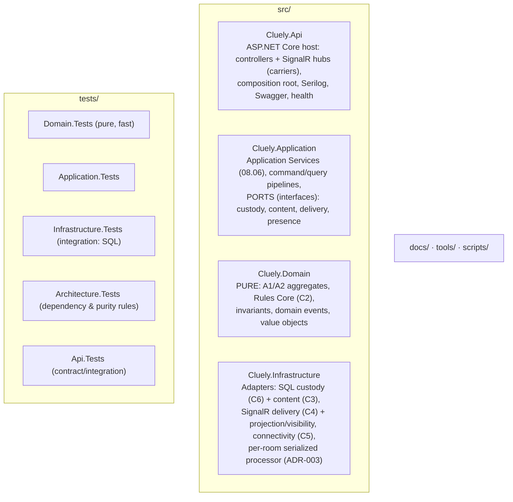
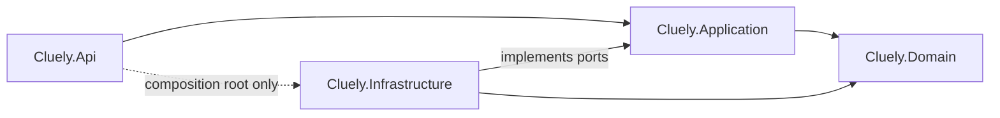
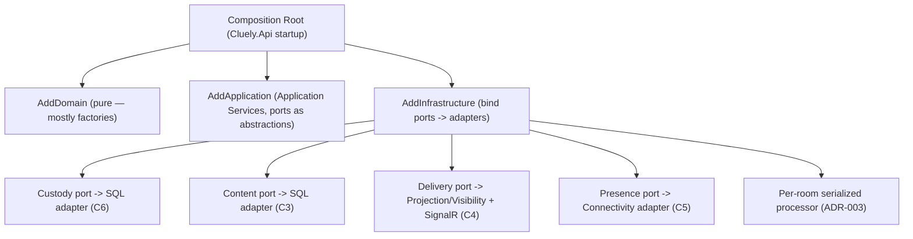
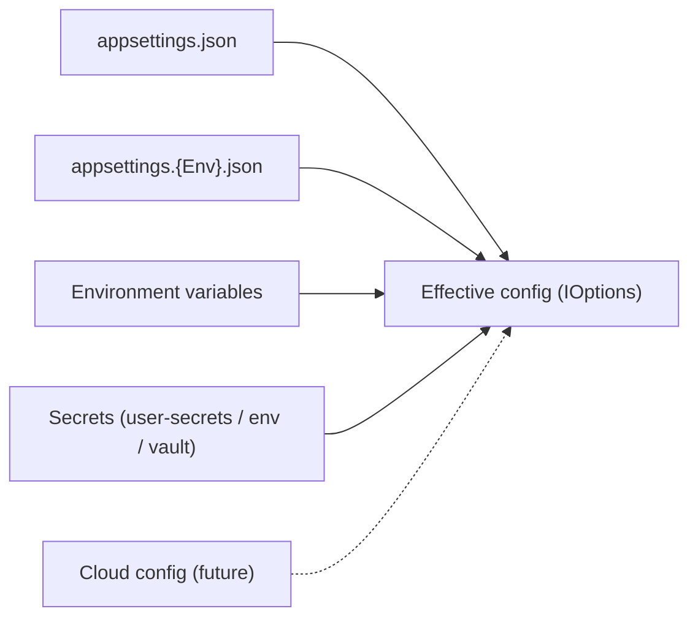

# Cluely — Technical Design Foundation & Technology Mapping

| | |
|---|---|
| **Document** | 09.01 — Technical Design Foundation & Technology Mapping |
| **Phase** | Technical Design (first document) |
| **Version** | 1.0 |
| **Status** | Approved — canonical technical foundation (technology stack, solution structure, layer/dependency directions, conventions become frozen on approval) |
| **Technology** | **Introduces the MVP stack** (.NET 10, ASP.NET Core, C#, SQL Server, SignalR, System.Text.Json, Serilog, FluentValidation, xUnit/FluentAssertions, Swagger, Docker/Linux). Every choice **realizes** the approved design; none redefines it. |
| **Purpose** | Answer *"how is the approved architecture and software design realized with concrete technologies, without changing any approved business or architectural decision?"* — the entry point of the Technical Design phase. |
| **Owner** | Lead Architect / Engineering Lead. |
| **Consumes (does not redefine)** | All Business docs, [Architecture Discovery + ADR-000…ADR-010](../07-software-architecture/README.md), and the full Software Design set [08.01–08.06](../08-software-design/README.md). |

> **Reading contract.** The single question carried through every section: *is this technology
> **conforming to** a frozen decision, or quietly **redefining** it?* The load-bearing rule: the live
> **authoritative state is the in-memory Room aggregate under the single writer** ([ADR-002](../07-software-architecture/12-decisions/ADR-002-authoritative-game-state.md)/[ADR-003](../07-software-architecture/12-decisions/ADR-003-per-room-coordination-model.md); the
> [Room Entity](../07-software-architecture/12-decisions/ADR-000-architecture-vocabulary.md#room-entity)); **SQL Server is State Custody** — it *holds* snapshots + a committed-event tail
> for recovery and **never adjudicates** ([ADR-005](../07-software-architecture/12-decisions/ADR-005-state-recovery-resilience.md), [ADR-000 State Custody](../07-software-architecture/12-decisions/ADR-000-architecture-vocabulary.md#state-custody)). This document sets the
> **foundation and conventions**; per-document technical designs (schema, API contracts, SignalR
> messages, security) follow in [09.02+](README.md) and must conform here.

---

## Table of Contents
1. [Purpose](#1-purpose)
2. [Technology Selection Philosophy](#2-technology-selection-philosophy)
3. [Technology Mapping Matrix](#3-technology-mapping-matrix)
4. [Solution Structure](#4-solution-structure)
5. [Layer Responsibilities](#5-layer-responsibilities)
6. [Package Strategy](#6-package-strategy)
7. [Coding Standards](#7-coding-standards)
8. [Dependency Injection Strategy](#8-dependency-injection-strategy)
9. [Configuration Strategy](#9-configuration-strategy)
10. [Error Handling Strategy](#10-error-handling-strategy)
11. [Serialization Strategy](#11-serialization-strategy)
12. [Validation Strategy](#12-validation-strategy)
13. [Logging & Observability](#13-logging--observability)
14. [Performance Strategy](#14-performance-strategy)
15. [Security Foundation](#15-security-foundation)
16. [Deployment Foundation](#16-deployment-foundation)
17. [Testing Foundation](#17-testing-foundation)
18. [Development Workflow](#18-development-workflow)
19. [Architecture Compliance & Fitness Functions](#19-architecture-compliance--fitness-functions)
20. [Technical Readiness Review](#20-technical-readiness-review)

---

## 1. Purpose

**Why Technical Design exists.** Architecture fixed *how the system must behave*; Software Design fixed
*the logical structure*; both are technology-neutral. Technical Design is where **concrete technology
is chosen to realize that design** — so an experienced .NET team can implement with a shared
understanding, while every architectural decision is preserved.

**How it differs from adjacent phases.**
| Phase | Concern | Relationship |
|-------|---------|--------------|
| [Architecture (07)](../07-software-architecture/README.md) | Binding decisions (ADRs) | TD **conforms**; never re-decides. |
| [Software Design (08)](../08-software-design/README.md) | Logical model (aggregates, modules, workflows) | TD **maps** it onto technology 1:1. |
| **Technical Design (09, this phase)** | *How*, concretely | Chooses stack + conventions; realizes the design. |
| Implementation (10) | Code | Must follow this foundation. |
| Operations (13) | Run it | Consumes deployment/observability conventions set here. |

This document is the **foundation**: it selects the stack, fixes the solution structure and dependency
directions, and sets cross-cutting conventions. It **defers** detailed designs (data schema, API/message
contracts, security mechanics) to their own TD documents.

---

## 2. Technology Selection Philosophy

For each choice: rationale · alternatives · why rejected for MVP · trade-off · future path. No
marketing language — each is justified by *conformance to the approved design* and MVP simplicity.

| Technology | Why chosen (conformance + MVP fit) | Alternatives considered | Rejected for MVP because | Trade-off | Future path |
|-----------|-------------------------------------|-------------------------|--------------------------|-----------|-------------|
| **.NET 10 / C#** | Mature, high-performance, first-class async/records/nullable — expresses pure Domain and stateless Application Services cleanly | Node/TS, Go, JVM | Team/ecosystem fit; strong typing for invariants; single stack for backend | Ecosystem lock-in | LTS upgrades |
| **ASP.NET Core** | Hosts the API; controllers/hubs are **carriers** of Commands/Queries ([ADR-010](../07-software-architecture/12-decisions/ADR-010-command-query-strategy.md)) | Minimal API only, other web frameworks | Full-featured hosting, DI, health, OpenAPI out of the box | Framework surface | Same host, more endpoints |
| **SignalR** | Realizes the [ADR-004](../07-software-architecture/12-decisions/ADR-004-real-time-communication-delivery.md) real-time **delivery boundary** — transport only; filtering happens **before** it | raw WebSockets, SSE, gRPC streaming | Managed connection/reconnect/groups; least custom transport code | Server-affinity per connection | Backplane later (Redis) if distributed |
| **SQL Server** | Realizes **State Custody (C6)** — durable snapshot + committed-event tail for recovery ([ADR-005](../07-software-architecture/12-decisions/ADR-005-state-recovery-resilience.md)) and immutable **Content (C3)** ([ADR-008](../07-software-architecture/12-decisions/ADR-008-dictionary-content-architecture.md)) | PostgreSQL, event store, NoSQL | Team familiarity; transactional durability for custody | Vendor coupling (isolated behind ports) | Swappable via custody port |
| **System.Text.Json** | Serialize API/SignalR payloads and snapshots; no extra dependency | Newtonsoft.Json | Built-in, fast, sufficient | Fewer knobs than Newtonsoft | Source-gen if needed |
| **FluentValidation** | **Input** validation at the carrier/Application edge (well-formedness only) | DataAnnotations, manual | Expressive, testable input rules | Another dependency | Stable |
| **Serilog** | Structured logging + correlation | built-in `ILogger` only | Structured sinks, enrichers | Dependency | OpenTelemetry export later |
| **xUnit + FluentAssertions** | Unit/integration/architecture tests | NUnit/MSTest | Team standard; readable assertions | — | Stable |
| **Swagger/OpenAPI** | Document the HTTP surface | manual docs | Generated, always-current | — | Contract tests off the spec |
| **Docker / Linux** | Reproducible single-node deployment | VM, bare metal | Portable, cheap, standard | Container ops | Orchestration when scaling |
| **Manual mapping** | Explicit Domain↔model mapping; no hidden behavior | AutoMapper | Mapping is trivial and safety-critical; avoid reflection magic | Boilerplate | Revisit only if it dominates |
| **No MediatR / no broker / no cache / single node** | 08.06 fixed the Application Layer as **not a framework**; MVP is single-node ([ADR-001](../07-software-architecture/12-decisions/ADR-001-overall-architecture-style.md)/[ADR-007](../07-software-architecture/12-decisions/ADR-007-room-isolation-distribution.md)) | MediatR, RabbitMQ/Kafka, Redis | Hand-rolled Application Services suffice; no distribution yet | Manual wiring | Add only when a driver appears |
| **No authentication** | MVP has none; the **future-auth seam** is isolated ([ADR-009](../07-software-architecture/12-decisions/ADR-009-participant-lifecycle-presence-session-continuity.md)) | JWT/OAuth now | Not required for private-room MVP | Anonymous rooms | JWT/OAuth/external IdP at the seam |

---

## 3. Technology Mapping Matrix

Every approved logical concept, mapped to technology **with the constraint that must survive the
mapping**. This is the heart of the document: technology *carries* or *holds*; it never *decides*.

| Frozen concept | Container | Technology realization | Constraint that must survive |
|----------------|-----------|------------------------|------------------------------|
| A1 Room/Match aggregate, A2 Dictionary Version ([08.05](../08-software-design/05-aggregate-design.md)) | C1/C3 | **`Cluely.Domain`** — pure C# aggregate types, VOs, domain events | **Zero framework references** (no ASP.NET/EF/SignalR/JSON attributes) |
| Rules Core, adjudication ([08.02 C2](../08-software-design/02-module-decomposition.md)) | C2 | Pure C# domain services in `Cluely.Domain` | Deterministic, no I/O, no language/transport ([AAP-09](../06-architecture-governance/02-architecture-anti-principles.md)) |
| Application Services ([08.06](../08-software-design/06-application-layer-design.md)) | (App seam) | **`Cluely.Application`** — plain stateless classes; define **ports** (interfaces) | Coordinate only; own no state; no rules |
| Commands / Queries ([ADR-010](../07-software-architecture/12-decisions/ADR-010-command-query-strategy.md)) | — | Request models / read models (POCOs) | **Carriers**: controllers/hub ship them; carry no logic |
| Single writer per room ([ADR-003](../07-software-architecture/12-decisions/ADR-003-per-room-coordination-model.md)) | C1 | In-process **per-room serialized processor** (holds the in-memory aggregate) | One writer per room; mechanism is single-node; **requirement unchanged** |
| Authoritative Game State ([ADR-002](../07-software-architecture/12-decisions/ADR-002-authoritative-game-state.md)) | C1 | **In-memory** Room aggregate under the single writer | The database is **not** the authority |
| Recovery / State Custody ([ADR-005](../07-software-architecture/12-decisions/ADR-005-state-recovery-resilience.md)) | C6 | **SQL Server** — snapshot + committed-event tail, behind a **custody port** | **Holds, never adjudicates**; replay rebuilds the in-memory aggregate |
| Content / Dictionary ([ADR-008](../07-software-architecture/12-decisions/ADR-008-dictionary-content-architecture.md)) | C3 | **SQL Server** tables — immutable, versioned; behind a content port | Referenced **by ID** (RegionCode+ContentVersion); no FK navigation into A1 |
| Delivery + role-filtering ([ADR-006](../07-software-architecture/12-decisions/ADR-006-role-based-information-visibility.md)) | C4 | **Projection/Visibility component (pure C#)** → **SignalR Hub** (transport) | Filtering happens **before** the Hub; the Hub never filters/decides/holds the Key |
| Connectivity / Presence ([ADR-009](../07-software-architecture/12-decisions/ADR-009-participant-lifecycle-presence-session-continuity.md)) | C5 | SignalR connection lifecycle + reconnect tokens; presence **derived** | Session transient/PII-free; **auth seam future** |
| Projection / read view | C4 | Read models / view models via **manual mapping** | Derived, never authoritative |
| API surface | (host) | **ASP.NET Core** controllers + SignalR hubs; **Swagger** | Carriers only; conform to Application flows |

> **The load-bearing distinction.** During a live match the truth is the **in-memory aggregate**;
> SQL Server is durable **custody** so that after a crash/restart the recovery path replays snapshot +
> tail to rebuild that in-memory truth ([ADR-005](../07-software-architecture/12-decisions/ADR-005-state-recovery-resilience.md)). "In-memory" is safe **because** custody exists, and
> this is **single-node** ([ADR-007](../07-software-architecture/12-decisions/ADR-007-room-isolation-distribution.md) distribution deferred). Treating SQL as "the store, rehydrated per
> command" would make the database the authority and render snapshot+tail redundant — a **violation**,
> not a simplification.

---

## 4. Solution Structure

Clean-architecture layout (single-node MVP). No implementation — project **responsibilities** only.



| Project | Responsibility | Depends on |
|---------|----------------|------------|
| **Cluely.Domain** | The pure model: aggregates, Rules Core, invariants, events, VOs. **No framework refs.** | *nothing* |
| **Cluely.Application** | Stateless Application Services; command/query orchestration; **defines ports**. | Domain |
| **Cluely.Infrastructure** | Implements ports: SQL custody/content, SignalR delivery + projection/visibility, connectivity, per-room processor. | Domain, Application (ports) |
| **Cluely.Api** | ASP.NET Core host; controllers + SignalR hubs (carriers); composition root/DI; Serilog; Swagger; health. | Application, Infrastructure *(composition root only)* |
| **tests/** | xUnit + FluentAssertions across layers; **Architecture.Tests** enforces dependency/purity. | respective projects |
| **docs/ · tools/ · scripts/** | This documentation; dev tooling; build/deploy scripts. | — |

---

## 5. Layer Responsibilities

| Layer | Responsibility | May depend on | Must NOT depend on |
|-------|----------------|---------------|--------------------|
| **API** | Host; carry Commands/Queries; auth (future); serialization edge; compose the app | Application, Infrastructure *(composition root)* | Domain internals directly for decisions |
| **Application** | Orchestrate use cases (08.06); define ports; input/workflow validation | Domain | Infrastructure, ASP.NET, SignalR, SQL |
| **Domain** | Decide outcomes (aggregates + Rules Core); enforce invariants | *nothing* | **everything** (framework, infra, transport) |
| **Infrastructure** | Implement ports: custody/content (SQL), delivery (SignalR) + projection/visibility, connectivity, per-room processor | Domain, Application (ports) | API |
| **Shared/Kernel** *(if needed)* | Tiny cross-cutting primitives (e.g., Result, identifiers) — **no** business/tech | — | anything heavy |

**Reference direction (compile-time).** `API → Application → Domain`, and `Infrastructure → Domain`
(implementing Application-defined ports). **Domain depends on nothing.** Infrastructure depends on the
Domain, **never the reverse** — dependency inversion via ports.



*These arrows are **compile-time reference** directions (not runtime call flow — see §Request Flow in
§10/§13). Every arrow points from dependent to dependency; Domain is a sink.*

---

## 6. Package Strategy

Minimal, justified dependencies. Each: purpose · owner · alternative · risk · removal difficulty.

| Package | Purpose | Owner layer | Alternative | Risk | Removal difficulty |
|---------|---------|-------------|-------------|------|--------------------|
| ASP.NET Core (SDK) | Host, DI, routing, health | API | Minimal API | Low (platform) | High (host) |
| SignalR | Real-time delivery transport | Infrastructure/API | raw WebSockets | Server-affinity | Medium (behind delivery port) |
| Microsoft.Data.SqlClient / SQL access | Custody + content persistence | Infrastructure | other DB clients | Vendor coupling | Medium (behind custody/content ports) |
| System.Text.Json | Serialization | API/Infra | Newtonsoft | Low | Low |
| FluentValidation | Input validation | Application/API edge | DataAnnotations | Low | Low |
| Serilog (+ sinks) | Structured logging | API/Infra | built-in logger | Low | Low |
| Swashbuckle (Swagger) | OpenAPI docs | API | manual | Low | Low |
| xUnit, FluentAssertions | Testing | tests | NUnit/MSTest | Low | Low |
| *(architecture tests lib)* | Enforce dependency/purity rules | tests | reflection checks | Low | Low |
| **Rejected: MediatR** | (in-process dispatch) | — | hand-rolled Application Services | Would re-frame 08.06 | — |
| **Rejected: AutoMapper** | (object mapping) | — | manual mapping | Hidden behavior | — |
| **Rejected: EF Core (for the aggregate)** *(see note)* | (ORM) | — | explicit custody adapter | Would tempt DB-as-authority | — |

> **EF Core note.** Whether a lightweight ORM is used *inside the custody/content adapters* is a
> **09.02 persistence-design** decision. It must never surface the aggregate as "load per command from
> the DB" (that would make SQL the authority, §3). Deferred, with that constraint fixed.

---

## 7. Coding Standards

| Topic | Standard |
|-------|----------|
| **Naming** | PascalCase types/methods; camelCase locals; `I`-prefixed interfaces; no Hungarian; ubiquitous-language names ([ADR-000](../07-software-architecture/12-decisions/ADR-000-architecture-vocabulary.md)) — `Room`, `Turn`, `Clue`, not synonyms. |
| **Namespaces** | `Cluely.<Layer>.<Feature>`; folder = namespace. |
| **Folder organization** | By feature within a layer (e.g., `Rooms`, `Gameplay`, `Content`), matching modules/aggregates. |
| **Nullable** | `<Nullable>enable</Nullable>` solution-wide; no `!` except justified. |
| **Async** | Async all the way at I/O boundaries; `CancellationToken` on every async public method; no sync-over-async. |
| **Exceptions** | Domain/Application use a **Result** pattern for expected rejections (Error Catalog); exceptions only for truly exceptional/unexpected. |
| **Logging** | Structured (Serilog), correlation IDs; never log hidden info (the Key) or PII. |
| **Cancellation** | Honor `CancellationToken` through pipelines. |
| **Time** | Inject an `IClock`/time abstraction; UTC everywhere; no `DateTime.Now`. |
| **Configuration** | Strongly-typed options (§9); no magic strings. |
| **Result pattern** | Expected outcomes returned as `Result<T>` mapping to the [Error Catalog](../02-business-analysis/12-business-error-catalog.md). |
| **Validation** | Input via FluentValidation at the edge; business/invariant validation in the Domain (§12). |
| **Comments / XML docs** | XML docs on public APIs of Domain/Application; comments explain *why*, not *what*. |
| **Analyzers / formatting** | Roslyn analyzers + `.editorconfig` enforced in CI; warnings-as-errors on core projects. |
| **Architecture rules** | Enforced by **Architecture.Tests** (§17/§19): Domain purity, dependency directions, carrier discipline. |

---

## 8. Dependency Injection Strategy

| Topic | Standard |
|-------|----------|
| **Composition Root** | Single, in **Cluely.Api** startup — the only place that knows all layers; wires ports→adapters. |
| **Lifetimes** | Domain types: no DI (pure, constructed by Application). Application Services: scoped/transient (stateless). Infrastructure adapters: scoped; the per-room processor/custody: singleton-scoped registry keyed by room. |
| **Registration conventions** | Explicit registration per layer (`AddDomain`/`AddApplication`/`AddInfrastructure`/`AddApi` extension methods); no broad reflection scanning of the Domain. |
| **Scanning policy** | Limited assembly scanning for handlers/validators only; never for Domain rules. |
| **Factories** | Use factories for per-room processors and for constructing aggregates from custody snapshots. |
| **Options** | Strongly-typed `IOptions<T>` for configuration (§9). |
| **Anti-pattern** | **No Service Locator** — constructor injection only; `IServiceProvider` never injected into Domain/Application. |



---

## 9. Configuration Strategy

| Source | Use |
|--------|-----|
| **appsettings.json** | Base configuration (non-secret defaults). |
| **appsettings.{Environment}.json** | Per-environment overrides (Development/Production). |
| **Environment variables** | Container/deploy overrides (12-factor). |
| **Secrets** | User-secrets in dev; environment/secret store in prod — **never in source**. |
| **Feature flags** | Simple config-driven flags (e.g., future-auth off); no flag framework in MVP. |
| **Runtime configuration** | Strongly-typed `IOptions<T>`; validated at startup. |
| **Future cloud configuration** | Pluggable provider (e.g., app-config/secret manager) — deferred. |



---

## 10. Error Handling Strategy

Aligns to the Application error layering ([08.06 §11](../08-software-design/06-application-layer-design.md#11-error-handling-strategy)) — technology only *surfaces* errors; the Domain *decides* them.

| Category | Technology handling |
|----------|---------------------|
| **Input validation** | FluentValidation at the edge → `400` **ProblemDetails** with field errors. |
| **Application/workflow** | `Result` failure → mapped ProblemDetails; no exception for expected cases. |
| **Domain rejections (business/invariant)** | `Result` carrying an [Error Catalog](../02-business-analysis/12-business-error-catalog.md) code → appropriate `4xx` ProblemDetails. |
| **Authorization (admission)** | Domain rejection → `403/409` (e.g., out-of-turn) per Error Catalog. |
| **Concurrency** | Serialized per room, so rare; conflicts resolved by re-serialization, not surfaced. |
| **HTTP mapping** | Central exception/Result-to-ProblemDetails mapping middleware; RFC 7807. |
| **Correlation** | Correlation ID per request/connection, logged and returned. |
| **Unexpected failures** | Caught at the host boundary → generic `500` ProblemDetails; **never leak internal or hidden state**; full detail logged (Serilog). |

*Detailed HTTP status mapping per endpoint is an [09 API-design](README.md) concern; this fixes the
**approach** (Result + ProblemDetails + correlation), not the per-endpoint table.*

---

## 11. Serialization Strategy

| Topic | Standard |
|-------|----------|
| **Library** | System.Text.Json (API + SignalR + snapshots). |
| **Enums** | Serialized as strings (stable names), not ordinals. |
| **Dates/time** | UTC ISO-8601; times produced via the injected clock; no local zones on the wire. |
| **Reference loops** | Avoided by design (DTOs/read models are acyclic); no reference-preservation. |
| **Naming** | camelCase JSON; explicit, stable property names. |
| **Versioning** | Additive, backward-compatible payload evolution; tolerant readers; **snapshot schema versioning** deferred to [09 persistence design](README.md). |
| **Domain purity** | **No JSON attributes in `Cluely.Domain`** — serialization concerns live in API/Infrastructure DTOs (mapped manually). |

---

## 12. Validation Strategy

Two clearly separated layers (conforming to [08.06 §8](../08-software-design/06-application-layer-design.md#8-validation-architecture)).

| Layer | Where | Technology | Owns |
|-------|-------|-----------|------|
| **Input validation** | API/Application edge | **FluentValidation** | Well-formedness (shape, required, ranges) — **not** business rules |
| **Business/invariant validation** | Domain | Pure C# in aggregates/Rules Core | Admission, rules, invariants ([08.05 §12](../08-software-design/05-aggregate-design.md#12-invariant-enforcement-matrix)) |

- **Pipeline location:** input validators run **before** the Application Service invokes the Domain.
- **Error formatting:** validation failures → ProblemDetails (§10).
- **Localization:** message localization deferred (MVP English); the *word dictionary* localization is a
  separate Content concern ([ADR-008](../07-software-architecture/12-decisions/ADR-008-dictionary-content-architecture.md)), unaffected.
- **Rule:** FluentValidation must **never** encode a game rule — that would move rules out of the Domain
  ([AAP-09](../06-architecture-governance/02-architecture-anti-principles.md)); guarded by FF-TD (§19).

---

## 13. Logging & Observability

| Topic | Standard |
|-------|----------|
| **Library** | Serilog, structured (message templates + properties). |
| **Correlation / request IDs** | Correlation ID per HTTP request and per SignalR connection; propagated through the command pipeline. |
| **Sensitive-data masking** | **Never** log the Key, unrevealed ownership, or PII; presence/nicknames only where safe. |
| **Metrics** | Basic counters/timers (commands processed, rooms active, recovery events) — lightweight in MVP. |
| **Health checks** | Liveness/readiness endpoints (§16), incl. custody (SQL) reachability. |
| **Tracing** | Correlation-based tracing in MVP. |
| **OpenTelemetry roadmap** | Export logs/metrics/traces via OTel later — deferred, non-breaking. |

**Cross-cutting rule:** logging/observability is **cross-cutting** and **never authoritative** — it
observes; it never decides or mutates state, and never carries hidden information outward.

---

## 14. Performance Strategy

Conforming to [AP-05 (fairness/correctness before optimization)](../06-architecture-governance/01-architecture-principles.md) — no premature optimization.

| Topic | Approach (MVP) |
|-------|----------------|
| **Async** | Async I/O throughout; the per-room writer stays single-threaded per room (correctness), scaling by room count. |
| **Allocation** | Reasonable care; avoid needless allocations on hot paths; measure before optimizing. |
| **Streaming** | SignalR streams events per commit; no large payloads (projections are small). |
| **Pagination** | For any list/history query (API design detail). |
| **Compression** | Response/transport compression where beneficial. |
| **Caching** | **None initially**; projections rebuilt from committed state. Add only with a driver. |
| **Connection pooling** | Default SQL connection pooling. |
| **Database efficiency** | Custody writes are per-commit and small; schema/index design is a [09 persistence](README.md) concern. |

---

## 15. Security Foundation

*Foundation and posture only — detailed security design is a dedicated [09 document](README.md).*

| Topic | MVP posture | Future |
|-------|-------------|--------|
| **Authentication** | **None** — private rooms, temporary nicknames ([ADR-009](../07-software-architecture/12-decisions/ADR-009-participant-lifecycle-presence-session-continuity.md)) | JWT/OAuth/external IdP at the **future-auth seam** |
| **Authorization** | Domain **admission** (role/turn) + Delivery **visibility** — application-level, not identity-based | Identity-based policies added at the seam |
| **Hidden-information protection** | The Key never crosses the delivery boundary unfiltered; filtering before SignalR ([ADR-006](../07-software-architecture/12-decisions/ADR-006-role-based-information-visibility.md), [INV-B9](../02-business-analysis/10-business-invariants.md)) | unchanged |
| **Secrets** | Out of source (§9) | secret store |
| **HTTPS/TLS** | Enforced in transit | unchanged |
| **Rate limiting** | Basic per-connection/room limits to protect the single writer | tuned |
| **Input hardening** | Validate all input (§12); reject malformed early | unchanged |
| **OWASP** | Standard ASP.NET protections (headers, anti-forgery where relevant); threat model in the security-design doc | expanded |

---

## 16. Deployment Foundation

| Topic | MVP |
|-------|-----|
| **Container** | Docker image, **Linux** base. |
| **Configuration** | Environment variables + mounted config/secrets (§9). |
| **Environment separation** | Development / Production via config; no environment-specific code. |
| **Health endpoints** | Liveness/readiness (incl. SQL custody reachability). |
| **Graceful shutdown** | Drain SignalR connections; **flush committed state to custody** before exit so recovery is clean. |
| **Single-node assumptions** | One deployment unit; all rooms in-process ([ADR-001](../07-software-architecture/12-decisions/ADR-001-overall-architecture-style.md)); **room affinity trivial** (single node). |
| **Future scaling** | Distribute **by room** with ownership fencing + SignalR backplane ([ADR-007](../07-software-architecture/12-decisions/ADR-007-room-isolation-distribution.md)) — deferred; no MVP code precludes it. |

---

## 17. Testing Foundation

| Test type | Scope | Tooling |
|-----------|-------|---------|
| **Unit** | Domain rules/invariants (pure, fast, deterministic — property-based where useful) | xUnit + FluentAssertions |
| **Application** | Orchestration flows with faked ports | xUnit |
| **Integration** | Infrastructure adapters against real SQL (custody/content), SignalR delivery | xUnit + test host |
| **Architecture** | **Dependency directions + Domain purity + carrier discipline** (the FF-TD checks, §19) | architecture-test lib |
| **Contract** | API/OpenAPI + SignalR message shape | generated-spec-based |
| **Performance** | Hot-path microbenchmarks where justified | BenchmarkDotNet (as needed) |
| **Future load** | Concurrency/soak at room scale | deferred |

**Coverage expectations:** high and meaningful on **Domain** (the correctness core) and Application;
integration coverage on adapters; architecture tests are **must-pass gates**. Coverage is a floor, not
a target that rewards trivial tests.

---

## 18. Development Workflow

| Topic | Standard |
|-------|----------|
| **Git strategy** | Trunk-based with short-lived feature branches; `main` always releasable. |
| **Branch naming** | `feature/…`, `fix/…`, `chore/…`, `docs/…`. |
| **Commit conventions** | Conventional Commits; imperative subject; reference doc/issue IDs. |
| **Pull Requests** | Small, focused; description links the design doc; green CI required. |
| **Code review** | At least one reviewer; checks conformance to this foundation and the design docs. |
| **CI** | Build + analyzers (warnings-as-errors on core) + all tests incl. **Architecture.Tests** + OpenAPI/contract checks. |
| **Quality gates** | Merges blocked on failing tests, architecture-rule violations, or coverage-floor regressions. |
| **Versioning** | SemVer for any published contract; document versions per [standards §7](../_meta/01-documentation-standards.md). |
| **Release process** | Tagged build → container image → environment promotion; migrations applied for custody/content schema. |

---

## 19. Architecture Compliance & Fitness Functions

### 19.1 Compliance
| Source | Requirement | How the tech conforms |
|--------|-------------|-----------------------|
| [ADR-001](../07-software-architecture/12-decisions/ADR-001-overall-architecture-style.md) | Modular monolith, single node | One solution, four layers, one deployment unit. ✅ |
| [ADR-002](../07-software-architecture/12-decisions/ADR-002-authoritative-game-state.md) | One authoritative state | In-memory aggregate is authoritative; SQL is custody. ✅ |
| [ADR-003](../07-software-architecture/12-decisions/ADR-003-per-room-coordination-model.md) | Single writer per room | In-process per-room serialized processor. ✅ |
| [ADR-004](../07-software-architecture/12-decisions/ADR-004-real-time-communication-delivery.md) | Delivery transport | SignalR realizes it; transports only. ✅ |
| [ADR-005](../07-software-architecture/12-decisions/ADR-005-state-recovery-resilience.md) | Snapshot + tail recovery | SQL custody + replay rebuilds in-memory state. ✅ |
| [ADR-006](../07-software-architecture/12-decisions/ADR-006-role-based-information-visibility.md) | Visibility, Key hidden | Projection/visibility filters **before** SignalR. ✅ |
| [ADR-007](../07-software-architecture/12-decisions/ADR-007-room-isolation-distribution.md) | Room isolation; distribution future | Rooms isolated in-process; scale-by-room deferred. ✅ |
| [ADR-008](../07-software-architecture/12-decisions/ADR-008-dictionary-content-architecture.md) | Immutable content by ID | SQL content tables, versioned, referenced by ID. ✅ |
| [ADR-009](../07-software-architecture/12-decisions/ADR-009-participant-lifecycle-presence-session-continuity.md) | Session/presence; auth future | SignalR connection lifecycle; presence derived; auth seam future. ✅ |
| [ADR-010](../07-software-architecture/12-decisions/ADR-010-command-query-strategy.md) | Commands to Root; Queries as projections | Controllers/hub are carriers; no logic. ✅ |
| [08.01–08.06](../08-software-design/README.md) | Domain/modules/aggregates/app layer | Mapped 1:1 (§3); no boundary changed. ✅ |

**Violations found:** none. **Mitigations** for the *risks* of technology overreach are the fitness
functions below.

### 19.2 Fitness functions (`FF-TD-*`) — enforced by Architecture.Tests
| # | Fitness function | Guards |
|---|------------------|--------|
| **FF-TD-1** | `Cluely.Domain` references **no** framework/infrastructure package (no `Microsoft.AspNetCore.*`, SignalR, SQL client, EF, STJ attributes). | Domain purity (AAP-09) |
| **FF-TD-2** | Dependency directions hold: `API→Application→Domain`, `Infrastructure→Domain`; **Domain→nothing**. | Layering |
| **FF-TD-3** | The **SignalR Hub** contains no rule/visibility/Key logic — it only sends already-filtered projections. | ADR-004/006 |
| **FF-TD-4** | SQL adapters implement **custody/content ports** and never invoke the Rules Core or decide outcomes. | ADR-005/ADR-002 |
| **FF-TD-5** | No path rehydrates and mutates the aggregate **from SQL per command** as the authority (custody is recovery-only). | ADR-002/005 |
| **FF-TD-6** | Controllers/Hub methods are **carriers**: call an Application Service, return its result; no adjudication. | ADR-010 |
| **FF-TD-7** | Role-filtering occurs **before** transport; no unfiltered Key crosses the delivery boundary. | ADR-006, INV-B9 |
| **FF-TD-8** | FluentValidation validators encode **no** game rule (input-only). | 08.06 §8 |
| **FF-TD-9** | Cross-aggregate references are by **ID/value**, not FK navigation between A1 and A2/content. | ADR-008 |
| **FF-TD-10** | No Service Locator; Domain/Application never receive `IServiceProvider`. | §8 |

---

## 20. Technical Readiness Review

**Strengths.** A faithful technology mapping anchored on one correctness point (in-memory authority,
SQL custody); a pure Domain isolated from all frameworks; carrier-only API/Hub; delivery filtering
before transport; ports/adapters keeping SQL and SignalR swappable; ten fitness functions that make
conformance testable; and disciplined deferral of schema/API/security to their own documents.

**Risks.** (1) The DB-as-authority reflex — guarded by FF-TD-4/5. (2) Rules leaking into
validators/hubs — guarded by FF-TD-1/3/8. (3) Per-room in-process serialization correctness under load
— an implementation/testing focus (concurrency tests). (4) Single-node durability window between commit
and custody flush — bounded by commit-then-broadcast + graceful shutdown (§16).

**Technical debt (acknowledged, tracked).** No cache/broker/distribution (intentional MVP); manual
mapping boilerplate; snapshot-schema versioning deferred. All revisitable behind ports.

**Deferred technologies.** JWT/OAuth/IdP; Redis/backplane; message broker; OpenTelemetry export; cloud
config; ORM-inside-adapters decision — each has a named future trigger, none precluded by MVP code.

**Future evolution.** Distribute by room (+ SignalR backplane, ownership fencing) ([ADR-007](../07-software-architecture/12-decisions/ADR-007-room-isolation-distribution.md)); attach auth
at the seam ([ADR-009](../07-software-architecture/12-decisions/ADR-009-participant-lifecycle-presence-session-continuity.md)); all additive.

**Readiness for Interface/API Design.** **Ready.** The stack, solution structure, layer/dependency
directions, and conventions are fixed. The next documents — **API/Interface Design, Persistence/Data-Model
Design, SignalR Message Design, Security Design** — conform to this foundation.

**Recommendation.** Approve; on approval the stack, solution structure, project boundaries, dependency
directions, coding standards, and package policy are **frozen**. Any later TD document that needs a new
technology must justify it here (a versioned update), not introduce it ad hoc.

### Validation checklist (self-verified)
| Check | Result |
|-------|--------|
| No business rule / ADR / aggregate / module changed | ✅ |
| Technology only **realizes** approved design | ✅ (§3) |
| Single-node assumptions documented | ✅ (§16) |
| Authentication remains future work | ✅ (§15) |
| SignalR never authoritative | ✅ (§3, FF-TD-3/7) |
| SQL Server never changes aggregate ownership | ✅ (§3, FF-TD-4/5) |
| ASP.NET never changes workflows | ✅ (carriers; FF-TD-6) |
| DI never changes architecture | ✅ (§8) |
| Logging remains cross-cutting | ✅ (§13) |
| Infrastructure depends on Domain, never the reverse | ✅ (§5, FF-TD-2) |
| All diagrams match the written design | ✅ (solution/layer/DI/config + request-flow) |

### Request flow (runtime — distinct from the compile-time dependency diagram)

```mermaid
sequenceDiagram
    actor Client as Player client
    participant Api as Cluely-Api carrier
    participant App as Cluely-Application service
    participant Dom as Cluely-Domain root and rules
    participant Cust as SQL Custody C6
    participant Del as Projection and SignalR C4
    Client->>Api: Command (HTTP or Hub) + correlation id
    Api->>App: invoke Application Service (carrier, no logic)
    App->>Dom: authorize + adjudicate (pure) under per-room writer
    Dom-->>App: committed outcome + events (Version++)
    App->>Cust: persist snapshot + event tail (custody)
    App->>Del: trigger projection (role-filter BEFORE transport)
    Del-->>Client: role-filtered projection via SignalR
    Note over Api,Del: carriers/transport only; Domain decides, SQL holds, SignalR delivers
```

---

## Revision History
| Version | Date | Change |
|---------|------|--------|
| 1.0 | 2026-07-05 | Initial canonical Technical Design Foundation. Selects the MVP stack (.NET 10/ASP.NET Core/C#, SQL Server, SignalR, System.Text.Json, Serilog, FluentValidation, xUnit/FluentAssertions, Swagger, Docker/Linux); maps every frozen concept to technology with the surviving constraint (in-memory authority vs SQL custody; SignalR transport-only; pure Domain; carriers); fixes clean-architecture solution structure, compile-time dependency directions, DI/config/error/serialization/validation/logging/performance/security/deployment/testing/workflow conventions; 10 FF-TD fitness functions; full ADR-000…010 + 08.01–08.06 compliance. Schema/API/message/security detail deferred to 09.02+. Technology-conforming; nothing re-architected. |
