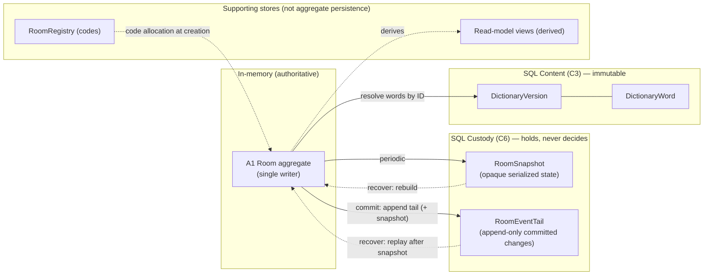
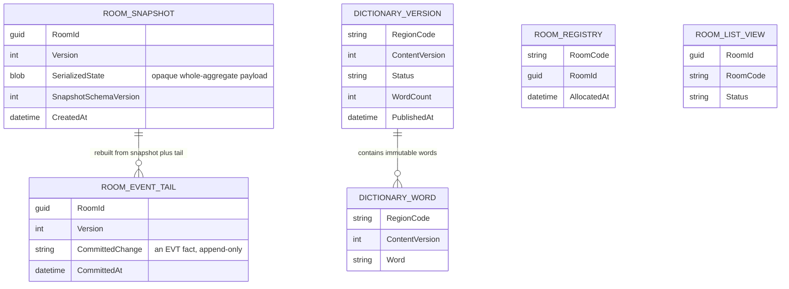
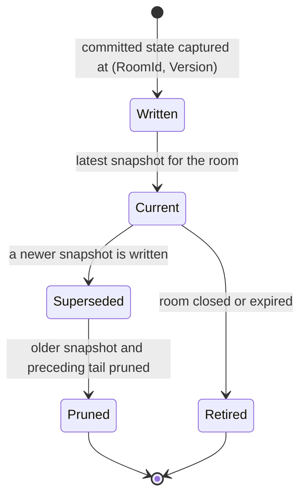
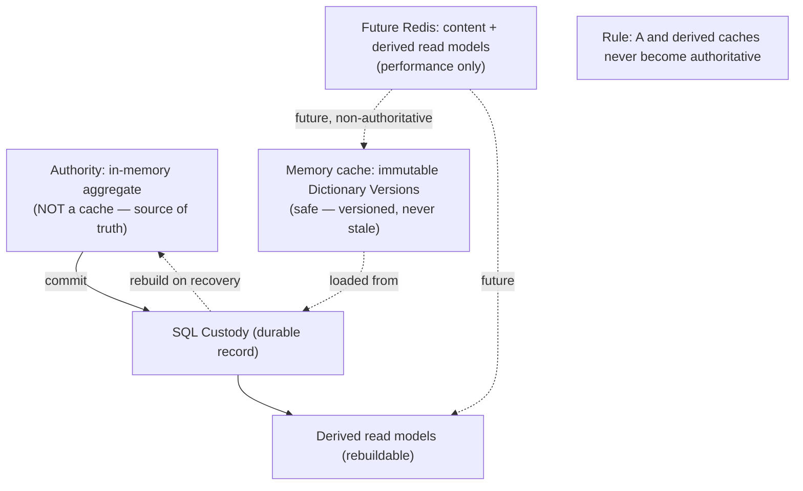

# Cluely — Persistence & Data Model Design

| | |
|---|---|
| **Document** | 09.02 — Persistence & Data Model Design |
| **Phase** | Technical Design (second document; first implementation-oriented) |
| **Version** | 1.0 |
| **Status** | Approved — canonical persistence & data model (persistence authority, data ownership, recovery/snapshot/event-tail, caching, repository responsibilities become frozen on approval) |
| **Technology** | SQL Server, .NET 10, C#, **manual mapping** ([09.01](01-technical-design-foundation.md)). No ORM/framework assumption; no SQL DDL in this document. |
| **Purpose** | Answer *"how is the approved Domain Model durably stored **without making persistence authoritative**?"* The database provides durability, recovery, querying, and immutable content — never authority, business rules, or adjudication. |
| **Owner** | Lead Architect / Engineering Lead. |
| **Consumes (does not redefine)** | [ADR-002](../07-software-architecture/12-decisions/ADR-002-authoritative-game-state.md), [ADR-003](../07-software-architecture/12-decisions/ADR-003-per-room-coordination-model.md), [ADR-005](../07-software-architecture/12-decisions/ADR-005-state-recovery-resilience.md), [ADR-007](../07-software-architecture/12-decisions/ADR-007-room-isolation-distribution.md), [ADR-008](../07-software-architecture/12-decisions/ADR-008-dictionary-content-architecture.md), [08.01](../08-software-design/01-domain-model-and-ubiquitous-language.md), [08.05](../08-software-design/05-aggregate-design.md), [08.06](../08-software-design/06-application-layer-design.md), [09.01](01-technical-design-foundation.md). |

> **The one principle this document enforces everywhere.**
> ```text
> Room Aggregate → Authoritative Truth (in memory) → Commit → Persistence (custody)
>                → Recovery → Rebuild Authority
> ```
> **NOT** `Load Aggregate → Modify → Save → (database becomes authority)`. The second model violates
> [ADR-002](../07-software-architecture/12-decisions/ADR-002-authoritative-game-state.md) and [ADR-005](../07-software-architecture/12-decisions/ADR-005-state-recovery-resilience.md). The discriminator, applied to every table and every step: *does SQL
> ever decide an outcome, or only hold and return state?* **Only hold.**
>
> **The load-bearing modeling decision (§4/§5):** the live A1 aggregate is stored as an **opaque
> serialized snapshot + an append-only event tail** — it is **not** decomposed into relational
> `Participant`/`Board`/`Card`/`Turn` tables. Those never appear in the schema; their structure lives
> **inside** the snapshot payload, opaque to SQL.

---

## Table of Contents
1. [Purpose](#1-purpose)
2. [Persistence Principles](#2-persistence-principles)
3. [Persistence Responsibilities](#3-persistence-responsibilities)
4. [Aggregate-to-Storage Mapping](#4-aggregate-to-storage-mapping)
5. [Domain-to-Relational Mapping](#5-domain-to-relational-mapping)
6. [Snapshot Strategy](#6-snapshot-strategy)
7. [Event Tail Strategy](#7-event-tail-strategy)
8. [Recovery Persistence Model](#8-recovery-persistence-model)
9. [Dictionary Storage](#9-dictionary-storage)
10. [Projection Persistence](#10-projection-persistence)
11. [Query Model](#11-query-model)
12. [Concurrency Model](#12-concurrency-model)
13. [Transactions](#13-transactions)
14. [Repository / Adapter Design](#14-repository--adapter-design)
15. [Schema Evolution](#15-schema-evolution)
16. [Performance Strategy](#16-performance-strategy)
17. [Caching Strategy](#17-caching-strategy-mandatory)
18. [Future Distribution](#18-future-distribution)
19. [Architecture Compliance](#19-architecture-compliance)
20. [Persistence Fitness Functions](#20-persistence-fitness-functions)
21. [Persistence Readiness Review](#21-persistence-readiness-review)

---

## 1. Purpose

**Why persistence exists.** So that a room in progress survives a process restart, so a match can be
recovered to its last committed state, so word content is durable and immutable, and so a few derived
views can be queried. Nothing more.

**Custody vs authority.** The **authority** is the in-memory Room aggregate under the single writer
([ADR-002](../07-software-architecture/12-decisions/ADR-002-authoritative-game-state.md)/[ADR-003](../07-software-architecture/12-decisions/ADR-003-per-room-coordination-model.md); the [Room Entity](../07-software-architecture/12-decisions/ADR-000-architecture-vocabulary.md#room-entity)). **Custody** (SQL Server, C6) is the durable
record — snapshot + event tail — from which that authority is **rebuilt** after interruption
([ADR-005](../07-software-architecture/12-decisions/ADR-005-state-recovery-resilience.md); [State Custody](../07-software-architecture/12-decisions/ADR-000-architecture-vocabulary.md#state-custody) *holds, never adjudicates*).

**Why SQL is not authoritative.** During a live match the database is a *follower*: it records what
the aggregate has already decided. It never computes an outcome, never enforces a game rule, never
resolves a turn. "In-memory authoritative" is safe **because** custody exists to rebuild it — and this
is **single-node** ([ADR-007](../07-software-architecture/12-decisions/ADR-007-room-isolation-distribution.md) distribution deferred), so "in-memory" does not mean "lost on restart."

---

## 2. Persistence Principles

| # | Principle | Consequence |
|---|-----------|-------------|
| P1 | **Persistence is passive.** | It records; it never initiates or decides. |
| P2 | **Persistence never decides.** | No rule/adjudication/terminal evaluation in SQL. |
| P3 | **Recovery rebuilds authority.** | The aggregate is reconstructed in memory, then used — never operated on as SQL rows. |
| P4 | **One aggregate → one persistence boundary.** | A1 ↔ custody; A2 ↔ content. Registry/read-models are **supporting stores**, outside aggregate persistence (§4.4). |
| P5 | **Persistence follows commits.** | Custody writes happen at/after the aggregate's commit, never before a decision. |
| P6 | **No persistence-triggered business rules.** | Triggers/computed columns never encode gameplay. |
| P7 | **Cross-aggregate references are by ID/value.** | No FK navigation between A1 custody and A2 content ([ADR-008](../07-software-architecture/12-decisions/ADR-008-dictionary-content-architecture.md)). |
| P8 | **Durable-before-observable.** | No effect is broadcast until its change is durable (§13). |

---

## 3. Persistence Responsibilities

| Actor | Responsibility | Must NOT |
|-------|----------------|----------|
| **SQL Server** | Durably hold snapshot rows, event-tail rows, immutable content, supporting views | Decide anything; run rules; adjudicate |
| **Repository / Adapter** (Infrastructure) | Implement custody/content **ports**: append tail, write snapshot, read for recovery, resolve content by ID | Own business rules, transactions-as-orchestration, or workflow (§14) |
| **Custody (C6)** | Provide "commit(snapshot+tail)" and "recover(roomId)" behind a port | Adjudicate; expose SQL rows as the live aggregate |
| **Aggregate (Domain)** | Be the authority; produce committed changes to persist | Know about SQL, tables, or serialization |
| **Application (08.06)** | *Trigger* commit and recovery; coordinate | Perform persistence; own transactions as business logic |
| **Recovery** | Rebuild the aggregate from snapshot + tail, verify invariants, resume | Continue using SQL rows directly as state |

---

## 4. Aggregate-to-Storage Mapping

### 4.1 A1 · Room / Match → **Custody** (opaque snapshot + event tail)
| Aspect | Design | Why |
|--------|--------|-----|
| **Tables** | `RoomSnapshot`, `RoomEventTail` (append-only) | Recovery artifacts only |
| **Ownership** | Written **only** by the room's single writer via the custody port | Single-writer ([ADR-003](../07-software-architecture/12-decisions/ADR-003-per-room-coordination-model.md)) |
| **Persisted fields** | RoomId, Version, **serialized aggregate state** (snapshot); RoomId, Sequence/Version, **committed change**, timestamp (tail) | Enough to rebuild the authority |
| **Derived fields** | none stored authoritatively (GamePhase, counts, presence are recomputed on rebuild) | Derived state is not custody |
| **Excluded fields** | transient (in-flight command), connection handles, projections | Not authoritative/durable |
| **Immutable fields** | tail rows are **append-only**; a snapshot at (RoomId, Version) is immutable | Ordering & replay integrity |

> **Crucially:** `Participant`, `Board`, `Card`, `Turn` are **not** tables. They live inside the
> serialized snapshot payload, opaque to SQL — so SQL can never be operated on as the aggregate.

### 4.2 A2 · Dictionary Version → **Content** (relational, immutable)
| Aspect | Design |
|--------|--------|
| **Tables** | `DictionaryVersion`, `DictionaryWord` |
| **Ownership** | Written by content publication (Admin/future); read-only to gameplay |
| **Persisted fields** | RegionCode, ContentVersion, Status, WordCount, PublishedAt; (RegionCode, ContentVersion, Word) |
| **Immutable fields** | **all** after publish ([ADR-008](../07-software-architecture/12-decisions/ADR-008-dictionary-content-architecture.md), [INV-D1..D3](../02-business-analysis/10-business-invariants.md)) |
| **Referenced** | by A1 **by ID only** (RegionCode + ContentVersion); no FK into A1 |

### 4.3 Why the two aggregates persist differently
A1 changes continuously under one writer and must round-trip as a *whole* consistent state → opaque
snapshot + tail. A2 is immutable, queryable content → normal relational tables. Different lifecycles,
different storage — one persistence boundary each (P4).

### 4.4 Supporting stores (outside aggregate persistence)
| Store | Purpose | Note |
|-------|---------|------|
| `RoomRegistry` | Room-code uniqueness **among live rooms** ([INV-R2](../02-business-analysis/10-business-invariants.md)) | A **cross-room** allocation store — cannot live inside one room's custody (room isolation, [08.05 §12](../08-software-design/05-aggregate-design.md#12-invariant-enforcement-matrix)) |
| Read-model views | Room list, (optional) in-lifetime match history | **Derived, rebuildable**; never authoritative (§10/§11) |

These are **supporting** stores, not aggregate persistence — so P4 ("one boundary per aggregate")
holds for A1↔custody and A2↔content.



---

## 5. Domain-to-Relational Mapping

| Domain construct | Mapping strategy | Notes |
|------------------|------------------|-------|
| **A1 Aggregate Root (Room) + owned entities** | **Serialized as one opaque snapshot payload** (+ tail of committed changes) | Never decomposed into per-entity tables; rebuilt as a whole |
| **Entities (Participant/Board/Card/Turn)** | Inside the snapshot payload | No identity columns/tables in SQL; identity is in-payload |
| **Value Objects** (Clue, Team, Key, Version…) | Inside the snapshot payload (by value) | Immutable; no separate tables |
| **Identifiers** (RoomId, ParticipantId…) | RoomId is the snapshot/tail key; others are in-payload | Cross-boundary refs by ID only |
| **Collections** (participants, cards) | In-payload collections | Not relational child tables |
| **References by ID** (DictionaryReference→A2) | Stored in payload as (RegionCode, ContentVersion); resolved against Content | No FK ([ADR-008](../07-software-architecture/12-decisions/ADR-008-dictionary-content-architecture.md)) |
| **A2 Dictionary Version + Words** | **Relational** (`DictionaryVersion` 1—* `DictionaryWord`) | Immutable content; genuinely queryable |

**Serialization is Infrastructure, mapped manually.** Snapshot (de)serialization uses
System.Text.Json in the Infrastructure adapter with **manual mapping** to/from Domain types — **no
JSON attributes on `Cluely.Domain`** ([09.01 §11](01-technical-design-foundation.md#11-serialization-strategy); FF-PS-9). The Domain never knows it is
persisted.

### 5.1 Conceptual data model
The ER model is the **visual embodiment of "SQL is not authoritative"**: the live aggregate appears
only as an **opaque snapshot payload + append-only tail** (no `Participant`/`Board`/`Card`/`Turn`
tables); only immutable content is genuinely relational; registry/read-models are supporting stores.
*(Conceptual only — no SQL DDL; attribute types are indicative.)*



*Note the absence: no entity/child tables for the aggregate's internals — that absence is the design.*

---

## 6. Snapshot Strategy

| Aspect | Design |
|--------|--------|
| **What is stored** | A consistent capture of the whole A1 authoritative state at a commit point (opaque serialized payload), keyed by (RoomId, Version). |
| **Frequency** | At room creation, at match start, and periodically/at significant commits (e.g., every N committed changes or at phase transitions) — a tunable Infrastructure policy, not a business rule. |
| **Versioning** | Each snapshot carries the room's monotonic **Version**; a **snapshot-schema version** tags the payload format for forward evolution (§15). |
| **Metadata** | RoomId, Version, CreatedAt, snapshot-schema version. |
| **Consistency** | A snapshot is only written for a **committed** state; never a partial/in-flight state. |
| **Why snapshots exist** | To bound recovery cost — rebuild loads the latest snapshot then replays only the tail after it, rather than replaying from creation. |

**Snapshot lifecycle** (a snapshot row's states — it is never mutated, only superseded/pruned/retired):



## 7. Event Tail Strategy

| Aspect | Design |
|--------|--------|
| **Committed events** | The tail is an **append-only** sequence of the room's committed changes, represented as the [EVT-*](../02-business-analysis/11-domain-events-catalog.md) facts ([08.05 §13](../08-software-design/05-aggregate-design.md#13-domain-event-production)), sufficient to rebuild state after a snapshot. |
| **Ordering** | Strict per-room order by Version/Sequence (total order within a room; never across rooms — [ADR-007](../07-software-architecture/12-decisions/ADR-007-room-isolation-distribution.md)). |
| **Version** | Each tail entry carries the Version it produced; monotonic. |
| **Retention** | Kept for the room's lifetime; entries **before** the latest snapshot may be pruned (they are no longer needed to rebuild). |
| **Replay** | Deterministic: snapshot + ordered tail rebuild exactly the committed state ([ADR-005](../07-software-architecture/12-decisions/ADR-005-state-recovery-resilience.md); [AP-06](../06-architecture-governance/01-architecture-principles.md)). |
| **Pruning** | On snapshot, older tail entries become prunable; terminal/closed rooms' custody is retired per data lifecycle. |
| **Recovery** | The tail is *the* durability mechanism for changes since the last snapshot. |

> **Recovery artifact, not an integration bus.** The tail holds the same EVT-* facts, but its **role is
> durability-for-recovery only**. Delivery's consumption of committed events is a **separate in-process
> hand-off** ([08.06 §12](../08-software-design/06-application-layer-design.md#12-event-publication)); clients and other concerns **never read the SQL tail as an event
> bus**. There is no message broker ([09.01](01-technical-design-foundation.md)); custody must not quietly become one.

---

## 8. Recovery Persistence Model

```text
Recovery reads (latest snapshot + ordered tail after it)
   → Rebuild the in-memory aggregate (manual deserialization)
   → Verify invariants (the rebuilt state must satisfy 08.05 §12)
   → Resume authority (the single writer takes over)
```
**Never** `Recovery → continue using SQL rows directly as state`. The SQL rows are read **once** to
reconstruct the aggregate; from then on the in-memory aggregate is the authority again.

```mermaid
sequenceDiagram
    participant Rt as Recovery C6
    participant SQL as SQL Custody
    participant Agg as In-memory aggregate
    participant Wr as Per-room single writer
    Rt->>SQL: read latest snapshot for RoomId
    SQL-->>Rt: snapshot payload at Version N
    Rt->>SQL: read ordered tail after Version N
    SQL-->>Rt: committed changes N+1..M
    Rt->>Agg: deserialize snapshot, replay tail to Version M
    Agg->>Agg: verify invariants (08.05 §12)
    Agg->>Wr: hand authority to the single writer
    Note over Rt,Wr: SQL read once to rebuild; thereafter the in-memory aggregate is authoritative
```

**Recover-once & no terminal re-fire:** recovery restores to the last committed Version exactly once;
terminal effects already committed are not re-emitted ([ADR-005](../07-software-architecture/12-decisions/ADR-005-state-recovery-resilience.md), [INV-G7](../02-business-analysis/10-business-invariants.md)).

---

## 9. Dictionary Storage

| Aspect | Design | Why it differs from gameplay |
|--------|--------|------------------------------|
| **Version storage** | `DictionaryVersion` rows keyed by (RegionCode, ContentVersion) | Content is **immutable & queryable**, unlike the live aggregate |
| **Immutable content** | `DictionaryWord` rows frozen after publish | [ADR-008](../07-software-architecture/12-decisions/ADR-008-dictionary-content-architecture.md), [INV-D1..D3](../02-business-analysis/10-business-invariants.md) |
| **Country variants** | RegionCode distinguishes localized sets | Only the word library is localized |
| **Metadata** | Status, WordCount, PublishedAt, (future) moderation status | Editorial lifecycle |
| **Moderation status** | A status column (Draft/Published/Deprecated) | Publication gate; not a gameplay rule |
| **Historical retention** | Old versions retained (never mutated), deprecated not deleted-in-place | Reproducibility; a pinned match keeps its version |

Dictionary is **relational** precisely because it is immutable, shared, and read-heavy — the opposite
of the continuously-mutating single-writer aggregate. Referenced by A1 **by ID only**.

---

## 10. Projection Persistence

| Question | Answer |
|----------|--------|
| **Should projections be stored?** | Not authoritatively. They are **derived** from committed state and **rebuildable**; MVP builds them on demand/in memory. |
| **Should they be rebuilt?** | Yes — always reconstructable from custody/committed events; losing a projection loses nothing authoritative. |
| **Should history persist?** | Within a room's lifetime, an optional derived **match-history read model** may be materialized for querying; it is derived, not truth. |
| **Which projections are transient?** | Role-filtered live projections (per commit) are transient/in-memory; they are re-derived on reconnect ([08.06 §13](../08-software-design/06-application-layer-design.md#13-projection-coordination)). |

**Rule:** no projection is authoritative; all are derived and rebuildable ([08.05 §9](../08-software-design/05-aggregate-design.md#9-aggregate-state-model)).

---

## 11. Query Model

Read models for **what exists in the MVP**. Player-identity models are **future** (no accounts in MVP).

| Read model | Status | Authoritative vs derived | Notes |
|------------|--------|--------------------------|-------|
| **Room list** | MVP | Derived | Active rooms/status for lobby discovery; rebuildable |
| **Match history (in room lifetime)** | MVP (optional) | Derived | Sequence of committed match facts for a room; rebuildable from custody |
| **Player summary** | **Future** ([Roadmap Phase 3](../03-business-governance/06-product-roadmap.md#6-phase-3--progression--recognition-future)) | Derived | Requires durable identity (accounts) — none in MVP; **not** designed here |
| **Statistics / leaderboards** | **Future** (Phase 3) | Derived | Aggregate analytics over committed events; deferred |

**Authoritative vs derived:** the only authoritative source is the in-memory aggregate (rebuilt from
custody); **every** read model is derived and may be rebuilt. No query result is ever a source of truth.

---

## 12. Concurrency Model

| Aspect | Design |
|--------|--------|
| **In-room writes** | Serialized by the **single writer per room** ([ADR-003](../07-software-architecture/12-decisions/ADR-003-per-room-coordination-model.md)); there is **no in-room write contention** by construction. |
| **Version numbers** | Monotonic per room; each committed change increments Version; tail/snapshot carry it. |
| **Optimistic concurrency** | The custody append is guarded by an **expected-Version** check: an append at Version *v* succeeds only if the last durable Version is *v−1*. Defense-in-depth against a second writer (split-brain). |
| **Room isolation** | Custody for different rooms is independent; no cross-room locks/transactions ([ADR-007](../07-software-architecture/12-decisions/ADR-007-room-isolation-distribution.md)). |
| **Custody consistency** | Snapshot + tail for a room are internally consistent by Version ordering. |

**Relationship to [ADR-003](../07-software-architecture/12-decisions/ADR-003-per-room-coordination-model.md):** because one writer serializes a room's commands, the Version
sequence is naturally gap-free and ordered; the optimistic check is a **guard**, not the primary
concurrency mechanism. Under future distribution, this check pairs with ownership fencing ([ADR-007](../07-software-architecture/12-decisions/ADR-007-room-isolation-distribution.md)).

---

## 13. Transactions

| Aspect | Design |
|--------|--------|
| **Transaction boundary** | One committed command → **one atomic custody write** (append the tail entry; write a snapshot if due) in a single transaction, scoped to one room. |
| **Commit order (no rollback needed)** | 1) Root authorizes → invokes **C2 pure** against current in-memory state (mutates nothing); 2) **durably append the committed change** (+ snapshot if due) — **this is the commit point**; 3) apply the outcome in memory, Version++; 4) hand off → **broadcast** (strictly after step 2). |
| **Durable-before-observable invariant** | An effect is **never broadcast until its change is durable**; the durable Version is ≥ any Version a client has observed. This makes "in-memory authoritative" and "recover to last committed state" consistent, not contradictory. |
| **Recovery guarantee** | Restore to the last **durable** Version, exactly once. |
| **Partial failure** | *Crash before step 2* → the change was never durable and never broadcast; the client retries under its idempotency key (no lost/phantom state). *Crash after step 2* → the change is in the tail and is replayed on recovery; the client resyncs. No window exposes non-durable or contradictory state. |
| **Idempotency** | Intake dedup key (App) + monotonic Version (Root) + append-once tail (Custody) + idempotent event consumption (Delivery) ([08.06 §10](../08-software-design/06-application-layer-design.md#10-idempotency-strategy)); replaying a tail entry is idempotent. |

---

## 14. Repository / Adapter Design

Technology-neutral **responsibilities** (no ORM/framework assumption). The repository/adapter is a
thin custody/content **port implementation**.

**A custody/content adapter MUST:**
- Implement the port operations: `AppendCommitted(roomId, version, change)`, `WriteSnapshot(roomId, version, payload)`, `ReadForRecovery(roomId)`, `ResolveWords(dictionaryRef)`.
- Map manually between Domain types and stored payloads/rows.
- Preserve ordering and the expected-Version guard.

**A repository/adapter MUST NOT:**
- Own business rules or invariants (Domain owns those).
- Own transactions **as orchestration** (it opens the custody transaction for a single commit; it does not sequence use cases — the Application coordinates).
- Own workflow/orchestration ([08.06](../08-software-design/06-application-layer-design.md)).
- Expose SQL rows as the live aggregate (recovery rebuilds; §8).

It **adapts persistence only** — the boundary between the pure Domain and durable storage.

---

## 15. Schema Evolution

| Aspect | Design |
|--------|--------|
| **Migrations** | Versioned, forward-only migrations applied at deploy; content/custody/read-model schemas evolve independently. |
| **Snapshot payload versioning** | Each snapshot tags a **snapshot-schema version**; readers are tolerant and can up-convert older payloads (manual mapping), so old snapshots remain recoverable. |
| **Backward compatibility** | Additive changes preferred; the event tail uses tolerant readers; never rewrite historical tail/snapshots in place. |
| **Rolling deployment** | Single-node MVP: brief drain + graceful shutdown (flush custody) then deploy; multi-node rolling is a future-distribution concern (§18). |
| **Historical data** | Content versions and closed-room custody are retained per the [Data Lifecycle](../03-business-governance/05-data-lifecycle-retention.md); never mutated. |

---

## 16. Performance Strategy

Distinguishing **MVP** from **future optimization** ([AP-05](../06-architecture-governance/01-architecture-principles.md): correctness before optimization).

| Topic | MVP | Future |
|-------|-----|--------|
| **Indexes** | PK on (RoomId, Version) for snapshot/tail; (RegionCode, ContentVersion) for content; index active rooms in the registry | tuned to query patterns |
| **Partitioning** | none | partition tail/history by room/time at scale |
| **Large history** | bounded by room lifetime; prune tail before latest snapshot | archival/partitioning |
| **Snapshot cleanup** | keep latest (+ small window); prune superseded snapshots/tail | policy-tuned retention |
| **Dictionary loading** | load pinned version on match start; small sets | memory cache / Redis (§17) |
| **Caching** | none (§17) | immutable-content and read-model caches |

---

## 17. Caching Strategy *(mandatory)*

Three categories, with ownership explicit. **A cache is never authoritative.**

### A. Authoritative state
**Never cached as authority.** The in-memory Room aggregate **is** the authority (not a cache of SQL);
SQL is custody. No separate cache may claim authority over game state. (Do **not** read "the in-memory
aggregate is a cache of the database" — it is the source of truth, rebuilt from custody.)

### B. Immutable content (Dictionary Versions)
**Memory cache allowed** now; **future Redis** allowed. Because content is immutable and versioned,
caching by (RegionCode, ContentVersion) is always safe — a cached version can never be stale.

### C. Derived read models
**Future cache candidate** (room list, history). Derived and rebuildable, so a cache is a performance
aid only; on miss or invalidation, rebuild from committed state.



---

## 18. Future Distribution

How persistence evolves **without changing any ADR**:

| Change | Persistence evolution | ADR preserved |
|--------|----------------------|---------------|
| **Multiple nodes** | Rooms distributed by RoomId; each room's custody owned by its node; **ownership fencing** (epoch) guards the expected-Version append | [ADR-007](../07-software-architecture/12-decisions/ADR-007-room-isolation-distribution.md) (isolation), [ADR-003](../07-software-architecture/12-decisions/ADR-003-per-room-coordination-model.md) (single writer) |
| **Redis** | Cache immutable content + derived read models; **never** authority | [ADR-002](../07-software-architecture/12-decisions/ADR-002-authoritative-game-state.md) |
| **SignalR backplane** | Fan-out delivery across nodes; delivery stays non-authoritative | [ADR-004](../07-software-architecture/12-decisions/ADR-004-real-time-communication-delivery.md) |
| **Message broker** | Only if a real integration need appears; custody tail remains recovery-only, not the bus | [09.01](01-technical-design-foundation.md) |
| **Cloud SQL** | Custody/content behind the same ports; managed durability | ports unchanged (§14) |

All additive; the authority-vs-custody split is invariant across every step.

---

## 19. Architecture Compliance

| Source | Requirement | Compliance |
|--------|-------------|------------|
| [ADR-002](../07-software-architecture/12-decisions/ADR-002-authoritative-game-state.md) | One authoritative state (in memory) | SQL is custody; never authoritative (§1/§4). ✅ |
| [ADR-003](../07-software-architecture/12-decisions/ADR-003-per-room-coordination-model.md) | Single writer per room | Custody written only by the room's writer; Version-ordered (§12). ✅ |
| [ADR-005](../07-software-architecture/12-decisions/ADR-005-state-recovery-resilience.md) | Snapshot + tail, recover once | §6/§7/§8; no terminal re-fire. ✅ |
| [ADR-007](../07-software-architecture/12-decisions/ADR-007-room-isolation-distribution.md) | Room isolation | Per-room custody; no cross-room joins/locks (§12/§18). ✅ |
| [ADR-008](../07-software-architecture/12-decisions/ADR-008-dictionary-content-architecture.md) | Immutable content, by ID | Relational immutable content; referenced by ID (§9). ✅ |
| [ADR-000](../07-software-architecture/12-decisions/ADR-000-architecture-vocabulary.md) | Custody holds, never adjudicates | P1/P2; repository owns no rules (§14). ✅ |
| [08.05](../08-software-design/05-aggregate-design.md) | Aggregate boundaries; one owner | One persistence boundary per aggregate; entities in-payload (§4/§5). ✅ |
| [08.06](../08-software-design/06-application-layer-design.md) | App coordinates; events post-commit | App triggers commit; durable-before-broadcast (§13). ✅ |
| [09.01](01-technical-design-foundation.md) | In-memory authority, SQL custody; pure Domain | Reinforced throughout; no JSON attrs in Domain (§5). ✅ |

**Violations found:** none. Risks of persistence overreach are guarded by the fitness functions below.

---

## 20. Persistence Fitness Functions

Objective checks (`FF-PS-*`), enforced by Architecture/Integration tests.

| # | Fitness function | Guards |
|---|------------------|--------|
| **FF-PS-1** | The database **never adjudicates** — no rule/terminal logic in SQL (no such trigger/proc). | ADR-002 |
| **FF-PS-2** | The aggregate is **rebuilt in memory before use**; no code path operates on SQL rows as the live aggregate. | ADR-005 |
| **FF-PS-3** | **No relational tables** exist for `Participant`/`Board`/`Card`/`Turn` (they live in the snapshot payload). | §4/§5 |
| **FF-PS-4** | **No cross-aggregate joins** between A1 custody and A2 content; refs by ID only. | ADR-008 |
| **FF-PS-5** | Dictionary content is **immutable after publish** (no update path). | ADR-008 |
| **FF-PS-6** | Recovery is **deterministic**: snapshot + ordered tail rebuild identical state. | ADR-005 |
| **FF-PS-7** | Snapshots are **versioned** (Version + snapshot-schema version). | §6/§15 |
| **FF-PS-8** | Event-tail entries are **strictly ordered and append-only** per room. | §7 |
| **FF-PS-9** | **No serialization attributes in `Cluely.Domain`** — mapping is manual in Infrastructure. | 09.01 §11 |
| **FF-PS-10** | **Caches never authoritative** — authority is the in-memory aggregate; content/read-model caches are derived. | §17 |
| **FF-PS-11** | Repositories/adapters contain **no business rules** and no use-case orchestration. | §14 |
| **FF-PS-12** | Persistence **never bypasses the Aggregate Root** — custody is written only from a committed aggregate. | ADR-002/010 |
| **FF-PS-13** | An effect is **never broadcast before its change is durable** (durable Version ≥ observed). | §13 |

---

## 21. Persistence Readiness Review

**Strengths.** A persistence model that is, by construction, non-authoritative: the live aggregate is
an **opaque snapshot + append-only tail** (no relational decomposition), recovery **rebuilds** the
in-memory authority and then abandons the rows, content is relational-immutable-by-ID, read models are
derived, and the commit ordering (**durable-before-observable**) removes any lost/phantom-state window.
Thirteen FF-PS checks make the "SQL is not authoritative" claim testable.

**Risks.** (1) Snapshot payload growth for long matches — bounded by 25 cards/one turn/one room and by
snapshot+prune (§6/§16). (2) Snapshot-schema evolution — mitigated by versioned payloads + tolerant
readers (§15). (3) The durable-before-broadcast step adds custody latency to the commit path — accepted
for correctness ([AP-05](../06-architecture-governance/01-architecture-principles.md)); optimizable later without changing the model.

**Future evolution.** Distribute by room + fencing; Redis for immutable content/read models; SignalR
backplane; cloud SQL — all behind the same ports, all preserving authority-vs-custody (§18).

**Deferred decisions.** Concrete SQL schema/DDL, index tuning, ORM-inside-adapter choice, exact
snapshot cadence, read-model materialization mechanics, player/statistics models (future accounts) —
each a later 09/implementation concern; **none** may reintroduce DB-as-authority.

**Readiness for API Design.** **Ready.** Persistence authority, data ownership, recovery/snapshot/tail,
caching, and repository responsibilities are fixed. The next documents — **09.03 Interface Contracts,
09.04 API Design, 09.05 SignalR Message Design, 09.06 Security Design** — build on this without
redefining persistence authority, aggregate ownership, or recovery semantics.

**Recommendation.** Approve; on approval the persistence architecture, data ownership, recovery
storage model, snapshot & event-tail strategy, caching strategy, and repository responsibilities are
**frozen**.

### Validation checklist (self-verified)
| Check | Result |
|-------|--------|
| SQL never authoritative | ✅ (§1/§4, FF-PS-1/2/12) |
| Recovery rebuilds aggregates | ✅ (§8, FF-PS-2) |
| Snapshots support recovery | ✅ (§6) |
| Event tail supports replay | ✅ (§7, FF-PS-6/8) |
| Dictionary immutable | ✅ (§9, FF-PS-5) |
| Cache never authoritative | ✅ (§17, FF-PS-10) |
| No business logic in repositories | ✅ (§14, FF-PS-11) |
| No ORM / framework assumption | ✅ (§14) |
| Aggregate boundaries preserved | ✅ (§4/§5) |
| One persistence boundary per aggregate | ✅ (§4.4; registry/read-models are supporting stores) |
| Cross references by ID only | ✅ (§5, FF-PS-4) |
| Diagrams match the text | ✅ (aggregate→persistence / recovery / snapshot / ER / caching) |

---

## Revision History
| Version | Date | Change |
|---------|------|--------|
| 1.0 | 2026-07-05 | Initial canonical Persistence & Data Model Design. Establishes the non-authoritative persistence model: A1 stored as an **opaque serialized snapshot + append-only event tail** (no relational decomposition of Participant/Board/Card/Turn), A2 as immutable relational content referenced by ID, registry + read models as supporting stores; snapshot/event-tail/recovery strategy; **durable-before-observable** commit ordering with crash-case analysis; concurrency (single-writer + optimistic Version guard); repository/adapter responsibilities; schema evolution; mandatory three-category caching (authority never cached); future distribution; full ADR + 08.05/08.06/09.01 compliance; 13 FF-PS fitness functions. Mermaid aggregate→persistence / recovery / snapshot-lifecycle / ER / caching diagrams. Technology-conforming; nothing re-architected. |
