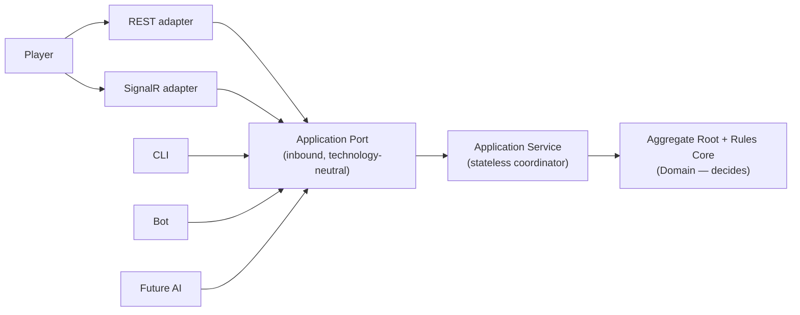
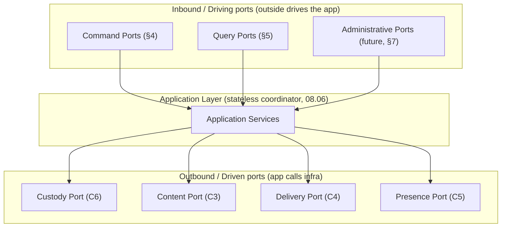
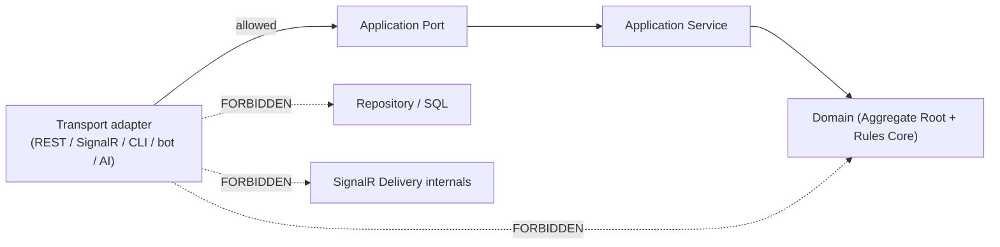

# Cluely — Interface Contracts (Application Ports)

| | |
|---|---|
| **Document** | 09.03 — Interface Contracts (Application Ports) |
| **Phase** | Technical Design (third document) — **last transport-independent document** |
| **Version** | 1.0 |
| **Status** | Approved — canonical application interface contracts (ports, command/query contracts, error/versioning/idempotency/correlation models, dependency rules become frozen on approval) |
| **Technology** | **Transport-neutral.** No HTTP/REST/SignalR/gRPC/URL/controller/DTO/JSON/serialization/auth/DB. Ports are logical contracts; transports are later adapters. |
| **Purpose** | Answer *"how does the outside world communicate with the Application Layer without coupling the Domain to transport technologies?"* Defines the application's **public contracts** (ports) so every future transport (REST, SignalR, CLI, bot, AI) is a conforming adapter. |
| **Owner** | Lead Architect / Engineering Lead. |
| **Consumes (does not redefine)** | [ADR-000…ADR-010](../07-software-architecture/12-decisions/README.md), [08.02](../08-software-design/02-module-decomposition.md), [08.05](../08-software-design/05-aggregate-design.md), [08.06](../08-software-design/06-application-layer-design.md), [09.01](01-technical-design-foundation.md), [09.02](02-persistence-and-data-model-design.md). |

> **Reading contract.** A **port** is a technology-neutral interface into (or out of) the Application
> Layer. This document formalizes the ports **already implied** by [08.06](../08-software-design/06-application-layer-design.md) (command/query pipelines) and
> [09.01](01-technical-design-foundation.md) (Application *defines* ports; Infrastructure implements them). Nothing is invented:
> the command/query catalog is the [08.06 §6](../08-software-design/06-application-layer-design.md#6-use-case-catalog) use cases 1:1. The single rule enforced
> everywhere: **transport never touches the Domain, persistence, or delivery directly — only a port.**
> Ports are **carriers-agnostic** ([ADR-010](../07-software-architecture/12-decisions/ADR-010-command-query-strategy.md)); the Application Layer stays a stateless coordinator.

---

## Table of Contents
1. [Purpose](#1-purpose)
2. [Design Principles](#2-design-principles)
3. [Port Classification](#3-port-classification)
4. [Command Port Catalog](#4-command-port-catalog)
5. [Query Port Catalog](#5-query-port-catalog)
6. [Internal (Driven) Ports](#6-internal-driven-ports)
7. [Future Ports](#7-future-ports)
8. [Command Contract Design](#8-command-contract-design)
9. [Query Contract Design](#9-query-contract-design)
10. [Port Lifecycle](#10-port-lifecycle)
11. [Error Contract](#11-error-contract)
12. [Versioning Strategy](#12-versioning-strategy)
13. [Idempotency Strategy](#13-idempotency-strategy)
14. [Correlation & Traceability](#14-correlation--traceability)
15. [Security Boundary](#15-security-boundary)
16. [Interface Dependency Rules](#16-interface-dependency-rules)
17. [Extension Rules](#17-extension-rules)
18. [Architecture Compliance](#18-architecture-compliance)
19. [Interface Fitness Functions](#19-interface-fitness-functions)
20. [Interface Readiness Review](#20-interface-readiness-review)

---

## 1. Purpose

**Why Application Ports exist.** So that many different transports (a REST call, a SignalR message, a
CLI, a bot, a future AI) can drive the same business capabilities through **one stable, technology-
neutral contract** — and so the Domain never learns that transports exist. Ports are the seam that
keeps [ADR-010](../07-software-architecture/12-decisions/ADR-010-command-query-strategy.md)'s "every transport is a *carrier* of Commands/Queries" literally true.

**Ports vs APIs.** An **API** is a *transport-specific* surface (URLs, methods, messages). A **port**
is the *transport-neutral capability* behind it. Many APIs map onto one port; the port is stable while
APIs come and go.

**Ports vs Services.** An **Application Service** ([08.06](../08-software-design/06-application-layer-design.md)) is the *implementation* that coordinates a
use case. A **port** is the *contract* it fulfils. The port is what a transport depends on; the service
is how it is realized.

**Ports vs Domain.** The **Domain** decides outcomes (aggregates + Rules Core). A port never contains
rules; it merely admits a well-formed intent/read and routes it to the Application Layer, which invokes
the Domain. Transport → Port → Application Service → Domain — never Transport → Domain.

**Application Port Architecture.** Every driver — a player over REST or SignalR, a CLI, a bot, a future
AI — reaches the same capability through the same inbound port; the transport is interchangeable, the
port is stable.



---

## 2. Design Principles

| # | Principle | Meaning |
|---|-----------|---------|
| D1 | **Transport independence** | A port names a capability, not a protocol; no HTTP/SignalR/serialization concept appears. |
| D2 | **Stable contracts** | Ports change rarely and additively (§12); transports absorb churn. |
| D3 | **Explicit intent** | Each port expresses one clear business intent in ubiquitous-language terms ([ADR-000](../07-software-architecture/12-decisions/ADR-000-architecture-vocabulary.md)). |
| D4 | **One business capability per port** | No "god port"; a port maps to exactly one use case ([08.06 §6](../08-software-design/06-application-layer-design.md#6-use-case-catalog)). |
| D5 | **No infrastructure leakage** | No persistence/transport/session type crosses a port. |
| D6 | **No UI concepts** | Ports carry intents/reads, not screens, widgets, or view state. |
| D7 | **No persistence concepts** | No rows, tables, SQL, or ORM notions; ports speak the domain. |
| D8 | **Command/Query separation** | Command ports change state (via the Root); Query ports never mutate ([ADR-010](../07-software-architecture/12-decisions/ADR-010-command-query-strategy.md)). |

---

## 3. Port Classification

The decisive taxonomy is **direction** (hexagonal ports & adapters): **inbound/driving** ports are how
the outside *drives* the application; **outbound/driven** ports are how the application *calls*
infrastructure. This matches [09.01](01-technical-design-foundation.md) (Application **defines** ports; Infrastructure implements them).

| Category | Direction | Purpose | Realized by |
|----------|-----------|---------|-------------|
| **Command Ports** | Inbound (driving) | Accept state-changing intents → Application Service → Aggregate Root | Transport adapters call these (§4) |
| **Query Ports** | Inbound (driving) | Accept read requests → role-filtered projections | Transport adapters call these (§5) |
| **Internal / Driven Ports** | Outbound (driven) | Application → infrastructure: custody, content, delivery, presence | Infrastructure adapters implement these (§6) |
| **Administrative Ports** | Inbound (driving, restricted) | Content publication / operational actions | Future/Admin adapters (§7) |
| **Future Integration Ports** | Either | Auth, matchmaking, tournament, AI, analytics, moderation | Additive (§7) |



---

## 4. Command Port Catalog

Every MVP command — the [08.06 §6](../08-software-design/06-application-layer-design.md#6-use-case-catalog) use cases, **1:1, none invented**. All route through the
A1 Aggregate Root; no transport detail. *(Input/Output are **conceptual** — intents and outcomes, not
DTOs.)*

| Command Port | Purpose | Input (conceptual) | Output | Success | Failure categories | Aggregate | Capability | ADRs |
|--------------|---------|--------------------|--------|---------|--------------------|-----------|------------|------|
| **CreateRoom** | Open a private room | host nickname, options | room reference | RoomCreated | validation, registry(code) | A1 (+registry) | Lobby | [002](../07-software-architecture/12-decisions/ADR-002-authoritative-game-state.md)/[003](../07-software-architecture/12-decisions/ADR-003-per-room-coordination-model.md) |
| **JoinRoom** | Join by code | room code, nickname | participant reference | PlayerJoined | validation, state(capacity/nick), business | A1 | Lobby | 003 |
| **LeaveRoom** | Leave a room | room, participant | ack | PlayerLeft | state | A1 | Lobby | 003 |
| **TransferHost** | Reassign host | room, target | ack | HostTransferred | authorization, state | A1 | Lobby | 003 |
| **RemoveParticipant** | Host removes a participant | room, target | ack | PlayerRemovedByHost | authorization | A1 | Lobby | 003 |
| **AssignTeam** | Set a participant's team | room, participant, team | ack | TeamChanged | business (INV-T2) | A1 | Setup | 003 |
| **AssignRole** | Set a participant's role | room, participant, role | ack | RoleChanged | business (INV-T3/T4) | A1 | Setup | 003 |
| **SelectDictionary** | Pin content for the match | room, locale | ack | DictionarySelected | validation, content | A1 (refs A2) | Setup | [008](../07-software-architecture/12-decisions/ADR-008-dictionary-content-architecture.md) |
| **StartMatch** | Begin a match (incl. **rematch**) | room | match reference | GameStarted, BoardGenerated | authorization, business (INV-T6) | A1 (+A2 resolve) | Setup | 002/003/008 |
| **SubmitClue** | Spymaster clue | room, clue(word,number) | ack | ClueSubmitted | authorization(turn), business (INV-G3) | A1 | Play | 003/[010](../07-software-architecture/12-decisions/ADR-010-command-query-strategy.md) |
| **SubmitGuess** | Operative guess | room, card selection | ack | GuessSubmitted, CardRevealed, (terminal) | authorization(turn), business (INV-G6) | A1 | Play | 003/010 |
| **EndTurn** | Voluntarily end a turn | room | ack | TurnEnded | authorization, business (INV-G5) | A1 | Play | 003 |
| **Reconnect** | Re-attach a participant | room, reconnect token | resync reference | PlayerReconnected | authorization(token), state | A1 (+C5) | Continuity | [009](../07-software-architecture/12-decisions/ADR-009-participant-lifecycle-presence-session-continuity.md) |
| **CloseRoom** | Host closes the room | room | ack | RoomClosed | authorization | A1 | Lobby | 003 |

**Validated candidate — "Vote Rematch": rejected as a distinct command.** A rematch is **StartMatch
again in the same room** after a Finished match ([08.05 §10](../08-software-design/05-aggregate-design.md#10-aggregate-lifecycle): `Finished → LobbyActive → StartMatch`).
No approved business rule defines a *voting* mechanic; introducing one would add gameplay ([Non-Goals](../02-business-analysis/README.md)).
So "rematch" maps to the existing **StartMatch** port; a future group-consent step, if ever desired,
is a **future port** (§7), not an MVP command. (Same validation discipline as [08.03 §3.3](../08-software-design/03-c4-system-context.md).)

---

## 5. Query Port Catalog

Read-only; answered as **role-filtered projections** ([08.06 §5](../08-software-design/06-application-layer-design.md#5-query-pipeline), [ADR-006](../07-software-architecture/12-decisions/ADR-006-role-based-information-visibility.md)). MVP models only what
exists (no accounts).

| Query Port | Input | Output (projection) | Consistency | Visibility restriction |
|------------|-------|---------------------|-------------|------------------------|
| **GetRoom** | room, requester role | room/lobby projection | current committed | membership-appropriate |
| **GetProjection / GetMatchState** | room, requester role | role-filtered match/board projection | current committed | **Key → Spymaster only**; Operatives never see unrevealed ownership ([INV-B9](../02-business-analysis/10-business-invariants.md)) |
| **GetScore** | room | remaining-counts projection | current committed | public within room |
| **GetHistory** | room | in-lifetime match-history projection | eventually-current | membership-appropriate |
| **GetDictionaryMetadata** | locale | version metadata (region, version, word count) | current | public (no words leaked pre-match beyond metadata) |
| *(future)* **GetPlayerSummary / GetStatistics** | account | — | — | **Future** (needs accounts; [Roadmap Phase 3](../03-business-governance/06-product-roadmap.md#6-phase-3--progression--recognition-future)) |

**Projection rules:** every query returns a **derived** projection (never authoritative), built by the
Delivery port with visibility applied **before** it leaves; a query **never** mutates state ([ADR-010](../07-software-architecture/12-decisions/ADR-010-command-query-strategy.md)).

---

## 6. Internal (Driven) Ports

The **outbound** ports the Application Layer depends on — defined by Application, **implemented by
Infrastructure** ([09.01 §5](01-technical-design-foundation.md#5-layer-responsibilities), [09.02](02-persistence-and-data-model-design.md)). These are **internal application contracts, not public APIs** — no
transport ever calls them directly.

| Driven Port | Purpose | Implemented by | Constraint |
|-------------|---------|----------------|------------|
| **Custody Port** | commit(snapshot+tail); recover(room) | SQL custody adapter (C6) | Holds, never adjudicates ([ADR-005](../07-software-architecture/12-decisions/ADR-005-state-recovery-resilience.md)) |
| **Content Port** | resolveVersion; resolveWords (by ID) | SQL content adapter (C3) | Immutable, by ID ([ADR-008](../07-software-architecture/12-decisions/ADR-008-dictionary-content-architecture.md)) |
| **Delivery Port** | publish committed events; build+send role-filtered projection | Projection/Visibility + SignalR adapter (C4) | Filter **before** transport; non-authoritative ([ADR-006](../07-software-architecture/12-decisions/ADR-006-role-based-information-visibility.md)) |
| **Presence Port** | session/connect/disconnect signals; reconnect-token validation | Connectivity adapter (C5) | Presence derived; auth seam future ([ADR-009](../07-software-architecture/12-decisions/ADR-009-participant-lifecycle-presence-session-continuity.md)) |
| **Registry Port** | allocate/validate room code (cross-room) | Registry adapter | Uniqueness among live rooms ([INV-R2](../02-business-analysis/10-business-invariants.md)) |

> **Reconciliation:** the **Registry Port** extends [09.01 §8](01-technical-design-foundation.md#8-dependency-injection-strategy)'s initial four-port composition
> (custody/content/delivery/presence). It first surfaced as the room-allocation store in
> [09.02 §4.4](02-persistence-and-data-model-design.md#44-supporting-stores-outside-aggregate-persistence)
> to satisfy [INV-R2](../02-business-analysis/10-business-invariants.md) ([08.05 §12](../08-software-design/05-aggregate-design.md#12-invariant-enforcement-matrix)) — it is a cross-room supporting store, not part of A1's aggregate persistence.

> The prompt's "Recovery / Projection generation / Dictionary resolution / Delivery trigger" are these
> **driven ports** — internal seams the Application *triggers*; the performers are the infrastructure
> adapters ([08.06](../08-software-design/06-application-layer-design.md)).

---

## 7. Future Ports

Additive — each attaches without changing existing ports ([08.05 §15](../08-software-design/05-aggregate-design.md#15-aggregate-evolution), [AP-13](../06-architecture-governance/01-architecture-principles.md)).

| Future port | Direction | Attaches at | Existing ports changed |
|-------------|-----------|-------------|------------------------|
| **Authentication** | inbound + driven (IdP) | future-auth seam (C5) | **none** (participant gains optional accountId) |
| **Matchmaking** | inbound | creates rooms via existing CreateRoom/JoinRoom | **none** |
| **Tournament** | inbound | new context referencing matches by ID | **none** |
| **AI Player** | inbound | emits the **same** Command ports as a player | **none** |
| **Analytics** | driven (consumer) | consumes committed events (read-only) | **none** |
| **Moderation** | inbound (admin) | content/room administrative actions | **none** |
| **Rematch consent** *(if ever)* | inbound | a pre-StartMatch group-consent step | **none** (wraps StartMatch) |

---

## 8. Command Contract Design

Conceptual fields every command contract carries (no DTOs, no serialization):

| Element | Meaning |
|---------|---------|
| **Intent** | The business action requested (e.g., "submit this guess"). The client **proposes**; the Domain **decides**. |
| **Validation stages** | Input (well-formedness) at the port/App; authorization admission + business/invariant at the Domain ([08.06 §8](../08-software-design/06-application-layer-design.md#8-validation-architecture)). |
| **Idempotency key** | A client-supplied key so a retried command is a no-op returning the prior outcome (§13). |
| **Correlation ID** | An identifier threading the request through logs/trace (§14). |
| **Version expectation** | Optional "expected room Version" for optimistic conditions; the Domain remains the arbiter (aligns to [09.02 §12](02-persistence-and-data-model-design.md#12-concurrency-model)). |
| **Error model** | A typed outcome (accepted / rejected + [Error Catalog](../02-business-analysis/12-business-error-catalog.md) category), never a leaked exception/stack (§11). |

A command contract expresses **what** is intended and **how the outcome is reported** — never **how**
it is transported or stored.

---

## 9. Query Contract Design

| Element | Design |
|---------|--------|
| **Read consistency** | Reads reflect **committed** state; freshness is bounded-eventual for delivery, never a gameplay dependency ([ADR-010](../07-software-architecture/12-decisions/ADR-010-command-query-strategy.md)). |
| **Snapshot expectations** | A query returns a coherent projection of a committed Version (no partial/in-flight state). |
| **Version awareness** | A projection may carry the Version it reflects, so clients can order/ignore stale views. |
| **Projection freshness** | Read-after-write is delivered via committed events (push), not by a query mutating anything. |
| **Role visibility** | Each projection is filtered to the requester's Role **before** return ([ADR-006](../07-software-architecture/12-decisions/ADR-006-role-based-information-visibility.md)). |
| **Hidden information** | The Key and unrevealed ownership never appear in a non-Spymaster projection ([INV-B9](../02-business-analysis/10-business-invariants.md)) — enforced at the Delivery port, not the query caller. |

---

## 10. Port Lifecycle

```text
Receive (port: accept intent/read)
  → Validate (input at port/App; business/invariant at Domain)
  → Coordinate (Application Service sequences the use case)
  → Domain (Aggregate Root authorizes + adjudicates; C2 pure)
  → Commit (Root commits + Version++; Custody port persists) [commands only]
  → Result (typed outcome / role-filtered projection returned)
```

| Stage | Owner |
|-------|-------|
| Receive | Port (thin) |
| Validate (input) | Application |
| Validate (business/invariant, authorization) | **Domain** (Aggregate Root / Rules Core) |
| Coordinate | Application Service |
| Commit | **Domain root** + Custody port |
| Result | Application (assembles), Delivery port (projection) |

**Command lifecycle**

```mermaid
sequenceDiagram
    actor Transport as Transport adapter
    participant Port as Command Port
    participant App as Application Service
    participant Dom as Aggregate Root plus Rules Core
    participant Cust as Custody Port
    participant Del as Delivery Port
    Transport->>Port: intent + idempotency key + correlation id
    Port->>App: well-formed intent (input-validated)
    App->>Dom: authorize + adjudicate (under per-room writer)
    Dom-->>App: committed outcome + events (Version++)
    App->>Cust: persist snapshot + tail (durable)
    App->>Del: trigger role-filtered projection
    Del-->>Transport: outcome / projection (role-filtered)
    Note over Port,Del: transport touches only the Port; Domain decides, Custody holds, Delivery filters
```

**Query lifecycle**

```mermaid
sequenceDiagram
    actor Transport as Transport adapter
    participant Port as Query Port
    participant App as Application Service
    participant Del as Delivery Port
    Transport->>Port: read request + requester role
    Port->>App: read intent (input-validated)
    App->>Del: request projection (visibility applied)
    Del-->>Transport: role-filtered projection (derived, read-only)
    Note over Port,Del: no Domain mutation; Key never leaves for non-Spymaster
```

---

## 11. Error Contract

| Category | Owner (decides it is an error) | Reported as |
|----------|-------------------------------|-------------|
| **Validation** (input) | Application/port | typed rejection + field detail |
| **Business** (rule) | Domain (C2/Root) | [Error Catalog](../02-business-analysis/12-business-error-catalog.md) code |
| **State** (e.g., out-of-turn, capacity) | Domain (Root admission) | Error Catalog code |
| **Visibility** | Delivery port | denied projection (never leaks) |
| **Infrastructure** (custody/content unavailable) | Infrastructure adapter | retryable failure |
| **Recovery** | Recovery (C6) | transient; "reconnecting" |
| **Unexpected** | host boundary | generic failure; internal/hidden state never exposed |

**Ownership rule:** business/state errors are **Domain-owned rejections** surfaced through the port,
not authored by the port ([08.06 §11](../08-software-design/06-application-layer-design.md#11-error-handling-strategy)). Every error is a typed outcome, never a raw exception.

---

## 12. Versioning Strategy

| Aspect | Policy |
|--------|--------|
| **Contract evolution** | Additive first: add new ports or optional fields; never silently change semantics. |
| **Backward compatibility** | Existing ports keep stable meaning; transports adapt to new shapes. |
| **Deprecation** | Mark a port deprecated with a successor and a window; retain until adapters migrate. |
| **Future additions** | New capabilities are new ports (§7), not overloads of existing ones. |
| **Stable semantics** | A port's business meaning is frozen on approval; only additive change is allowed. |

**No HTTP/media-type versioning here** — that is a transport (REST/API) concern in [09.04](README.md).

---

## 13. Idempotency Strategy

Ties to [ADR-005](../07-software-architecture/12-decisions/ADR-005-state-recovery-resilience.md) and [08.06 §10](../08-software-design/06-application-layer-design.md#10-idempotency-strategy) — split by owner (the port owns only intake dedup):

| Situation | Handling | Owner |
|-----------|----------|-------|
| **Duplicate commands** | Same idempotency key → no-op returning the prior outcome | Application (intake) |
| **Retries** | Safe by key; the Domain's command handling is idempotent | App + Domain |
| **Reconnect** | Token-validated resync; no move re-executed | Presence port + Root |
| **Timeout** | Client may retry with the same key; at-most-once effect | App |
| **Replay (recovery)** | Deterministic replay to last commit, once | Custody/Recovery |

Query ports are inherently idempotent (read-only).

---

## 14. Correlation & Traceability

| Identifier | Meaning | Flow |
|------------|---------|------|
| **Correlation ID** | One logical operation across boundaries | Set at the transport edge; carried through port → App → Domain → custody/delivery; logged (Serilog, [09.01 §13](01-technical-design-foundation.md#13-logging--observability)) |
| **Request ID** | A single inbound call | Per port invocation; child of the correlation ID |
| **Room ID** | The room scope | Carried on every room-scoped port; the per-room writer key |
| **Participant ID** | The actor (transient, PII-free — [INV-P2](../02-business-analysis/10-business-invariants.md)) | Carried for authorization/audit; never an account in MVP |
| **Version** | The committed room Version an outcome/projection reflects | Returned on outcomes/projections for ordering/idempotency |

These enable end-to-end tracing without any transport or identity technology being fixed here.

---

## 15. Security Boundary

Ports **declare** security requirements; they **do not implement** them.

| Concern | Port responsibility | Owned by |
|---------|--------------------|----------|
| **Authentication** | Declare "requires an authenticated actor" (future); MVP: none | Future [09.06 Security Design](README.md), at the auth seam ([ADR-009](../07-software-architecture/12-decisions/ADR-009-participant-lifecycle-presence-session-continuity.md)) |
| **Authorization** | Declare the admission/visibility expectation | Domain admission (role/turn) + Delivery visibility ([08.06 §9](../08-software-design/06-application-layer-design.md#9-authorization-flow)) |
| **Encryption** | Declare "in transit" expectation | Transport/deployment (TLS), [09.06](README.md) |

A port never contains an auth check, a token parser, or a crypto routine — those are transport/security
concerns behind the port.

---

## 16. Interface Dependency Rules



**Allowed:** `Transport → Application Port → Application Service → Domain`.
**Forbidden:** `Transport → Domain`, `Transport → Repository/SQL`, `Transport → Delivery internals`,
`Transport → any driven port directly`. The **only** way in is an inbound port; the only way to infra
is the Application via driven ports.

---

## 17. Extension Rules

Adding a transport requires **zero changes to Application Ports** — the transport is a new **adapter**
that calls existing inbound ports.

| New transport | What is added | Ports changed |
|---------------|---------------|---------------|
| **REST** | Controllers mapping routes → Command/Query ports ([09.04](README.md)) | **none** |
| **SignalR** | Hub methods mapping messages → ports ([09.05](README.md)) | **none** |
| **gRPC** | Service methods → ports | **none** |
| **CLI** | Commands → ports | **none** |
| **AI / Bot** | An in-process driver → the **same** Command ports | **none** |

If adding a transport would require changing a port, the port was transport-coupled — a defect this
document exists to prevent (FF, §19).

---

## 18. Architecture Compliance

| Source | Requirement | Compliance |
|--------|-------------|------------|
| [ADR-000](../07-software-architecture/12-decisions/ADR-000-architecture-vocabulary.md) | Vocabulary; ports carry Intents/Commands/Queries | Uses canonical terms; no new concepts. ✅ |
| [ADR-002](../07-software-architecture/12-decisions/ADR-002-authoritative-game-state.md)/[003](../07-software-architecture/12-decisions/ADR-003-per-room-coordination-model.md) | Authority; single writer | Commands route to the Root under the per-room writer (§10). ✅ |
| [ADR-005](../07-software-architecture/12-decisions/ADR-005-state-recovery-resilience.md) | Recovery/idempotency | Idempotency + replay-once (§13). ✅ |
| [ADR-006](../07-software-architecture/12-decisions/ADR-006-role-based-information-visibility.md) | Visibility; Key hidden | Query ports return role-filtered projections; Key→Spymaster (§5/§9). ✅ |
| [ADR-008](../07-software-architecture/12-decisions/ADR-008-dictionary-content-architecture.md) | Content by ID | Content driven port resolves by ID (§6). ✅ |
| [ADR-009](../07-software-architecture/12-decisions/ADR-009-participant-lifecycle-presence-session-continuity.md) | Session/presence; auth future | Presence driven port; auth seam future (§6/§15). ✅ |
| [ADR-010](../07-software-architecture/12-decisions/ADR-010-command-query-strategy.md) | Commands to Root; Queries as projections; carriers | Command/Query ports; transports are carriers (§1/§17). ✅ |
| [08.02](../08-software-design/02-module-decomposition.md)/[08.05](../08-software-design/05-aggregate-design.md)/[08.06](../08-software-design/06-application-layer-design.md) | Modules/aggregates/app layer | Ports = 08.06 use cases; driven ports = module seams. ✅ |
| [09.01](01-technical-design-foundation.md)/[09.02](02-persistence-and-data-model-design.md) | Ports defined by App; custody model | Inbound/driven taxonomy matches; custody port holds (§6). ✅ |

**Violations found:** none. **No transport/HTTP/REST/SignalR/serialization/DTO/auth/DB concept
appears** (verified in §Validation).

---

## 19. Interface Fitness Functions

`FF-IF-*`, enforced by Architecture tests.

| # | Fitness function | Guards |
|---|------------------|--------|
| **FF-IF-1** | Every command enters through a **Command Port** (no other entry to state change). | ADR-010 |
| **FF-IF-2** | **No transport type reaches the Domain** — transports depend only on inbound ports. | §16 |
| **FF-IF-3** | Ports are **technology-neutral** — no HTTP/SignalR/serialization/DTO/SQL type in a port signature. | D1/D5 |
| **FF-IF-4** | **No business logic in adapters** (transport or infrastructure) — rules stay in the Domain. | AAP-09 |
| **FF-IF-5** | **One capability per contract** — each port maps to exactly one use case. | D4 |
| **FF-IF-6** | **Hidden information never crosses a query port** to a non-Spymaster. | INV-B9, ADR-006 |
| **FF-IF-7** | **Query ports never mutate** state. | ADR-010 |
| **FF-IF-8** | **Commands never bypass the Application Layer / Aggregate Root.** | ADR-002/010 |
| **FF-IF-9** | Driven ports are **never called by a transport** directly. | §6/§16 |
| **FF-IF-10** | Adding a transport requires **zero** port changes. | §17 |
| **FF-IF-11** | Ports declare, but never **implement**, authentication/authorization/encryption. | §15 |

---

## 20. Interface Readiness Review

**Strengths.** A clean hexagonal contract layer: inbound Command/Query ports (the 08.06 use cases 1:1)
and outbound driven ports (custody/content/delivery/presence/registry), all technology-neutral; a
single entry rule (transport → port only); conceptual command/query contracts with idempotency,
correlation, versioning, and a typed error model; validated rejection of a non-existent "Vote Rematch"
command; 11 FF-IF fitness functions; and extension rules proving new transports need zero port changes.

**Risks.** (1) Adapter authors smuggling rules into transports — guarded by FF-IF-4. (2) A query port
accidentally exposing the Key — guarded by FF-IF-6 and the Delivery-side filter. (3) Contract drift —
bounded by the additive versioning policy (§12).

**Deferred decisions.** All transport shapes (routes, methods, messages), serialization, DTOs,
authentication mechanics, and encryption — deferred to [09.04 REST](README.md), [09.05 SignalR](README.md),
and [09.06 Security](README.md).

**Future evolution.** Auth/matchmaking/tournament/AI/analytics/moderation attach as new ports or
adapters without changing existing ports (§7/§17).

**Readiness for REST API Design.** **Ready.** Ports, command/query contracts, error/versioning/
idempotency/correlation models, and dependency rules are fixed. **09.04 REST**, **09.05 SignalR**, and
**09.06 Security** become straightforward mappings from transport onto these ports.

**Recommendation.** Approve; on approval the Application Ports, command/query contracts, error
contract, versioning policy, idempotency and correlation models, and dependency rules are **frozen**.
No future document may redefine application contracts, bypass Application Services, or let a transport
reach the Domain directly.

### Validation checklist (self-verified)
| Check | Result |
|-------|--------|
| No transport technology / HTTP / REST / SignalR / serialization / DTO chosen | ✅ |
| No authentication implementation | ✅ (§15) |
| No database / Domain leakage across ports | ✅ (D5/§16) |
| Commands remain authoritative (via Root) | ✅ (§4/§10) |
| Queries remain read-only | ✅ (§5, FF-IF-7) |
| Application Layer remains coordinator | ✅ (§1/§10) |
| Aggregate boundaries preserved | ✅ (§4/§18) |
| All diagrams match the text | ✅ (port arch / command / query / classification / dependency) |

---

## Revision History
| Version | Date | Change |
|---------|------|--------|
| 1.0 | 2026-07-05 | Initial canonical Interface Contracts (Application Ports). Formalizes the hexagonal port layer: inbound Command/Query ports (08.06 use cases 1:1) and outbound driven ports (custody/content/delivery/presence/registry); conceptual command/query contracts; error, versioning, idempotency, correlation, and security-boundary models; transport→port-only dependency rules; extension rules (zero port change per transport); validated rejection of "Vote Rematch" as a distinct command (maps to StartMatch); full ADR + 08.02/08.05/08.06 + 09.01/09.02 compliance; 11 FF-IF fitness functions. Mermaid port-architecture / command-lifecycle / query-lifecycle / classification / dependency diagrams. Transport-neutral; nothing invented. |
